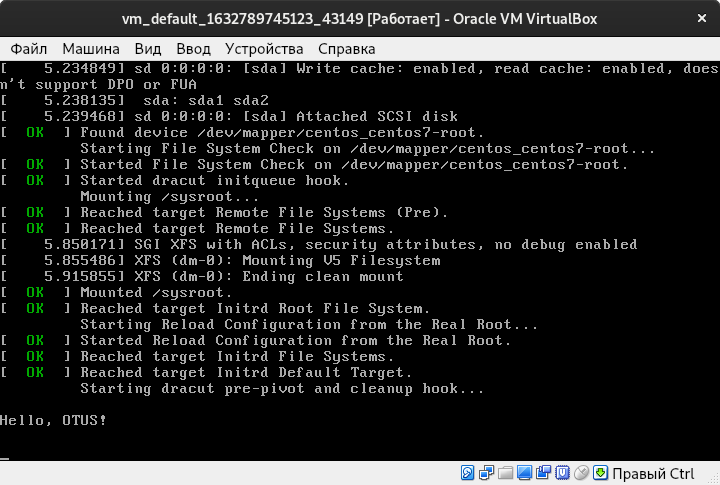

# Загрузка системы 

__Работа с загрузчиком__
* Попасть в систему без пароля несколькими способами
* Установить систему с LVM, после чего переименовать VG
* Добавить модуль в initrd
* \* Сконфигурировать систему без отдельного раздела с /boot, а только с LVM Репозиторий с пропатченым grub: https://yum.rumyantsev.com/centos/7/x86_64/ PV необходимо инициализировать с параметром --bootloaderareasize 1m

__Критерии оценки:__
Описать действия, описать разницу между методами получения шелла в процессе загрузки. Где получится - используем script, где не получается - словами или копипастой описываем действия.

## Исполнение

````shell
vagrant destroy -f && vagrant up
python3 v2a.py -o ../ansible/inventories/hosts
````

## Попасть в систему без пароля несколькими способами

1. Работа в однопользовательском режиме:
```text
c "centos/7" не работает, работает с "generic/centos7"
```
* при загрузке GRUB меню нажать `e` для перехода к редактированию параметров загрузки
* пролистать вниз и найти строку, начинающуюся с `linux16`
* заменить `rhgb quiet` на `init=/bin/bash`
* нажать `Ctrl+x`, чтобы загрузка продолжилась с установленными опциями. 
* проверить права на запись `mount | grep root`
* перемонтировать файловую систему с правами записи:  `mount -rw -o remount /`
* сменить пароль `passwd`
* обновить весь контекст SELinux `touch /.autorelabel`
* выйти `sync && umount /`
* выключить `poweroff -f` или перезагрузить `reboot -f` (`/sbin/reboot`). На VM не сработало, только кнопкой VirtualBOX.

2. Способ 2
* при загрузке GRUB меню нажать `e` для перехода к редактированию параметров загрузки
* пролистать вниз и найти строку, начинающуюся с `linux16`
* заменить `ro` на `rw init=/sysroot/bin/sh`, стереть `rhgb quiet`
* нажать `Ctrl+x`, чтобы загрузка продолжилась с установленными опциями. 
* выполнить `chroot /sysroot`
* сменить пароль `passwd root`
* обновить весь контекст SELinux `touch /.autorelabel`
* выполнить `exit`
* выполнить `exit`
* выполнить `reboot`

## Установить систему с LVM, после чего переименовать VG

```shell
cd ../ansible
```

```shell
ansible-playbook playbooks/lvm.yml > ../files/lvm.yml.txt
```


<details><summary>см. лог исполнения `playbooks/lvm.yml`</summary>

```text

PLAY [all] *********************************************************************

TASK [Gathering Facts] *********************************************************
ok: [default]

TASK [get current root name] ***************************************************
changed: [default]

TASK [print] *******************************************************************
ok: [default] => {
    "msg": "centos_centos7"
}

TASK [vgrename to OtusRoot] ****************************************************
changed: [default]

TASK [change /etc/fstab, /etc/default/grub и /boot/grub2/grub.cfg] *************
changed: [default] => (item=/etc/fstab)
changed: [default] => (item=/etc/default/grub)
changed: [default] => (item=/boot/grub2/grub.cfg)

TASK [change /etc/default/grub и /boot/grub2/grub.cfg] *************************
changed: [default] => (item=/etc/default/grub)
changed: [default] => (item=/boot/grub2/grub.cfg)

TASK [change /etc/default/grub и /boot/grub2/grub.cfg] *************************
changed: [default] => (item=/etc/default/grub)
changed: [default] => (item=/boot/grub2/grub.cfg)

TASK [mkinitrd -f -v /boot/initramfs-$(uname -r).img $(uname -r)] **************
changed: [default]

TASK [print] *******************************************************************
ok: [default] => {
    "msg": ""
}

TASK [reboot] ******************************************************************
changed: [default]

PLAY RECAP *********************************************************************
default                    : ok=10   changed=7    unreachable=0    failed=0    skipped=0    rescued=0    ignored=0   


```

</details>

```shell
ansible-playbook playbooks/check_lvm.yml  > ../files/check_lvm.yml.txt
```


<details><summary>см. лог исполнения `playbooks/check_lvm.yml`</summary>

```text

PLAY [all] *********************************************************************

TASK [Gathering Facts] *********************************************************
ok: [default]

TASK [Get current root name] ***************************************************
changed: [default]

TASK [Print current root name] *************************************************
ok: [default] => {
    "msg": "OtusRoot"
}

PLAY RECAP *********************************************************************
default                    : ok=3    changed=1    unreachable=0    failed=0    skipped=0    rescued=0    ignored=0   


```

</details>


## Добавить модуль в initrd

```shell
ansible-playbook playbooks/initrd.yml  > ../files/initrd.yml.txt
```


<details><summary>см. лог исполнения `playbooks/initrd.yml`</summary>

```text

PLAY [all] *********************************************************************

TASK [Gathering Facts] *********************************************************
ok: [default]

TASK [delete "rhgb quiet"] *****************************************************
changed: [default] => (item=/boot/grub2/grub.cfg)

TASK [example module dir] ******************************************************
changed: [default]

TASK [example module module-setup.sh] ******************************************
ok: [default]

TASK [example module component] ************************************************
ok: [default]

TASK [mkinitrd -f -v /boot/initramfs-$(uname -r).img $(uname -r)] **************
changed: [default]

TASK [lsinitrd -m /boot/initramfs-$(uname -r).img | grep test] *****************
changed: [default]

TASK [Print lsinitrd module exists check] **************************************
ok: [default] => {
    "msg": "test"
}

PLAY RECAP *********************************************************************
default                    : ok=8    changed=4    unreachable=0    failed=0    skipped=0    rescued=0    ignored=0   


```

</details>

