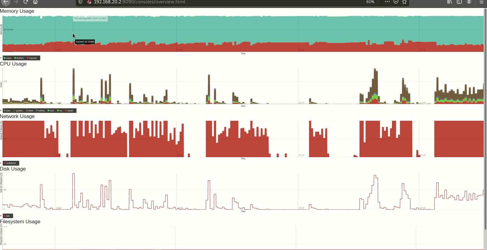

# Настройка мониторинга

Настроить дашборд с 4-мя графиками
- память;
- процессор;
- диск;
- сеть.

Настроить на одной из систем:
- zabbix (использовать screen (комплексный экран);
- prometheus - grafana.
- использование систем, примеры которых не рассматривались на занятии. Список возможных систем был приведен в презентации.

В качестве результата прислать скриншот экрана - дашборд должен содержать в названии имя приславшего.

Критерии оценки:
Статус "Принято" ставится при выполнении основного задания.

Задание со звездочкой выполняется по желанию.

## Результат



## Ansible

```shell
 ansible-playbook playbooks/server.yml
```

<details> 
<summary>Процесс настройки Prometheus</summary>

```text

PLAY [Playbook of server (prometheus) initialization] *

TASK [Gathering Facts] 
ok: [vagrant]

TASK [../roles/server : Set time zone] 
ok: [vagrant]

TASK [../roles/server : Synchronize datetime | Install chrony] 
ok: [vagrant]

TASK [../roles/server : Synchronize datetime | Turn on chronyd] *
ok: [vagrant]

TASK [../roles/server : Create prometheus user] *
ok: [vagrant]

TASK [../roles/server : Create work paths] 
changed: [vagrant]

TASK [../roles/server : Copy ./prometheus to /usr/local/bin] 
ok: [vagrant]

TASK [../roles/server : Copy ./promtool to /usr/local/bin] 
ok: [vagrant]

TASK [../roles/server : Configure prometeus application | prometheus.yml] *
ok: [vagrant]

TASK [../roles/server : Configure prometeus application | consoles] *
ok: [vagrant]

TASK [../roles/server : Configure prometeus application | console libraries] 
ok: [vagrant]

TASK [../roles/server : Configure prometeus application | consoles] *
ok: [vagrant]

TASK [../roles/server : Configure prometeus service] 
ok: [vagrant]

TASK [../roles/server : Turn on prometeus service] 
ok: [vagrant]

TASK [../roles/server : Check http] *
ok: [vagrant]

TASK [../roles/server : Check http] *
skipping: [vagrant]

PLAY RECAP 
vagrant                    : ok=15   changed=1    unreachable=0    failed=0    skipped=1    rescued=0    ignored=0 
```
</details>

```shell
ansible-playbook playbooks/client.yml
```

<details> 
<summary>Процесс настройки Node Exports</summary>

```text

PLAY [Playbook of client (node exporter) initialization] 

TASK [Gathering Facts] 
ok: [vagrant]

TASK [../roles/client : Synchronize datetime | Install chrony] 
ok: [vagrant]

TASK [../roles/client : Synchronize datetime | Turn on chronyd] *
ok: [vagrant]

TASK [../roles/client : Create node exporter user] 
ok: [vagrant]

TASK [../roles/client : Create work paths] 
changed: [vagrant]

TASK [../roles/client : Copy ./node_exporter to /usr/local/bin] *
ok: [vagrant]

TASK [../roles/client : Configure node exporter service] 
ok: [vagrant]

TASK [../roles/client : Turn on node_exporter service] 
ok: [vagrant]

TASK [../roles/client : Check data on client] *
ok: [vagrant]

TASK [../roles/client : Check data on client] *
skipping: [vagrant]

TASK [../roles/client : Show data on client] 
ok: [vagrant] => {
    "msg": {
        "changed": false,
        "connection": "close",
        "content_length": "150",
        "content_type": "text/html; charset=utf-8",
        "cookies": {},
        "cookies_string": "",
        "date": "Thu, 05 Aug 2021 20:45:28 GMT",
        "elapsed": 0,
        "failed": false,
        "msg": "OK (150 bytes)",
        "redirected": false,
        "status": 200,
        "url": "http://localhost:9100"
    }
}

PLAY RECAP 
vagrant                    : ok=10   changed=1    unreachable=0    failed=0    skipped=1    rescued=0    ignored=0   
```

</details>


```shell
ansible-playbook playbooks/at_the_end.yml
```

<details> 
<summary>Процесс добавления Node Exports в Prometheus</summary>

```text
ansible-playbook playbooks/at_the_end.yml 

PLAY [Playbook of server configure after clent initialization] 

TASK [Gathering Facts] 
ok: [vagrant]

TASK [../roles/at_the_end : Print to screen google authenticator details] *
changed: [vagrant]

TASK [../roles/at_the_end : Update prometheus.yml] 
changed: [vagrant]

RUNNING HANDLER [../roles/at_the_end : service restart prometheus] 
changed: [vagrant]

PLAY RECAP 
vagrant                    : ok=4    changed=3    unreachable=0    failed=0    skipped=0    rescued=0    ignored=0   
```

## Заметки

Не удалось штатным образом обновлять графики, хотя у графика имеется объест (https://tech.shutterstock.com/rickshaw/) с методом reload. Работает только обновление страницы.
