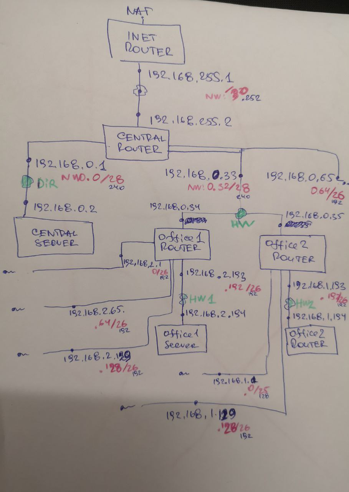
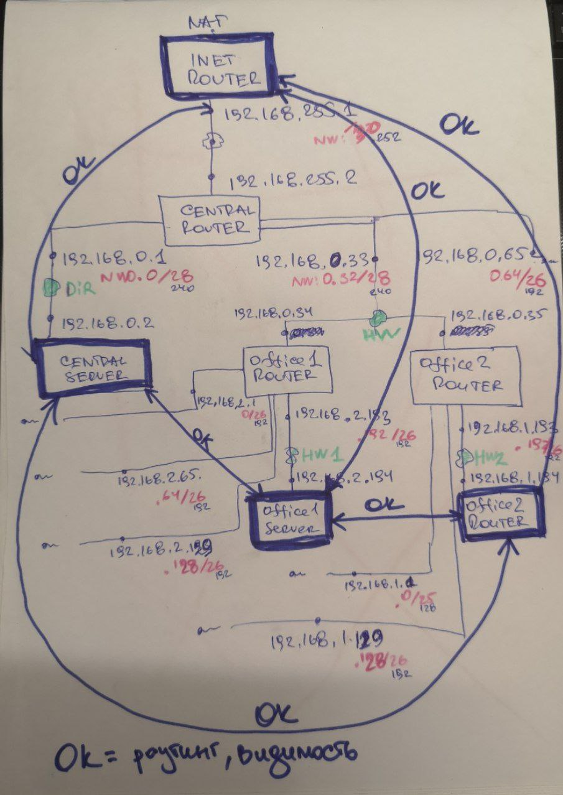

# Архитектура сетей 

Дано Vagrantfile (https://github.com/erlong15/otus-linux/tree/network (ветка network)) с начальным построением сети

* inetRouter
* centralRouter
* centralServer

тестировалось на virtualbox

Построить следующую архитектуру:
* Сеть office1
    * 192.168.2.0/26 - dev
    * 192.168.2.64/26 - test servers
    * 192.168.2.128/26 - managers
    * 192.168.2.192/26 - office hardware
* Сеть office2
    * 192.168.1.0/25 - dev
    * 192.168.1.128/26 - test servers
    * 192.168.1.192/26 - office hardware
* Сеть central
    * 192.168.0.0/28 - directors
    * 192.168.0.32/28 - office hardware
    * 192.168.0.64/26 - wifi

```text
Office1 ---\
            -----> Central --IRouter --> internet
Office2 ---/
```

Итого должны получится следующие сервера:
* inetRouter
* centralRouter
* office1Router
* office2Router
* centralServer
* office1Server
* office2Server

Теоретическая часть:
* Найти свободные подсети (исполнено)
* Посчитать сколько узлов в каждой подсети, включая свободные (исполнено)
* Указать broadcast адрес для каждой подсети (исполнено)
* Проверить нет ли ошибок при разбиении (исполнено)

Практическая часть:
* Соединить офисы в сеть согласно схеме и настроить роутинг (исполнено)
* Все сервера и роутеры должны ходить в инет черз inetRouter (исполнено)
* Все сервера должны видеть друг друга (исполнено)

Замечание:
* у всех новых серверов отключить дефолт на нат (eth0), который вагрант поднимает для связи (как?)
* при нехватке сетевых интерфейсов добавить по несколько адресов на интерфейс (мое примечание: при исключающем маскарадинге и реализованной сетевой связности понадобятся новые подсети для выхода в интернет)

Формат сдачи ДЗ - vagrant + ansible
Критерии оценки:
* Статус "Принято" ставится, если сделана хотя бы часть.
* Задание со звездочкой - выполнить всё.

## Теоретическая часть

### Найти свободные подсети

[template]:[Табличный отчет](./026/001_ipcheck/table.md)

[template]:[Скрипт](./026/001_ipcheck/app.py)

[template]:[Лог скрипта](./026/001_ipcheck/report.txt)

### Посчитать сколько узлов в каждой подсети, включая свободные

[template]:[Табличный отчет](./026/002_ipcheck/table.md)

[template]:[Скрипт](./026/002_ipcheck/app.py)

### Указать broadcast адрес для каждой подсети

[template]:[Табличный отчет](./026/003_ipcheck/table.md)

[template]:[Скрипт](./026/003_ipcheck/app.py)

### Проверить нет ли ошибок при разбиении

[template]:[MD-отчет](./026/004_ipcheck/report.md)

[template]:[Скрипт](./026/004_ipcheck/app.py)

[template]:[Лог скрипта](./026/004_ipcheck/report.txt)

## Практическая часть

### Соединить офисы в сеть согласно схеме и настроить роутинг

В исходный [template]:[Vagrantfile](./026/erlong15_vm/Vagrantfile) внес правки

т.к. 

```text
  Bringing machine 'office2Server' up with 'virtualbox' provider...
  ==> inetRouter: Box 'centos/6' could not be found. Attempting to find and install...
      inetRouter: Box Provider: virtualbox
      inetRouter: Box Version: >= 0
  The box 'centos/6' could not be found or
  could not be accessed in the remote catalog. If this is a private
  box on HashiCorp's Vagrant Cloud, please verify you're logged in via
  `vagrant login`. Also, please double-check the name. The expanded
  URL and error message are shown below:
  
  URL: ["https://vagrantcloud.com/centos/6"]
  Error: The requested URL returned error: 404
```

Поменял на centos/7.



Реализованная схема подключения описана в [template]:[Vagrantfile](./026/vm/Vagrantfile)




Периодически при отладке "скакали" vagrant-параметры (порты), необходимые для `/ansible/inventories/hosts`.
Залействовал https://github.com/haidaraM/vagrant-to-ansible-inventory
[template]:[импорт vagrant хостов в хосты ansible-inventory](./026/vm/v2a.py)

```shell
pwd
  /home/b/pycharm_projects_2021_2/otus_linux/026/vm

python3 v2a.py -o ../ansible/inventories/hosts
```

В ДЗ я применил хранение настроек в переменной, для однотипной задачи прописывания шлюзов на интерфейсах

[template]:[Параметры шлюзов](026/ansible/roles/routing/vars/main.yml)

Задача, использующая специальную ansible-переменную `inventory_hostname`, "знающую" для какого инвентори-хоста работает в данный момент плейбук.

[template]:[Задача](./026/ansible/roles/routing/tasks/main.yml)


### Проверка работоспособности шлюзов

Выход в Интернет через `inetRouter` я не сделал, но акак понял это можно при текщих связях сделать виртуальную сеть `eth1:0`, например, с адресацией 192.169.0.0. И на `inetRouter` сделать маскарадинг на нее (https://jakeroid.com/ru/blog/nastraivaem-nat-v-linux.html).

Произвожу исключительно проверку внутрисетевой связности:

```shell
ip a | grep ' eth'
ip neigh
traceroute 192.168.255.2
traceroute 192.168.255.1
traceroute 192.168.0.1
```
#### inetRouter

```shell
[vagrant@inetRouter ~]$ ip r 
default via 10.0.2.2 dev eth0 proto dhcp metric 100 
10.0.2.0/24 dev eth0 proto kernel scope link src 10.0.2.15 metric 100 
192.168.0.0/16 via 192.168.255.2 dev eth1 proto static metric 101 
192.168.255.0/30 dev eth1 proto kernel scope link src 192.168.255.1 metric 101 

[vagrant@inetRouter ~]$ ip a | grep ' eth'
2: eth0: <BROADCAST,MULTICAST,UP,LOWER_UP> mtu 1500 qdisc pfifo_fast state UP group default qlen 1000
    inet 10.0.2.15/24 brd 10.0.2.255 scope global dynamic eth0
3: eth1: <BROADCAST,MULTICAST,UP,LOWER_UP> mtu 1500 qdisc pfifo_fast state UP group default qlen 1000
    inet 192.168.255.1/30 brd 192.168.255.3 scope global eth1
    
[vagrant@inetRouter ~]$ ip neigh
10.0.2.3 dev eth0 lladdr 52:54:00:12:35:03 STALE
10.0.2.2 dev eth0 lladdr 52:54:00:12:35:02 REACHABLE
192.168.255.2 dev eth1 lladdr 08:00:27:b3:3f:5d REACHABLE

[vagrant@inetRouter ~]$ traceroute 192.168.255.2
traceroute to 192.168.255.2 (192.168.255.2), 30 hops max, 60 byte packets
 1  gateway (192.168.255.2)  0.589 ms  0.311 ms  0.286 ms
 
[vagrant@inetRouter ~]$ traceroute 192.168.255.1
traceroute to 192.168.255.1 (192.168.255.1), 30 hops max, 60 byte packets
 1  inetRouter (192.168.255.1)  0.068 ms  0.032 ms  0.028 ms
 
[vagrant@inetRouter ~]$ traceroute 192.168.0.1
traceroute to 192.168.0.1 (192.168.0.1), 30 hops max, 60 byte packets
 1  192.168.0.1 (192.168.0.1)  0.389 ms  0.204 ms  0.280 ms
```

#### centralRouter

```shell
[vagrant@centralRouter ~]$ ip r
default via 10.0.2.2 dev eth0 proto dhcp metric 100 
10.0.2.0/24 dev eth0 proto kernel scope link src 10.0.2.15 metric 100 
192.168.0.0/28 dev eth2 proto kernel scope link src 192.168.0.1 metric 102 
192.168.0.32/28 dev eth3 proto kernel scope link src 192.168.0.33 metric 103 
192.168.0.34 dev eth1 proto static scope link metric 101 
192.168.0.35 dev eth1 proto static scope link metric 101 
192.168.0.64/26 dev eth4 proto kernel scope link src 192.168.0.65 metric 104 
192.168.1.0/24 via 192.168.0.35 dev eth1 proto static metric 101 
192.168.2.0/24 via 192.168.0.34 dev eth1 proto static metric 101 
192.168.255.0/30 dev eth1 proto kernel scope link src 192.168.255.2 metric 101 

[vagrant@centralRouter ~]$ ip a | grep ' eth'
2: eth0: <BROADCAST,MULTICAST,UP,LOWER_UP> mtu 1500 qdisc pfifo_fast state UP group default qlen 1000
    inet 10.0.2.15/24 brd 10.0.2.255 scope global dynamic eth0
3: eth1: <BROADCAST,MULTICAST,UP,LOWER_UP> mtu 1500 qdisc pfifo_fast state UP group default qlen 1000
    inet 192.168.255.2/30 brd 192.168.255.3 scope global eth1
4: eth2: <BROADCAST,MULTICAST,UP,LOWER_UP> mtu 1500 qdisc pfifo_fast state UP group default qlen 1000
    inet 192.168.0.1/28 brd 192.168.0.15 scope global eth2
5: eth3: <BROADCAST,MULTICAST,UP,LOWER_UP> mtu 1500 qdisc pfifo_fast state UP group default qlen 1000
    inet 192.168.0.33/28 brd 192.168.0.47 scope global eth3
6: eth4: <BROADCAST,MULTICAST,UP,LOWER_UP> mtu 1500 qdisc pfifo_fast state UP group default qlen 1000
    inet 192.168.0.65/26 brd 192.168.0.127 scope global eth4
    
[vagrant@centralRouter ~]$ ip neigh
192.168.255.1 dev eth1 lladdr 08:00:27:39:5d:77 STALE
192.168.0.34 dev eth3 lladdr 08:00:27:20:3f:1f REACHABLE
192.168.0.2 dev eth2 lladdr 08:00:27:13:6f:3b STALE
192.168.0.35 dev eth3 lladdr 08:00:27:df:08:0f STALE
10.0.2.2 dev eth0 lladdr 52:54:00:12:35:02 DELAY

[vagrant@centralRouter ~]$ traceroute 192.168.255.2
traceroute to 192.168.255.2 (192.168.255.2), 30 hops max, 60 byte packets
 1  centralRouter (192.168.255.2)  0.057 ms  0.021 ms  0.022 ms
 
[vagrant@centralRouter ~]$ traceroute 192.168.255.1
traceroute to 192.168.255.1 (192.168.255.1), 30 hops max, 60 byte packets
 1  gateway (192.168.255.1)  0.947 ms  0.894 ms  0.735 ms
 
[vagrant@centralRouter ~]$ traceroute 192.168.0.1
traceroute to 192.168.0.1 (192.168.0.1), 30 hops max, 60 byte packets
 1  centralRouter (192.168.0.1)  0.036 ms  0.014 ms  0.014 ms
```

#### centralServer

```shell
[vagrant@centralServer ~]$ ip r
default via 10.0.2.2 dev eth0 proto dhcp metric 100 
10.0.2.0/24 dev eth0 proto kernel scope link src 10.0.2.15 metric 100 
192.168.0.0/28 dev eth1 proto kernel scope link src 192.168.0.2 metric 101 

[vagrant@centralServer ~]$ ip a | grep ' eth'
2: eth0: <BROADCAST,MULTICAST,UP,LOWER_UP> mtu 1500 qdisc pfifo_fast state UP group default qlen 1000
    inet 10.0.2.15/24 brd 10.0.2.255 scope global dynamic eth0
3: eth1: <BROADCAST,MULTICAST,UP,LOWER_UP> mtu 1500 qdisc pfifo_fast state UP group default qlen 1000
    inet 192.168.0.2/28 brd 192.168.0.15 scope global eth1

[vagrant@centralServer ~]$ ip neigh
10.0.2.3 dev eth0 lladdr 52:54:00:12:35:03 STALE
192.168.0.1 dev eth1 lladdr 08:00:27:15:f4:72 STALE
10.0.2.2 dev eth0 lladdr 52:54:00:12:35:02 REACHABLE

[vagrant@centralServer ~]$ traceroute 192.168.255.2
traceroute to 192.168.255.2 (192.168.255.2), 30 hops max, 60 byte packets
 1  192.168.255.2 (192.168.255.2)  0.558 ms  0.462 ms  0.356 ms
 
[vagrant@centralServer ~]$ traceroute 192.168.255.1
traceroute to 192.168.255.1 (192.168.255.1), 30 hops max, 60 byte packets
 1  gateway (192.168.0.1)  0.666 ms  0.391 ms  0.397 ms
 2  192.168.255.1 (192.168.255.1)  0.955 ms  1.255 ms  0.593 ms
 
[vagrant@centralServer ~]$ traceroute 192.168.2.194
traceroute to 192.168.2.194 (192.168.2.194), 30 hops max, 60 byte packets
 1  gateway (192.168.0.1)  0.383 ms  0.155 ms  0.175 ms
 2  192.168.0.34 (192.168.0.34)  0.560 ms  2.658 ms  2.540 ms
 3  192.168.2.194 (192.168.2.194)  2.659 ms  2.658 ms  2.504 ms
 
[vagrant@centralServer ~]$ traceroute 192.168.1.194
traceroute to 192.168.1.194 (192.168.1.194), 30 hops max, 60 byte packets
 1  gateway (192.168.0.1)  0.329 ms  0.299 ms  0.207 ms
 2  192.168.0.35 (192.168.0.35)  0.933 ms  0.772 ms  1.348 ms
 3  192.168.1.194 (192.168.1.194)  2.486 ms  2.314 ms  2.170 ms

```

#### office1Router

```shell
[vagrant@office1Router ~]$ ip r
default via 192.168.0.33 dev eth1 
10.0.2.0/24 dev eth0 proto kernel scope link src 10.0.2.15 
169.254.0.0/16 dev eth0 scope link metric 1002 
169.254.0.0/16 dev eth1 scope link metric 1003 
169.254.0.0/16 dev eth2 scope link metric 1004 
169.254.0.0/16 dev eth3 scope link metric 1005 
169.254.0.0/16 dev eth4 scope link metric 1006 
169.254.0.0/16 dev eth5 scope link metric 1007 
192.168.0.32/28 dev eth1 proto kernel scope link src 192.168.0.34 
192.168.2.0/26 dev eth2 proto kernel scope link src 192.168.2.1 
192.168.2.64/26 dev eth3 proto kernel scope link src 192.168.2.65 
192.168.2.128/26 dev eth4 proto kernel scope link src 192.168.2.129 
192.168.2.192/26 dev eth5 proto kernel scope link src 192.168.2.193 

[vagrant@office1Router ~]$ ip a | grep ' eth'
2: eth0: <BROADCAST,MULTICAST,UP,LOWER_UP> mtu 1500 qdisc pfifo_fast state UP group default qlen 1000
    inet 10.0.2.15/24 brd 10.0.2.255 scope global dynamic eth0
3: eth1: <BROADCAST,MULTICAST,UP,LOWER_UP> mtu 1500 qdisc pfifo_fast state UP group default qlen 1000
    inet 192.168.0.34/28 brd 192.168.0.47 scope global eth1
4: eth2: <BROADCAST,MULTICAST,UP,LOWER_UP> mtu 1500 qdisc pfifo_fast state UP group default qlen 1000
    inet 192.168.2.1/26 brd 192.168.2.63 scope global eth2
5: eth3: <BROADCAST,MULTICAST,UP,LOWER_UP> mtu 1500 qdisc pfifo_fast state UP group default qlen 1000
    inet 192.168.2.65/26 brd 192.168.2.127 scope global eth3
6: eth4: <BROADCAST,MULTICAST,UP,LOWER_UP> mtu 1500 qdisc pfifo_fast state UP group default qlen 1000
    inet 192.168.2.129/26 brd 192.168.2.191 scope global eth4
7: eth5: <BROADCAST,MULTICAST,UP,LOWER_UP> mtu 1500 qdisc pfifo_fast state UP group default qlen 1000
    inet 192.168.2.193/26 brd 192.168.2.255 scope global eth5
    
[vagrant@office1Router ~]$ ip neigh
192.168.0.33 dev eth1 lladdr 08:00:27:0e:a8:65 STALE
10.0.2.3 dev eth0 lladdr 52:54:00:12:35:03 REACHABLE
192.168.2.194 dev eth5 lladdr 08:00:27:27:ec:71 STALE
10.0.2.2 dev eth0 lladdr 52:54:00:12:35:02 REACHABLE

[vagrant@office1Router ~]$ traceroute 192.168.255.2
traceroute to 192.168.255.2 (192.168.255.2), 30 hops max, 60 byte packets
 1  192.168.255.2 (192.168.255.2)  1.171 ms  0.906 ms  0.755 ms
 
[vagrant@office1Router ~]$ traceroute 192.168.255.1
traceroute to 192.168.255.1 (192.168.255.1), 30 hops max, 60 byte packets
 1  gateway (192.168.0.33)  0.348 ms  0.157 ms  0.212 ms
 2  192.168.255.1 (192.168.255.1)  1.725 ms  1.555 ms  1.378 ms
```

#### office1Server

```shell
[vagrant@office1Server ~]$  ip r
default via 192.168.2.193 dev eth1 
10.0.2.0/24 dev eth0 proto kernel scope link src 10.0.2.15 
169.254.0.0/16 dev eth0 scope link metric 1002 
169.254.0.0/16 dev eth1 scope link metric 1003 
192.168.2.192/26 dev eth1 proto kernel scope link src 192.168.2.194 

[vagrant@office1Server ~]$ ip a | grep ' eth'
2: eth0: <BROADCAST,MULTICAST,UP,LOWER_UP> mtu 1500 qdisc pfifo_fast state UP group default qlen 1000
    inet 10.0.2.15/24 brd 10.0.2.255 scope global dynamic eth0
3: eth1: <BROADCAST,MULTICAST,UP,LOWER_UP> mtu 1500 qdisc pfifo_fast state UP group default qlen 1000
    inet 192.168.2.194/26 brd 192.168.2.255 scope global eth1
    
[vagrant@office1Server ~]$ ip neigh
10.0.2.2 dev eth0 lladdr 52:54:00:12:35:02 REACHABLE
192.168.2.193 dev eth1 lladdr 08:00:27:b5:25:b0 DELAY
10.0.2.3 dev eth0 lladdr 52:54:00:12:35:03 STALE

[vagrant@office1Server ~]$ traceroute 192.168.255.2
traceroute to 192.168.255.2 (192.168.255.2), 30 hops max, 60 byte packets
 1  gateway (192.168.2.193)  0.807 ms  0.600 ms  0.432 ms
 2  192.168.255.2 (192.168.255.2)  1.299 ms  1.333 ms  0.956 ms

[vagrant@office1Server ~]$ traceroute 192.168.255.1
traceroute to 192.168.255.1 (192.168.255.1), 30 hops max, 60 byte packets
 1  gateway (192.168.2.193)  0.451 ms  0.408 ms  0.402 ms
 2  192.168.0.33 (192.168.0.33)  1.817 ms  1.581 ms  1.351 ms
 3  192.168.255.1 (192.168.255.1)  1.885 ms  1.653 ms  1.771 ms

[vagrant@office1Server ~]$ traceroute 192.168.0.2
traceroute to 192.168.0.2 (192.168.0.2), 30 hops max, 60 byte packets
 1  gateway (192.168.2.193)  0.372 ms  0.357 ms  0.278 ms
 2  192.168.0.33 (192.168.0.33)  0.742 ms  0.497 ms  0.553 ms
 3  192.168.0.2 (192.168.0.2)  1.019 ms  0.978 ms  1.304 ms

[vagrant@office1Server ~]$ traceroute 192.168.1.194
traceroute to 192.168.1.194 (192.168.1.194), 30 hops max, 60 byte packets
 1  gateway (192.168.2.193)  0.351 ms  0.206 ms  0.255 ms
 2  192.168.0.33 (192.168.0.33)  0.919 ms  0.693 ms  1.532 ms
 3  192.168.0.35 (192.168.0.35)  2.306 ms  2.058 ms  2.321 ms
 4  192.168.1.194 (192.168.1.194)  3.368 ms  3.434 ms  3.236 ms
```

#### office2Router

```shell
[vagrant@office2Router ~]$ ip r
default via 192.168.0.33 dev eth1 
10.0.2.0/24 dev eth0 proto kernel scope link src 10.0.2.15 
169.254.0.0/16 dev eth0 scope link metric 1002 
169.254.0.0/16 dev eth1 scope link metric 1003 
169.254.0.0/16 dev eth2 scope link metric 1004 
169.254.0.0/16 dev eth3 scope link metric 1005 
169.254.0.0/16 dev eth4 scope link metric 1006 
192.168.0.32/28 dev eth1 proto kernel scope link src 192.168.0.35 
192.168.1.0/25 dev eth2 proto kernel scope link src 192.168.1.1 
192.168.1.128/26 dev eth3 proto kernel scope link src 192.168.1.129 
192.168.1.192/26 dev eth4 proto kernel scope link src 192.168.1.193 

[vagrant@office2Router ~]$ ip a | grep ' eth'
2: eth0: <BROADCAST,MULTICAST,UP,LOWER_UP> mtu 1500 qdisc pfifo_fast state UP group default qlen 1000
    inet 10.0.2.15/24 brd 10.0.2.255 scope global dynamic eth0
3: eth1: <BROADCAST,MULTICAST,UP,LOWER_UP> mtu 1500 qdisc pfifo_fast state UP group default qlen 1000
    inet 192.168.0.35/28 brd 192.168.0.47 scope global eth1
4: eth2: <BROADCAST,MULTICAST,UP,LOWER_UP> mtu 1500 qdisc pfifo_fast state UP group default qlen 1000
    inet 192.168.1.1/25 brd 192.168.1.127 scope global eth2
5: eth3: <BROADCAST,MULTICAST,UP,LOWER_UP> mtu 1500 qdisc pfifo_fast state UP group default qlen 1000
    inet 192.168.1.129/26 brd 192.168.1.191 scope global eth3
6: eth4: <BROADCAST,MULTICAST,UP,LOWER_UP> mtu 1500 qdisc pfifo_fast state UP group default qlen 1000
    inet 192.168.1.193/26 brd 192.168.1.255 scope global eth4
    
[vagrant@office2Router ~]$ ip neigh
192.168.1.194 dev eth4 lladdr 08:00:27:48:44:b5 STALE
192.168.0.33 dev eth1 lladdr 08:00:27:b7:4f:c6 STALE
10.0.2.2 dev eth0 lladdr 52:54:00:12:35:02 REACHABL

[vagrant@office2Router ~]$ traceroute 192.168.255.2
traceroute to 192.168.255.2 (192.168.255.2), 30 hops max, 60 byte packets
 1  192.168.255.2 (192.168.255.2)  0.337 ms  0.229 ms  0.185 ms
 
[vagrant@office2Router ~]$ traceroute 192.168.255.1
traceroute to 192.168.255.1 (192.168.255.1), 30 hops max, 60 byte packets
 1  gateway (192.168.0.33)  0.640 ms  0.539 ms  0.478 ms
 2  192.168.255.1 (192.168.255.1)  0.744 ms  1.091 ms  0.947 ms
```

#### office2Server

```shell
[vagrant@office2Server ~]$ ip r
default via 192.168.1.193 dev eth1 
10.0.2.0/24 dev eth0 proto kernel scope link src 10.0.2.15 
169.254.0.0/16 dev eth0 scope link metric 1002 
169.254.0.0/16 dev eth1 scope link metric 1003 
192.168.1.192/26 dev eth1 proto kernel scope link src 192.168.1.194 

[vagrant@office2Server ~]$ ip a | grep ' eth'
2: eth0: <BROADCAST,MULTICAST,UP,LOWER_UP> mtu 1500 qdisc pfifo_fast state UP group default qlen 1000
    inet 10.0.2.15/24 brd 10.0.2.255 scope global dynamic eth0
3: eth1: <BROADCAST,MULTICAST,UP,LOWER_UP> mtu 1500 qdisc pfifo_fast state UP group default qlen 1000
    inet 192.168.1.194/26 brd 192.168.1.255 scope global eth1

[vagrant@office2Server ~]$ ip neigh
10.0.2.2 dev eth0 lladdr 52:54:00:12:35:02 DELAY
10.0.2.3 dev eth0 lladdr 52:54:00:12:35:03 STALE
192.168.1.193 dev eth1 lladdr 08:00:27:3f:84:75 STALE

[vagrant@office2Server ~]$ traceroute 192.168.255.2
traceroute to 192.168.255.2 (192.168.255.2), 30 hops max, 60 byte packets
 1  gateway (192.168.1.193)  0.644 ms  0.197 ms  0.851 ms
 2  192.168.255.2 (192.168.255.2)  0.822 ms  1.355 ms  1.177 ms

[vagrant@office2Server ~]$ traceroute 192.168.255.1
traceroute to 192.168.255.1 (192.168.255.1), 30 hops max, 60 byte packets
 1  gateway (192.168.1.193)  0.994 ms  0.726 ms  0.453 ms
 2  192.168.0.33 (192.168.0.33)  1.454 ms  2.837 ms  2.661 ms
 3  192.168.255.1 (192.168.255.1)  6.412 ms  6.790 ms  6.546 ms

[vagrant@office2Server ~]$ traceroute 192.168.0.2
traceroute to 192.168.0.2 (192.168.0.2), 30 hops max, 60 byte packets
 1  gateway (192.168.1.193)  1.068 ms  0.809 ms  0.574 ms
 2  192.168.0.33 (192.168.0.33)  1.954 ms  1.738 ms  2.969 ms
 3  192.168.0.2 (192.168.0.2)  2.670 ms  2.412 ms  2.483 ms
 
[vagrant@office2Server ~]$ traceroute 192.168.2.194
traceroute to 192.168.2.194 (192.168.2.194), 30 hops max, 60 byte packets
 1  gateway (192.168.1.193)  0.559 ms  0.259 ms  0.308 ms
 2  192.168.0.33 (192.168.0.33)  1.555 ms  1.263 ms  1.109 ms
 3  192.168.0.34 (192.168.0.34)  2.493 ms  2.267 ms  2.649 ms
 4  192.168.2.194 (192.168.2.194)  3.130 ms  2.744 ms  2.607 ms


```

## Тут не пригодилось, на потом

В рамках демонстрации работоспособности в ДЗ применил циклы `ansible` для проверки доступности списка внешних хостов из узлов сети.

[template]:[списка внешних хостов](./026/ansible/roles/test_001_check_internet_available/vars/main.yml)

[template]:[Задача с циклом](./026/ansible/roles/test_001_check_internet_available/tasks/main.yml)

Если запустить до настройки

```shell
ansible-playbook playbooks/test_001_check_internet_available.yml 

PLAY [Playbook of tests] ******************************************************************************************************************************************************

TASK [Gathering Facts] ********************************************************************************************************************************************************
fatal: [inetRouter]: UNREACHABLE! => {"changed": false, "msg": "Failed to connect to the host via ssh: @@@@@@@@@@@@@@@@@@@@@@@@@@@@@@@@@@@@@@@@@@@@@@@@@@@@@@@@@@@\r\n@    WARNING: REMOTE HOST IDENTIFICATION HAS CHANGED!     @\r\n@@@@@@@@@@@@@@@@@@@@@@@@@@@@@@@@@@@@@@@@@@@@@@@@@@@@@@@@@@@\r\nIT IS POSSIBLE THAT SOMEONE IS DOING SOMETHING NASTY!\r\nSomeone could be eavesdropping on you right now (man-in-the-middle attack)!\r\nIt is also possible that a host key has just been changed.\r\nThe fingerprint for the ECDSA key sent by the remote host is\nSHA256:R8ES/yAg+NJUw1rjRA28SKNfO1rNbZqUaRROINcNTyI.\r\nPlease contact your system administrator.\r\nAdd correct host key in /home/b/.ssh/known_hosts to get rid of this message.\r\nOffending ECDSA key in /home/b/.ssh/known_hosts:6\r\n  remove with:\r\n  ssh-keygen -f \"/home/b/.ssh/known_hosts\" -R \"[127.0.0.1]:2222\"\r\nChallenge/response authentication is disabled to avoid man-in-the-middle attacks.\r\nno such identity: ./vm/.vagrant/machines/inetRouter/virtualbox/private_key: No such file or directory\r\nvagrant@127.0.0.1: Permission denied (publickey,gssapi-keyex,gssapi-with-mic).", "unreachable": true}
fatal: [office1Router]: UNREACHABLE! => {"changed": false, "msg": "Failed to connect to the host via ssh: @@@@@@@@@@@@@@@@@@@@@@@@@@@@@@@@@@@@@@@@@@@@@@@@@@@@@@@@@@@\r\n@    WARNING: REMOTE HOST IDENTIFICATION HAS CHANGED!     @\r\n@@@@@@@@@@@@@@@@@@@@@@@@@@@@@@@@@@@@@@@@@@@@@@@@@@@@@@@@@@@\r\nIT IS POSSIBLE THAT SOMEONE IS DOING SOMETHING NASTY!\r\nSomeone could be eavesdropping on you right now (man-in-the-middle attack)!\r\nIt is also possible that a host key has just been changed.\r\nThe fingerprint for the ECDSA key sent by the remote host is\nSHA256:AhYJfLNzkxS5mE9Y/Ggqm4sy/wpN2h0RKPSjT1zNE+M.\r\nPlease contact your system administrator.\r\nAdd correct host key in /home/b/.ssh/known_hosts to get rid of this message.\r\nOffending ECDSA key in /home/b/.ssh/known_hosts:10\r\n  remove with:\r\n  ssh-keygen -f \"/home/b/.ssh/known_hosts\" -R \"[127.0.0.1]:2202\"\r\nChallenge/response authentication is disabled to avoid man-in-the-middle attacks.\r\nno such identity: ./vm/.vagrant/machines/office1Router/virtualbox/private_key: No such file or directory\r\nvagrant@127.0.0.1: Permission denied (publickey,gssapi-keyex,gssapi-with-mic).", "unreachable": true}
fatal: [centralRouter]: UNREACHABLE! => {"changed": false, "msg": "Failed to connect to the host via ssh: @@@@@@@@@@@@@@@@@@@@@@@@@@@@@@@@@@@@@@@@@@@@@@@@@@@@@@@@@@@\r\n@    WARNING: REMOTE HOST IDENTIFICATION HAS CHANGED!     @\r\n@@@@@@@@@@@@@@@@@@@@@@@@@@@@@@@@@@@@@@@@@@@@@@@@@@@@@@@@@@@\r\nIT IS POSSIBLE THAT SOMEONE IS DOING SOMETHING NASTY!\r\nSomeone could be eavesdropping on you right now (man-in-the-middle attack)!\r\nIt is also possible that a host key has just been changed.\r\nThe fingerprint for the ECDSA key sent by the remote host is\nSHA256:kEtk4sfKPKzbgjrOv4H5zJI5lg1vi5yK2Mjr5a494b8.\r\nPlease contact your system administrator.\r\nAdd correct host key in /home/b/.ssh/known_hosts to get rid of this message.\r\nOffending ECDSA key in /home/b/.ssh/known_hosts:7\r\n  remove with:\r\n  ssh-keygen -f \"/home/b/.ssh/known_hosts\" -R \"[127.0.0.1]:2200\"\r\nChallenge/response authentication is disabled to avoid man-in-the-middle attacks.\r\nno such identity: ./vm/.vagrant/machines/centralRouter/virtualbox/private_key: No such file or directory\r\nvagrant@127.0.0.1: Permission denied (publickey,gssapi-keyex,gssapi-with-mic).", "unreachable": true}
fatal: [centralServer]: UNREACHABLE! => {"changed": false, "msg": "Failed to connect to the host via ssh: @@@@@@@@@@@@@@@@@@@@@@@@@@@@@@@@@@@@@@@@@@@@@@@@@@@@@@@@@@@\r\n@    WARNING: REMOTE HOST IDENTIFICATION HAS CHANGED!     @\r\n@@@@@@@@@@@@@@@@@@@@@@@@@@@@@@@@@@@@@@@@@@@@@@@@@@@@@@@@@@@\r\nIT IS POSSIBLE THAT SOMEONE IS DOING SOMETHING NASTY!\r\nSomeone could be eavesdropping on you right now (man-in-the-middle attack)!\r\nIt is also possible that a host key has just been changed.\r\nThe fingerprint for the ECDSA key sent by the remote host is\nSHA256:/ZWCATVrT44LByhzOJ4SzbdcyP/T9quhUj3i++eRGOI.\r\nPlease contact your system administrator.\r\nAdd correct host key in /home/b/.ssh/known_hosts to get rid of this message.\r\nOffending ECDSA key in /home/b/.ssh/known_hosts:8\r\n  remove with:\r\n  ssh-keygen -f \"/home/b/.ssh/known_hosts\" -R \"[127.0.0.1]:2201\"\r\nChallenge/response authentication is disabled to avoid man-in-the-middle attacks.\r\nno such identity: ./vm/.vagrant/machines/centralServer/virtualbox/private_key: No such file or directory\r\nvagrant@127.0.0.1: Permission denied (publickey,gssapi-keyex,gssapi-with-mic).", "unreachable": true}
fatal: [office1Server]: UNREACHABLE! => {"changed": false, "msg": "Failed to connect to the host via ssh: @@@@@@@@@@@@@@@@@@@@@@@@@@@@@@@@@@@@@@@@@@@@@@@@@@@@@@@@@@@\r\n@    WARNING: REMOTE HOST IDENTIFICATION HAS CHANGED!     @\r\n@@@@@@@@@@@@@@@@@@@@@@@@@@@@@@@@@@@@@@@@@@@@@@@@@@@@@@@@@@@\r\nIT IS POSSIBLE THAT SOMEONE IS DOING SOMETHING NASTY!\r\nSomeone could be eavesdropping on you right now (man-in-the-middle attack)!\r\nIt is also possible that a host key has just been changed.\r\nThe fingerprint for the ECDSA key sent by the remote host is\nSHA256:n2fIIWuSpPTvAM+aNviyFTSm5AcPo4PRHli3kRxCsB0.\r\nPlease contact your system administrator.\r\nAdd correct host key in /home/b/.ssh/known_hosts to get rid of this message.\r\nOffending ECDSA key in /home/b/.ssh/known_hosts:11\r\n  remove with:\r\n  ssh-keygen -f \"/home/b/.ssh/known_hosts\" -R \"[127.0.0.1]:2203\"\r\nChallenge/response authentication is disabled to avoid man-in-the-middle attacks.\r\nno such identity: ./vm/.vagrant/machines/office1Server/virtualbox/private_key: No such file or directory\r\nvagrant@127.0.0.1: Permission denied (publickey,gssapi-keyex,gssapi-with-mic).", "unreachable": true}
fatal: [office2Router]: UNREACHABLE! => {"changed": false, "msg": "Failed to connect to the host via ssh: @@@@@@@@@@@@@@@@@@@@@@@@@@@@@@@@@@@@@@@@@@@@@@@@@@@@@@@@@@@\r\n@    WARNING: REMOTE HOST IDENTIFICATION HAS CHANGED!     @\r\n@@@@@@@@@@@@@@@@@@@@@@@@@@@@@@@@@@@@@@@@@@@@@@@@@@@@@@@@@@@\r\nIT IS POSSIBLE THAT SOMEONE IS DOING SOMETHING NASTY!\r\nSomeone could be eavesdropping on you right now (man-in-the-middle attack)!\r\nIt is also possible that a host key has just been changed.\r\nThe fingerprint for the ECDSA key sent by the remote host is\nSHA256:lcbJszKYkjFnpoqyTP5dZEWNv78HDWTN5yEQPOS9RAI.\r\nPlease contact your system administrator.\r\nAdd correct host key in /home/b/.ssh/known_hosts to get rid of this message.\r\nOffending ECDSA key in /home/b/.ssh/known_hosts:12\r\n  remove with:\r\n  ssh-keygen -f \"/home/b/.ssh/known_hosts\" -R \"[127.0.0.1]:2204\"\r\nChallenge/response authentication is disabled to avoid man-in-the-middle attacks.\r\nno such identity: ./vm/.vagrant/machines/office2Router/virtualbox/private_key: No such file or directory\r\nvagrant@127.0.0.1: Permission denied (publickey,gssapi-keyex,gssapi-with-mic).", "unreachable": true}
fatal: [office2Server]: UNREACHABLE! => {"changed": false, "msg": "Failed to connect to the host via ssh: @@@@@@@@@@@@@@@@@@@@@@@@@@@@@@@@@@@@@@@@@@@@@@@@@@@@@@@@@@@\r\n@    WARNING: REMOTE HOST IDENTIFICATION HAS CHANGED!     @\r\n@@@@@@@@@@@@@@@@@@@@@@@@@@@@@@@@@@@@@@@@@@@@@@@@@@@@@@@@@@@\r\nIT IS POSSIBLE THAT SOMEONE IS DOING SOMETHING NASTY!\r\nSomeone could be eavesdropping on you right now (man-in-the-middle attack)!\r\nIt is also possible that a host key has just been changed.\r\nThe fingerprint for the ECDSA key sent by the remote host is\nSHA256:GsWjM9N6I4kx090UkkZ9sYS0fV7/ubq1xwaJEUSEpxE.\r\nPlease contact your system administrator.\r\nAdd correct host key in /home/b/.ssh/known_hosts to get rid of this message.\r\nOffending ECDSA key in /home/b/.ssh/known_hosts:9\r\n  remove with:\r\n  ssh-keygen -f \"/home/b/.ssh/known_hosts\" -R \"[127.0.0.1]:2205\"\r\nChallenge/response authentication is disabled to avoid man-in-the-middle attacks.\r\nno such identity: ./vm/.vagrant/machines/office2Server/virtualbox/private_key: No such file or directory\r\nvagrant@127.0.0.1: Permission denied (publickey,gssapi-keyex,gssapi-with-mic).", "unreachable": true}

PLAY RECAP ********************************************************************************************************************************************************************
centralRouter              : ok=0    changed=0    unreachable=1    failed=0    skipped=0    rescued=0    ignored=0   
centralServer              : ok=0    changed=0    unreachable=1    failed=0    skipped=0    rescued=0    ignored=0   
inetRouter                 : ok=0    changed=0    unreachable=1    failed=0    skipped=0    rescued=0    ignored=0   
office1Router              : ok=0    changed=0    unreachable=1    failed=0    skipped=0    rescued=0    ignored=0   
office1Server              : ok=0    changed=0    unreachable=1    failed=0    skipped=0    rescued=0    ignored=0   
office2Router              : ok=0    changed=0    unreachable=1    failed=0    skipped=0    rescued=0    ignored=0   
office2Server              : ok=0    changed=0    unreachable=1    failed=0    skipped=0    rescued=0    ignored=0   

```


 
ansible-playbook playbooks/network-hosts.yml  
ansible-playbook playbooks/internet-router.yml 
ansible-playbook playbooks/forwarding-on.yml  
ansible-playbook playbooks/gateway-on.yml  
ansible-playbook playbooks/test_001_check_internet_available.yml

traceroute 8.8.8.8
echo "192.168.0.0/16 via 192.168.255.2" > /etc/sysconfig/network-scripts/route-eth1

echo "192.168.0.0/24 via 192.168.0.1" > /etc/sysconfig/network-scripts/route-eth1

echo "default via 192.168.0.1" > /etc/sysconfig/network-scripts/route-eth1

root@centralServer vagrant
echo "default via 192.168.0.1" > /etc/sysconfig/network-scripts/route-eth1
echo "default via 192.168.0.1" > /etc/sysconfig/network-scripts/route-eth1
echo "default via 192.168.255.1" > /etc/sysconfig/network-scripts/route-eth1
echo "default via 192.168.255.2" > /etc/sysconfig/network-scripts/route-eth1


sysctl net.ipv4.conf.all.forwarding=1

  17  tracepath 8.8.8.8
   18  traceroute 8.8.8.8
   19  ip r
   20  traceroute 8.8.8.8
   21   systemctl restart network

ip a | grep ' eth'
ip neigh
traceroute 192.168.255.2
traceroute 192.168.255.1
traceroute 192.168.0.1

