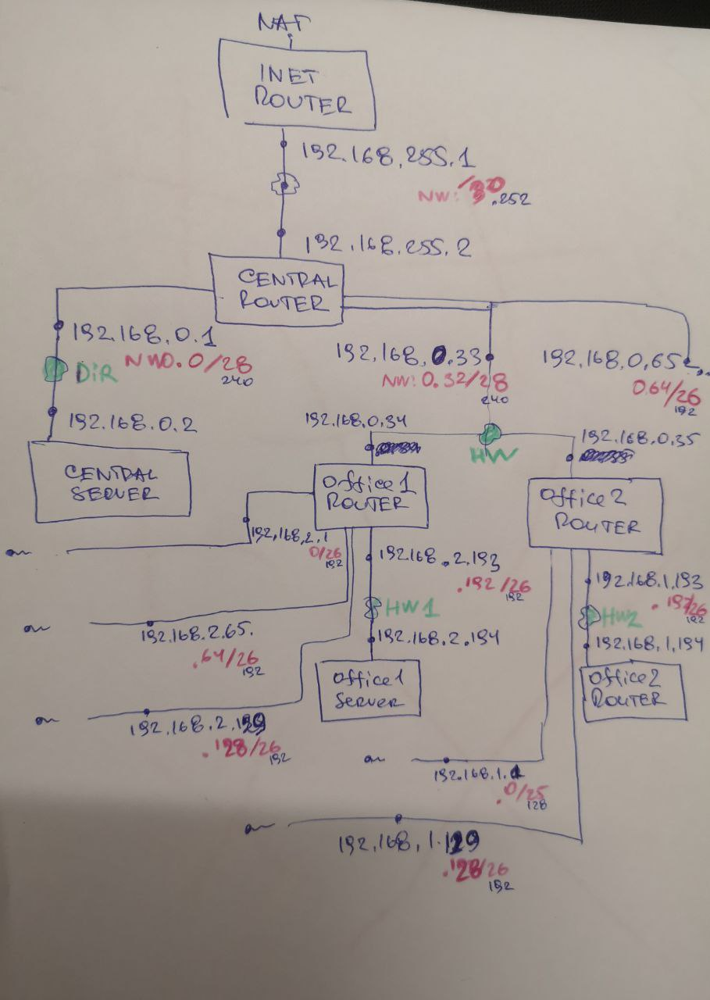
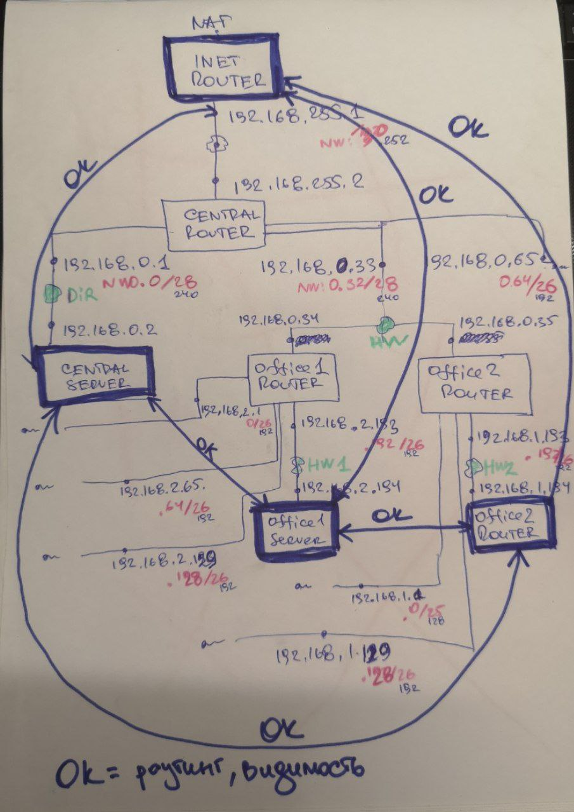

# Архитектура сетей 

Дано Vagrantfile (https://github.com/erlong15/otus-linux/tree/network (ветка network)) с начальным построением сети

* inetRouter
* centralRouter
* centralServer

тестировалось на virtualbox

Построить следующую архитектуру:
* Сеть office1
    * 192.168.2.0/26 - dev
    * 192.168.2.64/26 - test servers
    * 192.168.2.128/26 - managers
    * 192.168.2.192/26 - office hardware
* Сеть office2
    * 192.168.1.0/25 - dev
    * 192.168.1.128/26 - test servers
    * 192.168.1.192/26 - office hardware
* Сеть central
    * 192.168.0.0/28 - directors
    * 192.168.0.32/28 - office hardware
    * 192.168.0.64/26 - wifi

```text
Office1 ---\
            -----> Central --IRouter --> internet
Office2 ---/
```

Итого должны получится следующие сервера:
* inetRouter
* centralRouter
* office1Router
* office2Router
* centralServer
* office1Server
* office2Server

Теоретическая часть:
* Найти свободные подсети (исполнено)
* Посчитать сколько узлов в каждой подсети, включая свободные (исполнено)
* Указать broadcast адрес для каждой подсети (исполнено)
* Проверить нет ли ошибок при разбиении (исполнено)

Практическая часть:
* Соединить офисы в сеть согласно схеме и настроить роутинг (исполнено)
* Все сервера и роутеры должны ходить в инет черз inetRouter ([исполнено](./0XX.md))
* Все сервера должны видеть друг друга (исполнено)

Замечание:
* у всех новых серверов отключить дефолт на нат (eth0), который вагрант поднимает для связи (как?)
* при нехватке сетевых интерфейсов добавить по несколько адресов на интерфейс (мое примечание: при исключающем маскарадинге и реализованной сетевой связности понадобятся новые подсети для выхода в интернет)

Формат сдачи ДЗ - vagrant + ansible
Критерии оценки:
* Статус "Принято" ставится, если сделана хотя бы часть.
* Задание со звездочкой - выполнить всё.

## Теоретическая часть

### Найти свободные подсети

[template]:[Табличный отчет](./026/001_ipcheck/table.md)

[template]:[Скрипт](./026/001_ipcheck/app.py)

[template]:[Лог скрипта](./026/001_ipcheck/report.txt)

### Посчитать сколько узлов в каждой подсети, включая свободные

[template]:[Табличный отчет](./026/002_ipcheck/table.md)

[template]:[Скрипт](./026/002_ipcheck/app.py)

### Указать broadcast адрес для каждой подсети

[template]:[Табличный отчет](./026/003_ipcheck/table.md)

[template]:[Скрипт](./026/003_ipcheck/app.py)

### Проверить нет ли ошибок при разбиении

[template]:[MD-отчет](./026/004_ipcheck/report.md)

[template]:[Скрипт](./026/004_ipcheck/app.py)

[template]:[Лог скрипта](./026/004_ipcheck/report.txt)

## Практическая часть

### Соединить офисы в сеть согласно схеме и настроить роутинг

В исходный [template]:[Vagrantfile](./026/erlong15_vm/Vagrantfile) внес правки

т.к. 

```text
  Bringing machine 'office2Server' up with 'virtualbox' provider...
  ==> inetRouter: Box 'centos/6' could not be found. Attempting to find and install...
      inetRouter: Box Provider: virtualbox
      inetRouter: Box Version: >= 0
  The box 'centos/6' could not be found or
  could not be accessed in the remote catalog. If this is a private
  box on HashiCorp's Vagrant Cloud, please verify you're logged in via
  `vagrant login`. Also, please double-check the name. The expanded
  URL and error message are shown below:
  
  URL: ["https://vagrantcloud.com/centos/6"]
  Error: The requested URL returned error: 404
```

Поменял на centos/7.



Реализованная схема подключения описана в [template]:[Vagrantfile](./026/vm/Vagrantfile)



Задействовал https://github.com/haidaraM/vagrant-to-ansible-inventory

[template]:[импорт vagrant хостов в хосты ansible-inventory](./026/vm/v2a.py)

```shell
pwd
  /home/b/pycharm_projects_2021_2/otus_linux/026/vm

python3 v2a.py -o ../ansible/inventories/hosts
```

В ДЗ я применил хранение настроек в переменной, для однотипной задачи прописывания шлюзов на интерфейсах

[template]:[Параметры шлюзов](026/ansible/roles/routing/vars/main.yml)

Задача, использующая специальную ansible-переменную `inventory_hostname`, "знающую" для какого инвентори-хоста работает в данный момент плейбук.

[template]:[Задача](./026/ansible/roles/routing/tasks/main.yml)

Аналогично в рамках демонстрации работоспособности применит и `loop` и `inventory_hostname` 

[template]:[Задача](./026/ansible/roles/test_001_network_connectivity/tasks/main.yml)

Я отказался от NetworkManager в пользу классики, так как с ним у меня возникли непонятки по маршрутам в NAT

```shell
systemctl stop NetworkManager
systemctl disable NetworkManager
systemctl enable network.service
systemctl start network.service
```

### Ansible

```shell
ansible-playbook playbooks/forwarding-on.yml > ../files/ansible-running/forwarding-on.txt
```
[template]:[forwarding-on.txt](./026/files/ansible-running/forwarding-on.txt)

```shell
ansible-playbook playbooks/routing.yml > ../files/ansible-running/routing.txt
```
[template]:[routing.txt](./026/files/ansible-running/routing.txt)

```shell
ansible-playbook playbooks/internet-router.yml > ../files/ansible-running/internet-router.txt
```
[template]:[internet-router.txt](./026/files/ansible-running/internet-router.txt)

```shell
ansible-playbook playbooks/network-hosts.yml > ../files/ansible-running/network-hosts.txt
```
[template]:[network-hosts.txt](./026/files/ansible-running/network-hosts.txt)

## Проверка работоспособности шлюзов

Выход в Интернет через `inetRouter` я не сделал, но при текщих связях с запрещенным маскарадингом необходимо сделать виртуальную сеть `eth1:0`, например, с адресацией 192.169.0.0. И на `inetRouter` сделать NAT на нее (https://jakeroid.com/ru/blog/nastraivaem-nat-v-linux.html).

Произвожу проверку внутрисетевой связности от "сервера" к "серверу", используя заранее установленный пакет `traceroute`:

```shell
traceroute 192.168.255.1 # internetRouter
traceroute 192.168.255.2 # centralRouter
traceroute 192.168.0.2   # centralServer
traceroute 192.168.2.194 # office1Server
traceroute 192.168.1.194 # office1Server
```

Обернуто в Anible

```shell
ansible-playbook playbooks/test_001_network_connectivity.yml > ../files/ansible-running/test_001_network_connectivity.txt
```

[template]:[ansible test_001_network_connectivity](./026/files/ansible-running/test_001_network_connectivity.txt)

#### inetRouter

[template]:[traceroute 192.168.255.1](./026/files/tests-reports/inetRouter - traceroute 192.168.255.1.txt)

[template]:[traceroute 192.168.255.2](./026/files/tests-reports/inetRouter - traceroute 192.168.255.2.txt)

[template]:[traceroute 192.168.0.2](./026/files/tests-reports/inetRouter - traceroute 192.168.0.2.txt)

[template]:[traceroute 192.168.2.194](./026/files/tests-reports/inetRouter - traceroute 192.168.2.194.txt)

[template]:[traceroute 192.168.1.194](./026/files/tests-reports/inetRouter - traceroute 192.168.1.194.txt)

#### centralRouter

[template]:[traceroute 192.168.255.1](./026/files/tests-reports/centralRouter - traceroute 192.168.255.1.txt)

[template]:[traceroute 192.168.255.2](./026/files/tests-reports/centralRouter - traceroute 192.168.255.2.txt)

[template]:[traceroute 192.168.0.2](./026/files/tests-reports/centralRouter - traceroute 192.168.0.2.txt)

[template]:[traceroute 192.168.2.194](./026/files/tests-reports/centralRouter - traceroute 192.168.2.194.txt)

[template]:[traceroute 192.168.1.194](./026/files/tests-reports/centralRouter - traceroute 192.168.1.194.txt)

#### centralServer

[template]:[traceroute 192.168.255.1](./026/files/tests-reports/centralServer - traceroute 192.168.255.1.txt)

[template]:[traceroute 192.168.255.2](./026/files/tests-reports/centralServer - traceroute 192.168.255.2.txt)

[template]:[traceroute 192.168.0.2](./026/files/tests-reports/centralServer - traceroute 192.168.0.2.txt)

[template]:[traceroute 192.168.2.194](./026/files/tests-reports/centralServer - traceroute 192.168.2.194.txt)

[template]:[traceroute 192.168.1.194](./026/files/tests-reports/centralServer - traceroute 192.168.1.194.txt)

#### office1Router

[template]:[traceroute 192.168.255.1](./026/files/tests-reports/office1Router - traceroute 192.168.255.1.txt)

[template]:[traceroute 192.168.255.2](./026/files/tests-reports/office1Router - traceroute 192.168.255.2.txt)

[template]:[traceroute 192.168.0.2](./026/files/tests-reports/office1Router - traceroute 192.168.0.2.txt)

[template]:[traceroute 192.168.2.194](./026/files/tests-reports/office1Router - traceroute 192.168.2.194.txt)

[template]:[traceroute 192.168.1.194](./026/files/tests-reports/office1Router - traceroute 192.168.1.194.txt)

#### office1Server

[template]:[traceroute 192.168.255.1](./026/files/tests-reports/office1Server - traceroute 192.168.255.1.txt)

[template]:[traceroute 192.168.255.2](./026/files/tests-reports/office1Server - traceroute 192.168.255.2.txt)

[template]:[traceroute 192.168.0.2](./026/files/tests-reports/office1Server - traceroute 192.168.0.2.txt)

[template]:[traceroute 192.168.2.194](./026/files/tests-reports/office1Server - traceroute 192.168.2.194.txt)

[template]:[traceroute 192.168.1.194](./026/files/tests-reports/office1Server - traceroute 192.168.1.194.txt)

#### office2Router

[template]:[traceroute 192.168.255.1](./026/files/tests-reports/office2Router - traceroute 192.168.255.1.txt)

[template]:[traceroute 192.168.255.2](./026/files/tests-reports/office2Router - traceroute 192.168.255.2.txt)

[template]:[traceroute 192.168.0.2](./026/files/tests-reports/office2Router - traceroute 192.168.0.2.txt)

[template]:[traceroute 192.168.2.194](./026/files/tests-reports/office2Router - traceroute 192.168.2.194.txt)

[template]:[traceroute 192.168.1.194](./026/files/tests-reports/office2Router - traceroute 192.168.1.194.txt)

#### office2Server

[template]:[traceroute 192.168.255.1](./026/files/tests-reports/office2Server - traceroute 192.168.255.1.txt)

[template]:[traceroute 192.168.255.2](./026/files/tests-reports/office2Server - traceroute 192.168.255.2.txt)

[template]:[traceroute 192.168.0.2](./026/files/tests-reports/office2Server - traceroute 192.168.0.2.txt)

[template]:[traceroute 192.168.2.194](./026/files/tests-reports/office2Server - traceroute 192.168.2.194.txt)

[template]:[traceroute 192.168.1.194](./026/files/tests-reports/office2Server - traceroute 192.168.1.194.txt)

