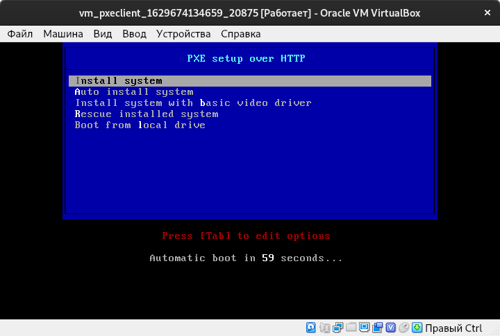
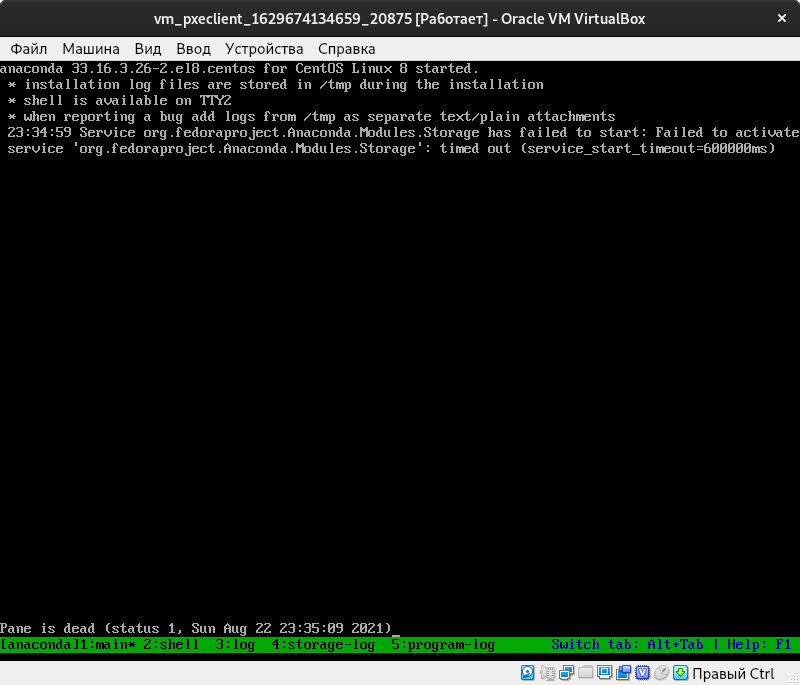

# Настройка PXE сервера для автоматической установки

Цель:

Отрабатываем навыки установки и настройки DHCP, TFTP, PXE загрузчика и автоматической загрузки

* Следуя шагам из документа https://docs.centos.org/en-US/8-docs/advanced-install/assembly_preparing-for-a-network-install установить и настроить загрузку по сети для дистрибутива CentOS8. В качестве шаблона воспользуйтесь репозиторием https://github.com/nixuser/virtlab/tree/main/centos_pxe.
* Поменять установку из репозитория NFS на установку из репозитория HTTP.
* Настроить автоматическую установку для созданного kickstart файла (*) Файл загружается по HTTP.
* \* автоматизировать процесс установки Cobbler, cледуя шагам из документа https://cobbler.github.io/quickstart/.

Формат сдачи ДЗ - vagrant + ansible
Критерии оценки:

* Ссылка на репозиторий github.
* Vagrantfile с шагами установки необходимых компонентов
* Исходный код scripts для настройки сервера (если необходимо)
* Если какие-то шаги невозможно или сложно автоматизировать, то инструкции по ручным шагам для настройки

Рекомендуем сдать до: 09.08.2021

##  Исполнение

Замечание: разворачивание инфраструктуры необходимо производить поэтапно, а именно сначала запусить и настроить `pxeserver`, а уже потом запускать `pxeclient`, иначе `pxeclient` не даст нормально завершиться инструкциям `Vagrantfile`, так как будет ожидать установку по LAN, которая не возможна, так как сам `pxeserver` еще не настроен.

[Vagrantfile](./027_tobe/vm/Vagrantfile)

<details><summary>см. Vagrantfile</summary>

```properties
# -*- mode: ruby -*-
# vi: set ft=ruby :

Vagrant.configure("2") do |config|

    config.vm.define "pxeserver" do |server|
        config.vm.box = 'centos/8.2'
        config.vm.box_url = 'https://cloud.centos.org/centos/8/x86_64/images/CentOS-8-Vagrant-8.2.2004-20200611.2.x86_64.vagrant-virtualbox.box'
        config.vm.box_download_checksum = '698b0d9c6c3f31a4fd1c655196a5f7fc224434112753ab6cb3218493a86202de'
        config.vm.box_download_checksum_type = 'sha256'
        config.gatling.rsync_on_startup = false

        server.vm.host_name = 'pxeserver'
        server.vm.network :private_network,
                         ip: "10.0.0.20",
                         virtualbox__intnet: 'pxenet'

        # server.vm.network "forwarded_port", guest: 80, host: 8081

        server.vm.provider "virtualbox" do |vb|
            vb.memory = "1024"
            vb.customize ["modifyvm", :id, "--natdnshostresolver1", "on"]
        end

        # config.vm.network "forwarded_port", guest: 80, host: 8888

        # ENABLE to setup PXE
        # server.vm.provision "shell",
        #  name: "Setup PXE server",
        #  path: "setup_pxe.sh"
        # end
    end

    # Cent OS 8.2
    # config used from this
    # https://github.com/eoli3n/vagrant-pxe/blob/master/client/Vagrantfile
    config.vm.define "pxeclient" do |pxeclient|
        pxeclient.vm.box = 'centos/7'                       # <------ изначально стоит Сentos 7
        pxeclient.vm.host_name = 'pxeclient'
        pxeclient.vm.network :private_network, ip: "10.0.0.21"
        pxeclient.vm.provider :virtualbox do |vb|
            vb.memory = "2048"
            vb.customize ["modifyvm", :id, "--natdnshostresolver1", "on"]
            vb.customize [
                'modifyvm', :id,
                '--nic1', 'intnet',
                '--intnet1', 'pxenet',
                '--nic2', 'nat',
                '--boot1', 'net',
                '--boot2', 'none',
                '--boot3', 'none',
                '--boot4', 'none'
            ]
        end
    end

end

```

</details>


Из-за больших ISO сам Vagrant предложил добавить `config.gatling.rsync_on_startup = false`, а также применить `ansible_ssh_transfer_method=scp`.

```shell
vagrant up pxeserver
...
```

Теперь настраиваем `pxeserver`

```shell
ansible-playbook playbooks/pxeserver.yml --tags dhcpd.conf
```

[лог](./027_tobe/files/ansible-pxeserver.txt)

<details><summary>см. лог</summary>

```properties

PLAY [Playbook of "PXE server"] *************************************************************************************************************************************************

TASK [Gathering Facts] **********************************************************************************************************************************************************
ok: [pxeserver]

TASK [../roles/pxeserver : Install EPEL Repo package from standart repo] ********************************************************************************************************
changed: [pxeserver]

TASK [../roles/pxeserver : Install DHCP-server] *********************************************************************************************************************************
changed: [pxeserver]

TASK [../roles/pxeserver : Install tftp-server] *********************************************************************************************************************************
changed: [pxeserver]

TASK [../roles/pxeserver : Install nfs-utils] ***********************************************************************************************************************************
ok: [pxeserver]

TASK [../roles/pxeserver : Install nginx] ***************************************************************************************************************************************
changed: [pxeserver]

TASK [../roles/pxeserver : Configure nginx] *************************************************************************************************************************************
changed: [pxeserver]

TASK [../roles/pxeserver : Firewall and SELinix configure] **********************************************************************************************************************
changed: [pxeserver]

TASK [../roles/pxeserver : Burn /etc/dhcp/dhcpd.conf] ***************************************************************************************************************************
changed: [pxeserver]

TASK [../roles/pxeserver : Install syslinux-tftpboot.noarch] ********************************************************************************************************************
changed: [pxeserver]

TASK [../roles/pxeserver : Create pxelinux cfg dir] *****************************************************************************************************************************
changed: [pxeserver]

TASK [../roles/pxeserver : Burn pxelinux.0] *************************************************************************************************************************************
changed: [pxeserver]

TASK [../roles/pxeserver : Burn libutil.c32] ************************************************************************************************************************************
changed: [pxeserver]

TASK [../roles/pxeserver : Burn menu.c32] ***************************************************************************************************************************************
changed: [pxeserver]

TASK [../roles/pxeserver : Burn libmenu.c32] ************************************************************************************************************************************
changed: [pxeserver]

TASK [../roles/pxeserver : Burn ldlinux.c32] ************************************************************************************************************************************
changed: [pxeserver]

TASK [../roles/pxeserver : Burn vesamenu.c32] ***********************************************************************************************************************************
changed: [pxeserver]

TASK [../roles/pxeserver : Burn pxelinux.cfg/default] ***************************************************************************************************************************
changed: [pxeserver]

TASK [../roles/pxeserver : Burn initrd.img] *************************************************************************************************************************************
changed: [pxeserver]

TASK [../roles/pxeserver : Burn vmlinuz] ****************************************************************************************************************************************
changed: [pxeserver]

TASK [../roles/pxeserver : Burn image.iso] **************************************************************************************************************************************
changed: [pxeserver]

TASK [../roles/pxeserver : Mount `dvd.iso` image] *******************************************************************************************************************************
changed: [pxeserver]

TASK [../roles/pxeserver : Burn boot.iso] ***************************************************************************************************************************************
changed: [pxeserver]

TASK [../roles/pxeserver : Mount `boot.iso` image] ******************************************************************************************************************************
changed: [pxeserver]

TASK [../roles/pxeserver : Burn ks.cfg] *****************************************************************************************************************************************
changed: [pxeserver]

TASK [../roles/pxeserver : Mount `dvd.iso` image] *******************************************************************************************************************************
changed: [pxeserver]

TASK [../roles/pxeserver : Bump] ************************************************************************************************************************************************
changed: [pxeserver]

RUNNING HANDLER [../roles/pxeserver : systemctl-restart-dhcpd] ******************************************************************************************************************
changed: [pxeserver]

RUNNING HANDLER [../roles/pxeserver : systemctl-restart-nfs-server] *************************************************************************************************************
changed: [pxeserver]

RUNNING HANDLER [../roles/pxeserver : start nginx] ******************************************************************************************************************************
changed: [pxeserver]

RUNNING HANDLER [../roles/pxeserver : restart nginx] ****************************************************************************************************************************
changed: [pxeserver]

PLAY RECAP **********************************************************************************************************************************************************************
pxeserver                  : ok=31   changed=29   unreachable=0    failed=0    skipped=0    rescued=0    ignored=0
```

</details>


Производим первичную проверку доступности файлов, в том числе по сети (`http://127.0.0.1`, `/http://10.0.0.20`).

```shell
ansible-playbook playbooks/pxeserver_test.yml
```

[лог](./027_tobe/files/ansible-pxeserver_test.txt)

<details><summary>см. лог</summary>

```properties

PLAY [Playbook of "PXE server"] *************************************************************************************************************************************************

TASK [Gathering Facts] **********************************************************************************************************************************************************
ok: [pxeserver]

TASK [../roles/pxeserver_test : check files available at local] *****************************************************************************************************************
changed: [pxeserver] => (item=/usr/share/nginx/html/pxelinux.0)
changed: [pxeserver] => (item=/usr/share/nginx/html/libutil.c32)
changed: [pxeserver] => (item=/usr/share/nginx/html/menu.c32)
changed: [pxeserver] => (item=/usr/share/nginx/html/libmenu.c32)
changed: [pxeserver] => (item=/usr/share/nginx/html/ldlinux.c32)
changed: [pxeserver] => (item=/usr/share/nginx/html/vesamenu.c32)
changed: [pxeserver] => (item=/usr/share/nginx/html/exports)
changed: [pxeserver] => (item=/usr/share/nginx/html/pxelinux.cfg/default)
changed: [pxeserver] => (item=/usr/share/nginx/html/centos8-install/LICENSE)
changed: [pxeserver] => (item=/usr/share/nginx/html/cfg/ks.cfg)
changed: [pxeserver] => (item=/usr/share/nginx/html/images/CentOS-8/initrd.img)
changed: [pxeserver] => (item=/usr/share/nginx/html/images/CentOS-8/vmlinuz)

TASK [../roles/pxeserver_test : check pages available on http://127.0.0.1/] *****************************************************************************************************
ok: [pxeserver] => (item=pxelinux.0)
ok: [pxeserver] => (item=libutil.c32)
ok: [pxeserver] => (item=menu.c32)
ok: [pxeserver] => (item=libmenu.c32)
ok: [pxeserver] => (item=ldlinux.c32)
ok: [pxeserver] => (item=vesamenu.c32)
ok: [pxeserver] => (item=exports)
ok: [pxeserver] => (item=pxelinux.cfg/default)
ok: [pxeserver] => (item=centos8-install/LICENSE)
ok: [pxeserver] => (item=cfg/ks.cfg)
ok: [pxeserver] => (item=images/CentOS-8/initrd.img)
ok: [pxeserver] => (item=images/CentOS-8/vmlinuz)

TASK [../roles/pxeserver_test : check pages available on http://10.0.0.20/] *****************************************************************************************************
ok: [pxeserver] => (item=pxelinux.0)
ok: [pxeserver] => (item=libutil.c32)
ok: [pxeserver] => (item=menu.c32)
ok: [pxeserver] => (item=libmenu.c32)
ok: [pxeserver] => (item=ldlinux.c32)
ok: [pxeserver] => (item=vesamenu.c32)
ok: [pxeserver] => (item=exports)
ok: [pxeserver] => (item=pxelinux.cfg/default)
ok: [pxeserver] => (item=centos8-install/LICENSE)
ok: [pxeserver] => (item=cfg/ks.cfg)
ok: [pxeserver] => (item=images/CentOS-8/initrd.img)
ok: [pxeserver] => (item=images/CentOS-8/vmlinuz)

TASK [../roles/pxeserver_test : check files content] ****************************************************************************************************************************
changed: [pxeserver] => (item=/usr/share/nginx/html/exports)
changed: [pxeserver] => (item=/usr/share/nginx/html/pxelinux.cfg/default)
changed: [pxeserver] => (item=/usr/share/nginx/html/cfg/ks.cfg)

TASK [../roles/pxeserver_test : check files content] ****************************************************************************************************************************
ok: [pxeserver] => (item={'cmd': ['/bin/cat', '/usr/share/nginx/html/exports'], 'stdout': 'http://10.0.0.20//centos8-install *(ro)\nhttp://10.0.0.20//centos8-autoinstall *(ro)\nhttp://10.0.0.20/ *(ro)', 'stderr': '', 'rc': 0, 'start': '2021-08-22 23:00:20.146268', 'end': '2021-08-22 23:00:20.153406', 'delta': '0:00:00.007138', 'changed': True, 'invocation': {'module_args': {'_raw_params': '/bin/cat /usr/share/nginx/html/exports', '_uses_shell': False, 'warn': False, 'stdin_add_newline': True, 'strip_empty_ends': True, 'argv': None, 'chdir': None, 'executable': None, 'creates': None, 'removes': None, 'stdin': None}}, 'stdout_lines': ['http://10.0.0.20//centos8-install *(ro)', 'http://10.0.0.20//centos8-autoinstall *(ro)', 'http://10.0.0.20/ *(ro)'], 'stderr_lines': [], 'failed': False, 'item': '/usr/share/nginx/html/exports', 'ansible_loop_var': 'item'}) => {
    "msg": [
        "http://10.0.0.20//centos8-install *(ro)",
        "http://10.0.0.20//centos8-autoinstall *(ro)",
        "http://10.0.0.20/ *(ro)"
    ]
}
ok: [pxeserver] => (item={'cmd': ['/bin/cat', '/usr/share/nginx/html/pxelinux.cfg/default'], 'stdout': '\ndefault menu\nprompt 0\ntimeout 600\n\nMENU TITLE Demo PXE setup\n\nLABEL linux\n  menu label ^Install system\n  menu default\n  kernel images/CentOS-8/vmlinuz\n  append initrd=images/CentOS-8/initrd.img ip=enp0s3:dhcp inst.repo=http://10.0.0.20/centos8-install\nLABEL linux-auto\n  menu label ^Auto install system\n  kernel images/CentOS-8/vmlinuz\n  append initrd=images/CentOS-8/initrd.img ip=enp0s3:dhcp inst.ks=http://10.0.0.20/cfg/ks.cfg inst.repo=http://10.0.0.20/centos8-autoinstall\nLABEL vesa\n  menu label Install system with ^basic video driver\n  kernel images/CentOS-8/vmlinuz\n  append initrd=images/CentOS-8/initrd.img ip=dhcp inst.xdriver=vesa nomodeset\nLABEL rescue\n  menu label ^Rescue installed system\n  kernel images/CentOS-8/vmlinuz\n  append initrd=images/CentOS-8/initrd.img rescue\nLABEL local\n  menu label Boot from ^local drive\n  localboot 0xffff', 'stderr': '', 'rc': 0, 'start': '2021-08-22 23:00:20.890674', 'end': '2021-08-22 23:00:20.897365', 'delta': '0:00:00.006691', 'changed': True, 'invocation': {'module_args': {'_raw_params': '/bin/cat /usr/share/nginx/html/pxelinux.cfg/default', '_uses_shell': False, 'warn': False, 'stdin_add_newline': True, 'strip_empty_ends': True, 'argv': None, 'chdir': None, 'executable': None, 'creates': None, 'removes': None, 'stdin': None}}, 'stdout_lines': ['', 'default menu', 'prompt 0', 'timeout 600', '', 'MENU TITLE Demo PXE setup', '', 'LABEL linux', '  menu label ^Install system', '  menu default', '  kernel images/CentOS-8/vmlinuz', '  append initrd=images/CentOS-8/initrd.img ip=enp0s3:dhcp inst.repo=http://10.0.0.20/centos8-install', 'LABEL linux-auto', '  menu label ^Auto install system', '  kernel images/CentOS-8/vmlinuz', '  append initrd=images/CentOS-8/initrd.img ip=enp0s3:dhcp inst.ks=http://10.0.0.20/cfg/ks.cfg inst.repo=http://10.0.0.20/centos8-autoinstall', 'LABEL vesa', '  menu label Install system with ^basic video driver', '  kernel images/CentOS-8/vmlinuz', '  append initrd=images/CentOS-8/initrd.img ip=dhcp inst.xdriver=vesa nomodeset', 'LABEL rescue', '  menu label ^Rescue installed system', '  kernel images/CentOS-8/vmlinuz', '  append initrd=images/CentOS-8/initrd.img rescue', 'LABEL local', '  menu label Boot from ^local drive', '  localboot 0xffff'], 'stderr_lines': [], 'failed': False, 'item': '/usr/share/nginx/html/pxelinux.cfg/default', 'ansible_loop_var': 'item'}) => {
    "msg": [
        "",
        "default menu",
        "prompt 0",
        "timeout 600",
        "",
        "MENU TITLE Demo PXE setup",
        "",
        "LABEL linux",
        "  menu label ^Install system",
        "  menu default",
        "  kernel images/CentOS-8/vmlinuz",
        "  append initrd=images/CentOS-8/initrd.img ip=enp0s3:dhcp inst.repo=http://10.0.0.20/centos8-install",
        "LABEL linux-auto",
        "  menu label ^Auto install system",
        "  kernel images/CentOS-8/vmlinuz",
        "  append initrd=images/CentOS-8/initrd.img ip=enp0s3:dhcp inst.ks=http://10.0.0.20/cfg/ks.cfg inst.repo=http://10.0.0.20/centos8-autoinstall",
        "LABEL vesa",
        "  menu label Install system with ^basic video driver",
        "  kernel images/CentOS-8/vmlinuz",
        "  append initrd=images/CentOS-8/initrd.img ip=dhcp inst.xdriver=vesa nomodeset",
        "LABEL rescue",
        "  menu label ^Rescue installed system",
        "  kernel images/CentOS-8/vmlinuz",
        "  append initrd=images/CentOS-8/initrd.img rescue",
        "LABEL local",
        "  menu label Boot from ^local drive",
        "  localboot 0xffff"
    ]
}
ok: [pxeserver] => (item={'cmd': ['/bin/cat', '/usr/share/nginx/html/cfg/ks.cfg'], 'stdout': '#version=RHEL8\nignoredisk --only-use=sda\nautopart --type=lvm\n# Partition clearing information\nclearpart --all --initlabel --drives=sda\n# Use graphical install\ngraphical\n# Keyboard layouts\nkeyboard --vckeymap=us --xlayouts=\'us\'\n# System language\nlang en_US.UTF-8\n#repo\n#url --url=http://ftp.mgts.by/pub/CentOS/${centos_version}/BaseOS/x86_64/os/\n# Network information\nnetwork  --bootproto=dhcp --device=enp0s3 --ipv6=auto --activate\nnetwork  --bootproto=dhcp --device=enp0s8 --onboot=off --ipv6=auto --activate\nnetwork  --hostname=localhost.localdomain\n# Root password\nrootpw --iscrypted $6$g4WYvaAf1mNKnqjY$w2MtZxP/Yj6MYQOhPXS2rJlYT200DcBQC5KGWQ8gG32zASYYLUzoONIYVdRAr4tu/GbtB48.dkif.1f25pqeh.\n# Run the Setup Agent on first boot\nfirstboot --enable\n# Do not configure the X Window System\nskipx\n# System services\nservices --enabled="chronyd"\n# System timezone\ntimezone America/New_York --isUtc\nuser --groups=wheel --name=val --password=$6$ihX1bMEoO3TxaCiL$OBDSCuY.EpqPmkFmMPVvI3JZlCVRfC4Nw6oUoPG0RGuq2g5BjQBKNboPjM44.0lJGBc7OdWlL17B3qzgHX2v// --iscrypted --gecos="val"\n%packages\n@^minimal-environment\nkexec-tools\n%end\n%addon com_redhat_kdump --enable --reserve-mb=\'auto\'\n%end\n%anaconda\npwpolicy root --minlen=6 --minquality=1 --notstrict --nochanges --notempty\npwpolicy user --minlen=6 --minquality=1 --notstrict --nochanges --emptyok\npwpolicy luks --minlen=6 --minquality=1 --notstrict --nochanges --notempty\n%end', 'stderr': '', 'rc': 0, 'start': '2021-08-22 23:00:21.653388', 'end': '2021-08-22 23:00:21.659632', 'delta': '0:00:00.006244', 'changed': True, 'invocation': {'module_args': {'_raw_params': '/bin/cat /usr/share/nginx/html/cfg/ks.cfg', '_uses_shell': False, 'warn': False, 'stdin_add_newline': True, 'strip_empty_ends': True, 'argv': None, 'chdir': None, 'executable': None, 'creates': None, 'removes': None, 'stdin': None}}, 'stdout_lines': ['#version=RHEL8', 'ignoredisk --only-use=sda', 'autopart --type=lvm', '# Partition clearing information', 'clearpart --all --initlabel --drives=sda', '# Use graphical install', 'graphical', '# Keyboard layouts', "keyboard --vckeymap=us --xlayouts='us'", '# System language', 'lang en_US.UTF-8', '#repo', '#url --url=http://ftp.mgts.by/pub/CentOS/${centos_version}/BaseOS/x86_64/os/', '# Network information', 'network  --bootproto=dhcp --device=enp0s3 --ipv6=auto --activate', 'network  --bootproto=dhcp --device=enp0s8 --onboot=off --ipv6=auto --activate', 'network  --hostname=localhost.localdomain', '# Root password', 'rootpw --iscrypted $6$g4WYvaAf1mNKnqjY$w2MtZxP/Yj6MYQOhPXS2rJlYT200DcBQC5KGWQ8gG32zASYYLUzoONIYVdRAr4tu/GbtB48.dkif.1f25pqeh.', '# Run the Setup Agent on first boot', 'firstboot --enable', '# Do not configure the X Window System', 'skipx', '# System services', 'services --enabled="chronyd"', '# System timezone', 'timezone America/New_York --isUtc', 'user --groups=wheel --name=val --password=$6$ihX1bMEoO3TxaCiL$OBDSCuY.EpqPmkFmMPVvI3JZlCVRfC4Nw6oUoPG0RGuq2g5BjQBKNboPjM44.0lJGBc7OdWlL17B3qzgHX2v// --iscrypted --gecos="val"', '%packages', '@^minimal-environment', 'kexec-tools', '%end', "%addon com_redhat_kdump --enable --reserve-mb='auto'", '%end', '%anaconda', 'pwpolicy root --minlen=6 --minquality=1 --notstrict --nochanges --notempty', 'pwpolicy user --minlen=6 --minquality=1 --notstrict --nochanges --emptyok', 'pwpolicy luks --minlen=6 --minquality=1 --notstrict --nochanges --notempty', '%end'], 'stderr_lines': [], 'failed': False, 'item': '/usr/share/nginx/html/cfg/ks.cfg', 'ansible_loop_var': 'item'}) => {
    "msg": [
        "#version=RHEL8",
        "ignoredisk --only-use=sda",
        "autopart --type=lvm",
        "# Partition clearing information",
        "clearpart --all --initlabel --drives=sda",
        "# Use graphical install",
        "graphical",
        "# Keyboard layouts",
        "keyboard --vckeymap=us --xlayouts='us'",
        "# System language",
        "lang en_US.UTF-8",
        "#repo",
        "#url --url=http://ftp.mgts.by/pub/CentOS/${centos_version}/BaseOS/x86_64/os/",
        "# Network information",
        "network  --bootproto=dhcp --device=enp0s3 --ipv6=auto --activate",
        "network  --bootproto=dhcp --device=enp0s8 --onboot=off --ipv6=auto --activate",
        "network  --hostname=localhost.localdomain",
        "# Root password",
        "rootpw --iscrypted $6$g4WYvaAf1mNKnqjY$w2MtZxP/Yj6MYQOhPXS2rJlYT200DcBQC5KGWQ8gG32zASYYLUzoONIYVdRAr4tu/GbtB48.dkif.1f25pqeh.",
        "# Run the Setup Agent on first boot",
        "firstboot --enable",
        "# Do not configure the X Window System",
        "skipx",
        "# System services",
        "services --enabled=\"chronyd\"",
        "# System timezone",
        "timezone America/New_York --isUtc",
        "user --groups=wheel --name=val --password=$6$ihX1bMEoO3TxaCiL$OBDSCuY.EpqPmkFmMPVvI3JZlCVRfC4Nw6oUoPG0RGuq2g5BjQBKNboPjM44.0lJGBc7OdWlL17B3qzgHX2v// --iscrypted --gecos=\"val\"",
        "%packages",
        "@^minimal-environment",
        "kexec-tools",
        "%end",
        "%addon com_redhat_kdump --enable --reserve-mb='auto'",
        "%end",
        "%anaconda",
        "pwpolicy root --minlen=6 --minquality=1 --notstrict --nochanges --notempty",
        "pwpolicy user --minlen=6 --minquality=1 --notstrict --nochanges --emptyok",
        "pwpolicy luks --minlen=6 --minquality=1 --notstrict --nochanges --notempty",
        "%end"
    ]
}

PLAY RECAP **********************************************************************************************************************************************************************
pxeserver                  : ok=6    changed=2    unreachable=0    failed=0    skipped=0    rescued=0    ignored=0


```

</details>


Некоторые файлы проекта

[dhcpd.conf](./027_tobe/ansible/roles/pxeserver/files/etc/dhcp/dhcpd.conf)

<details><summary>см. dhcpd.conf</summary>

```properties
option space pxelinux;
option pxelinux.magic code 208 = string;
option pxelinux.configfile code 209 = text;
option pxelinux.pathprefix code 210 = text;
option pxelinux.reboottime code 211 = unsigned integer 32;
option architecture-type code 93 = unsigned integer 16;

subnet 10.0.0.0 netmask 255.255.255.0 {
	#option routers 10.0.0.254;
	range 10.0.0.100 10.0.0.120;

	class "pxeclients" {
	  match if substring (option vendor-class-identifier, 0, 9) = "PXEClient";
	  next-server 10.0.0.20;

	  if option architecture-type = 00:07 {
	    filename "uefi/shim.efi";
      } else {
        #  filename "pxelinux/pxelinux.0";
	    filename "http://10.0.0.20/pxelinux.0";
	  }
	}
}
```

</details>


[ks.cfg](./027_tobe/ansible/roles/pxeserver/files/home/vagrant/cfg/ks.cfg)

<details><summary>см. ks.cfg</summary>

```properties
#version=RHEL8
ignoredisk --only-use=sda
autopart --type=lvm
# Partition clearing information
clearpart --all --initlabel --drives=sda
# Use graphical install
graphical
# Keyboard layouts
keyboard --vckeymap=us --xlayouts='us'
# System language
lang en_US.UTF-8
#repo
#url --url=http://ftp.mgts.by/pub/CentOS/${centos_version}/BaseOS/x86_64/os/
# Network information
network  --bootproto=dhcp --device=enp0s3 --ipv6=auto --activate
network  --bootproto=dhcp --device=enp0s8 --onboot=off --ipv6=auto --activate
network  --hostname=localhost.localdomain
# Root password
rootpw --iscrypted $6$g4WYvaAf1mNKnqjY$w2MtZxP/Yj6MYQOhPXS2rJlYT200DcBQC5KGWQ8gG32zASYYLUzoONIYVdRAr4tu/GbtB48.dkif.1f25pqeh.
# Run the Setup Agent on first boot
firstboot --enable
# Do not configure the X Window System
skipx
# System services
services --enabled="chronyd"
# System timezone
timezone America/New_York --isUtc
user --groups=wheel --name=val --password=$6$ihX1bMEoO3TxaCiL$OBDSCuY.EpqPmkFmMPVvI3JZlCVRfC4Nw6oUoPG0RGuq2g5BjQBKNboPjM44.0lJGBc7OdWlL17B3qzgHX2v// --iscrypted --gecos="val"
%packages
@^minimal-environment
kexec-tools
%end
%addon com_redhat_kdump --enable --reserve-mb='auto'
%end
%anaconda
pwpolicy root --minlen=6 --minquality=1 --notstrict --nochanges --notempty
pwpolicy user --minlen=6 --minquality=1 --notstrict --nochanges --emptyok
pwpolicy luks --minlen=6 --minquality=1 --notstrict --nochanges --notempty
%end
```

</details>


[pxelinux.cfg/default](./027_tobe/ansible/roles/pxeserver/files/var/lib/tftpboot/pxelinux/pxelinux.cfg/default)

<details><summary>см. pxelinux.cfg/default</summary>

```properties

default menu
prompt 0
timeout 600

MENU TITLE PXE setup over HTTP

LABEL linux
  menu label ^Install system
  menu default
  kernel images/CentOS-8/vmlinuz
  append initrd=images/CentOS-8/initrd.img ip=enp0s3:dhcp inst.repo=http://10.0.0.20/centos8-install
LABEL linux-auto
  menu label ^Auto install system
  kernel images/CentOS-8/vmlinuz
  append initrd=images/CentOS-8/initrd.img ip=enp0s3:dhcp inst.ks=http://10.0.0.20/cfg/ks.cfg inst.repo=http://10.0.0.20/centos8-autoinstall
LABEL vesa
  menu label Install system with ^basic video driver
  kernel images/CentOS-8/vmlinuz
  append initrd=images/CentOS-8/initrd.img ip=dhcp inst.xdriver=vesa nomodeset
LABEL rescue
  menu label ^Rescue installed system
  kernel images/CentOS-8/vmlinuz
  append initrd=images/CentOS-8/initrd.img rescue
LABEL local
  menu label Boot from ^local drive
  localboot 0xffff
```

</details>


```shell
vagrant up pxeclient
```

Экран выВОДА



Успешно 


И что-то не пошло оно дальше, почему? 


