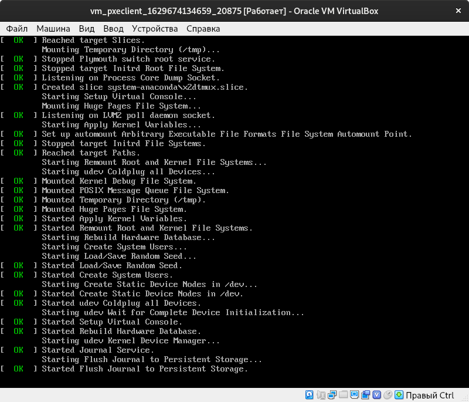
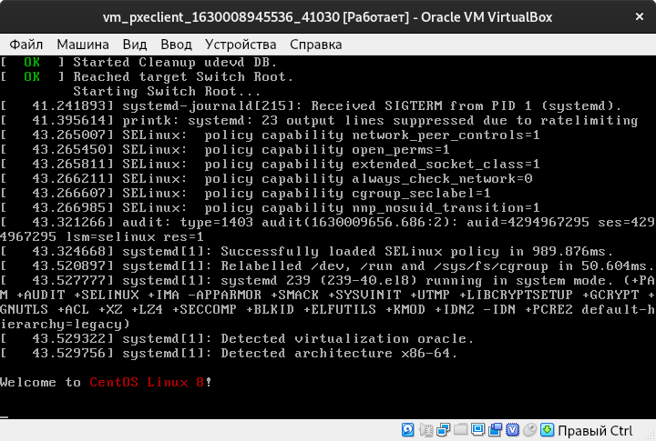
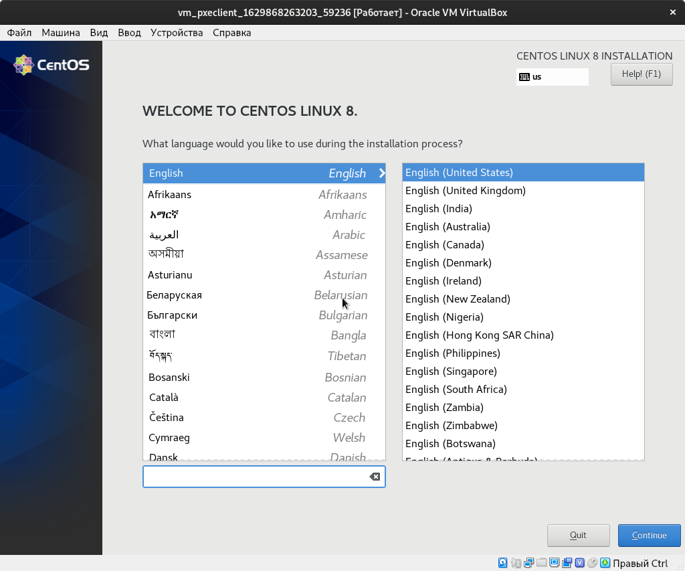
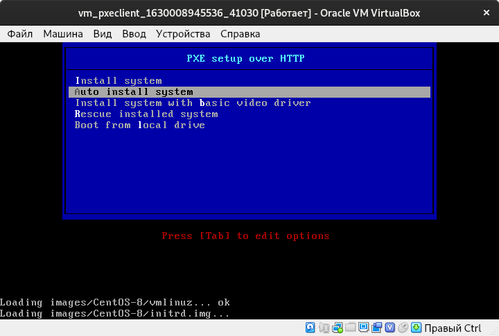
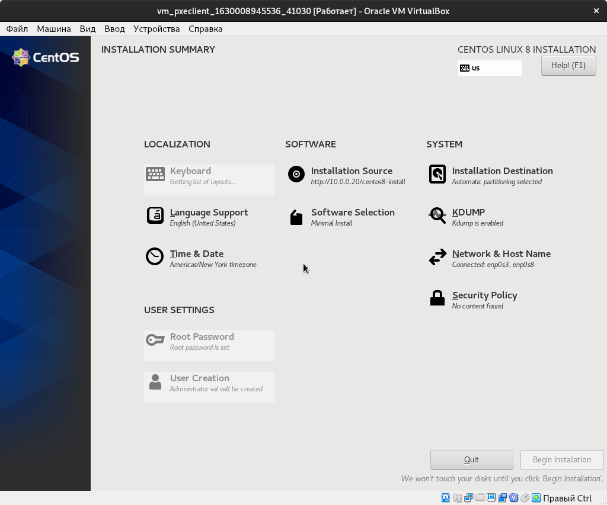
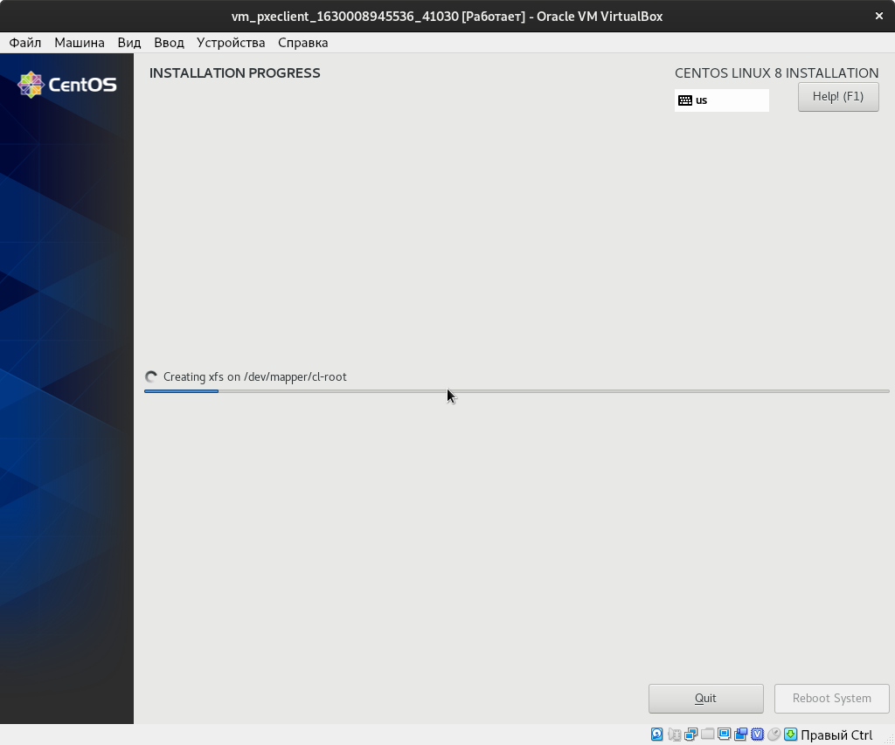
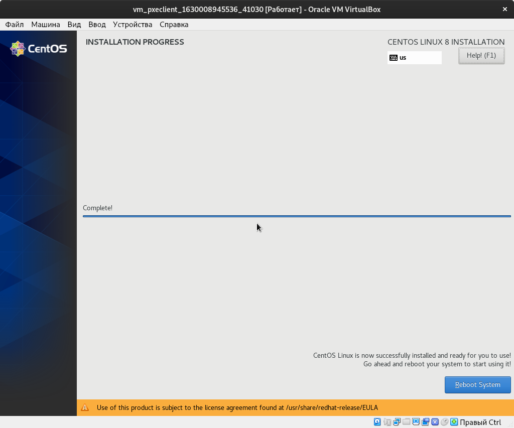

# Настройка PXE сервера для автоматической установки

Цель:

Отрабатываем навыки установки и настройки DHCP, TFTP, PXE загрузчика и автоматической загрузки

* Следуя шагам из документа https://docs.centos.org/en-US/8-docs/advanced-install/assembly_preparing-for-a-network-install установить и настроить загрузку по сети для дистрибутива CentOS8. В качестве шаблона воспользуйтесь репозиторием https://github.com/nixuser/virtlab/tree/main/centos_pxe.
* Поменять установку из репозитория NFS на установку из репозитория HTTP.
* Настроить автоматическую установку для созданного kickstart файла (*) Файл загружается по HTTP.
* \* автоматизировать процесс установки Cobbler, cледуя шагам из документа https://cobbler.github.io/quickstart/.

Формат сдачи ДЗ - [Vagrantfile](./027_tobe/vm/Vagrantfile) + [Ansible](./027_tobe/ansible/roles/pxeserver/tasks/main.yml)
Критерии оценки:

* Ссылка на репозиторий github.
* Vagrantfile с шагами установки необходимых компонентов
* Исходный код scripts для настройки сервера (если необходимо)
* Если какие-то шаги невозможно или сложно автоматизировать, то инструкции по ручным шагам для настройки

Рекомендуем сдать до: 09.08.2021

##  Исполнение
Замечание: пример выглядит так, как будто все заранее скачано (*.iso, *.c32). Все необходимое есть в этом репозитории (вместо dvd.iso взял minimal.iso). Откуда качать - есть в конце. Из-за слабого канала я не могу написать онлайн ansible скачивальщик-установщик. 

Необходимо самостоятельно скачать, так как GitHub не хочет большие файлы
* [initrd.img](http://ftp.mgts.by/pub/CentOS/8.3.2011/BaseOS/x86_64/os/images/pxeboot/initrd.img)
* [minimal.iso](http://ftp.mgts.by/pub/CentOS/8.3.2011/isos/x86_64/CentOS-8.3.2011-x86_64-minimal.iso)

Замечание: разворачивание инфраструктуры необходимо производить поэтапно, а именно сначала запусить и настроить `pxeserver`, а уже потом запускать `pxeclient`, иначе `pxeclient` не даст нормально завершиться инструкциям `Vagrantfile`, так как будет ожидать установку по LAN, которая не возможна, так как сам `pxeserver` еще не настроен.

[template]:[Vagrantfile](./027_tobe/vm/Vagrantfile)

Из-за больших ISO сам Vagrant предложил добавить `config.gatling.rsync_on_startup = false`, а также применить `ansible_ssh_transfer_method=scp`.

```shell
vagrant up pxeserver
```

Теперь настраиваем `pxeserver`

```shell
ansible-playbook playbooks/pxeserver.yml  > ../files/ansible-pxeserver.log 
```

[template]:[ansible-pxeserver.log ](./027_tobe/files/ansible-pxeserver.log)

Производим первичную проверку доступности файлов, в том числе по сети (`http://127.0.0.1`, `http://10.0.0.20`).

```shell
ansible-playbook playbooks/pxeserver_test.yml > ../files/ansible-pxeserver_test.log
```

[template]:[ansible-pxeserver_test.log](./027_tobe/files/ansible-pxeserver_test.log)

Некоторые файлы проекта

[template]:[dhcpd.conf](./027_tobe/ansible/roles/pxeserver/files/etc/dhcp/dhcpd.conf)

[template]:[ks.cfg](./027_tobe/ansible/roles/pxeserver/files/home/vagrant/cfg/ks.cfg)

[template]:[pxelinux.cfg/default](./027_tobe/ansible/roles/pxeserver/files/var/lib/tftpboot/pxelinux/pxelinux.cfg/default)

```shell
vagrant up pxeclient
```

Экран 


Успешно 





Интерфейс установки



Замечание: важно соблюдать совпадение версии всех дистрибутивов и содержания `syslinux-tftpboot-version-architecture.rpm`. Иначе будет ошибка


Замечание: как извлечь см [тут](https://docs.centos.org/en-US/8-docs/advanced-install/assembly_preparing-for-a-network-install/)

```shell
mount -t iso9660 /path_to_image/name_of_image.iso /mount_point -o loop,ro
cp -pr /mount_point/BaseOS/Packages/syslinux-tftpboot-version-architecture.rpm /publicly_available_directory
umount /mount_point
rpm2cpio syslinux-tftpboot-version-architecture.rpm | cpio -dimv
ls ./tftpboot/
    cat.c32     cpu.c32        disk.c32      gpxecmd.c32  ifmemdsk.c32     libcom32.c32  lpxelinux.0  menu.c32      pwd.c32      sdi.c32       vpdtest.c32
    chain.c32   cpuid.c32      dmi.c32       hdt.c32      ifplop.c32       libgpl.c32    ls.c32       pci.c32       pxechn.c32   sysdump.c32   whichsys.c32
    cmd.c32     cpuidtest.c32  dmitest.c32   hexdump.c32  kbdmap.c32       liblua.c32    lua.c32      pcitest.c32   pxelinux.0   syslinux.c32  zzjson.c32
    cmenu.c32   debug.c32      elf.c32       host.c32     kontron_wdt.c32  libmenu.c32   mboot.c32    pmload.c32    reboot.c32   vesa.c32
    config.c32  dhcp.c32       ethersel.c32  ifcpu64.c32  ldlinux.c32      libutil.c32   memdisk      poweroff.c32  rosh.c32     vesainfo.c32
    cptime.c32  dir.c32        gfxboot.c32   ifcpu.c32    lfs.c32          linux.c32     meminfo.c32  prdhcp.c32    sanboot.c32  vesamenu.c32

```
Для 8.3.2011:
* http://ftp.mgts.by/pub/CentOS/8.3.2011/BaseOS/x86_64/os/images/pxeboot/
* http://ftp.mgts.by/pub/CentOS/8.3.2011/isos/x86_64/

Вопрос:

* а как сразу запустить графический интерфейс, чтоб не открывать отдельно VirtualBox?
* возможно ли настроить vagrant, чтоб "отпустило" процесс установки, чтоб не сигнализировал в фоне в консоли `pxeclient: Warning: Connection refused. Retrying...` и не менять специально `config.vm.boot_timeout`
### Автоустановка









## Еще

* https://xakep.ru/2015/10/16/pxe-local-net/