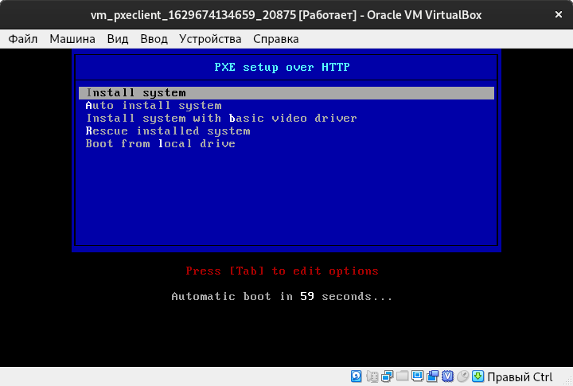
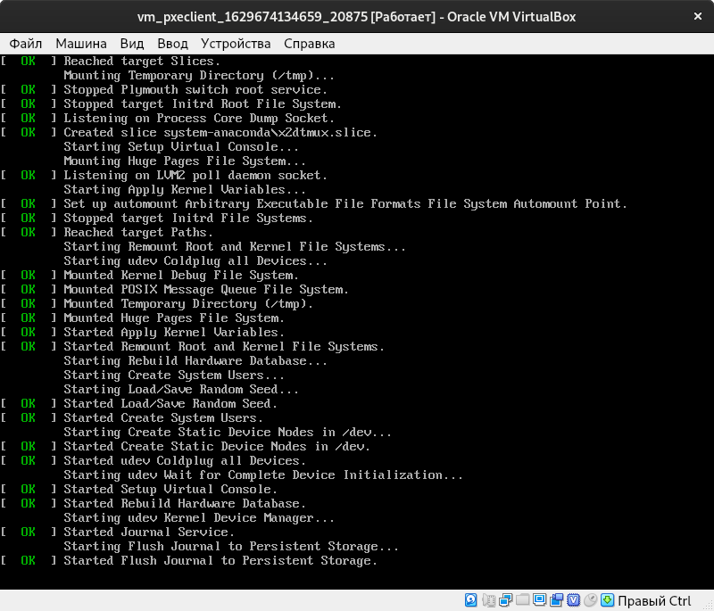
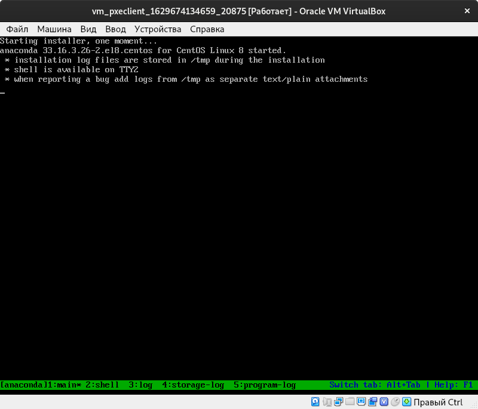

# Настройка PXE сервера для автоматической установки

Цель:

Отрабатываем навыки установки и настройки DHCP, TFTP, PXE загрузчика и автоматической загрузки

* Следуя шагам из документа https://docs.centos.org/en-US/8-docs/advanced-install/assembly_preparing-for-a-network-install установить и настроить загрузку по сети для дистрибутива CentOS8. В качестве шаблона воспользуйтесь репозиторием https://github.com/nixuser/virtlab/tree/main/centos_pxe.
* Поменять установку из репозитория NFS на установку из репозитория HTTP.
* Настроить автоматическую установку для созданного kickstart файла (*) Файл загружается по HTTP.
* \* автоматизировать процесс установки Cobbler, cледуя шагам из документа https://cobbler.github.io/quickstart/.

Формат сдачи ДЗ - vagrant + ansible
Критерии оценки:

* Ссылка на репозиторий github.
* Vagrantfile с шагами установки необходимых компонентов
* Исходный код scripts для настройки сервера (если необходимо)
* Если какие-то шаги невозможно или сложно автоматизировать, то инструкции по ручным шагам для настройки

Рекомендуем сдать до: 09.08.2021

##  Исполнение

Замечание: разворачивание инфраструктуры необходимо производить поэтапно, а именно сначала запусить и настроить `pxeserver`, а уже потом запускать `pxeclient`, иначе `pxeclient` не даст нормально завершиться инструкциям `Vagrantfile`, так как будет ожидать установку по LAN, которая не возможна, так как сам `pxeserver` еще не настроен.

[template]:[Vagrantfile](./027_tobe/vm/Vagrantfile)

Из-за больших ISO сам Vagrant предложил добавить `config.gatling.rsync_on_startup = false`, а также применить `ansible_ssh_transfer_method=scp`.

```shell
vagrant up pxeserver
...
```

Теперь настраиваем `pxeserver`

```shell
ansible-playbook playbooks/pxeserver.yml --tags dhcpd.conf
```

[template]:[лог](./027_tobe/files/ansible-pxeserver.txt)

Производим первичную проверку доступности файлов, в том числе по сети (`http://127.0.0.1`, `/http://10.0.0.20`).

```shell
ansible-playbook playbooks/pxeserver_test.yml
```

[template]:[лог](./027_tobe/files/ansible-pxeserver_test.txt)

Некоторые файлы проекта

[template]:[dhcpd.conf](./027_tobe/ansible/roles/pxeserver/files/etc/dhcp/dhcpd.conf)

[template]:[ks.cfg](./027_tobe/ansible/roles/pxeserver/files/home/vagrant/cfg/ks.cfg)

[template]:[pxelinux.cfg/default](./027_tobe/ansible/roles/pxeserver/files/var/lib/tftpboot/pxelinux/pxelinux.cfg/default)

```shell
vagrant up pxeclient
```

Экран выВОДА



Успешно 



И что-то не пошло оно дальше, почему? 


