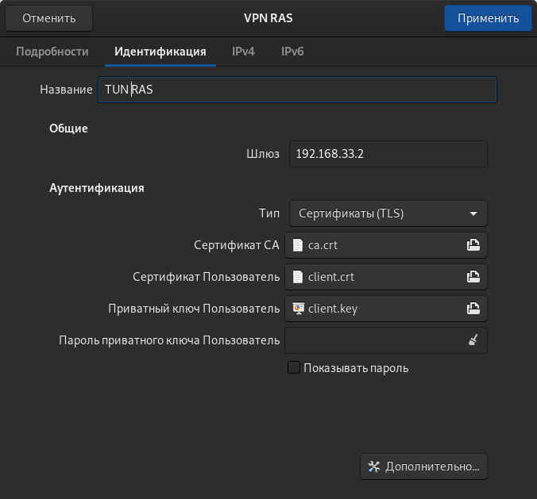
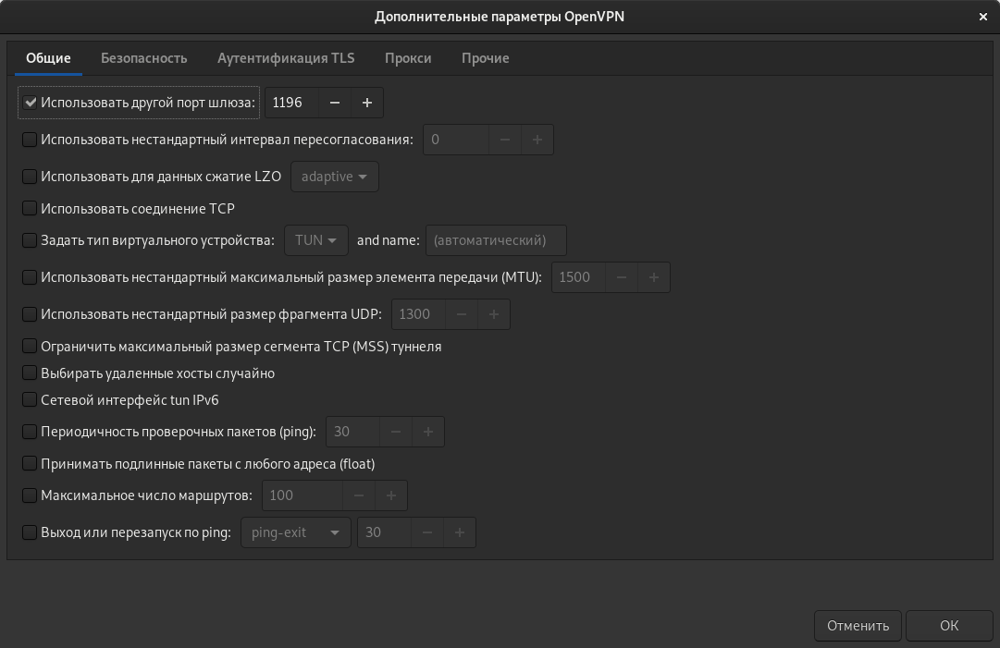
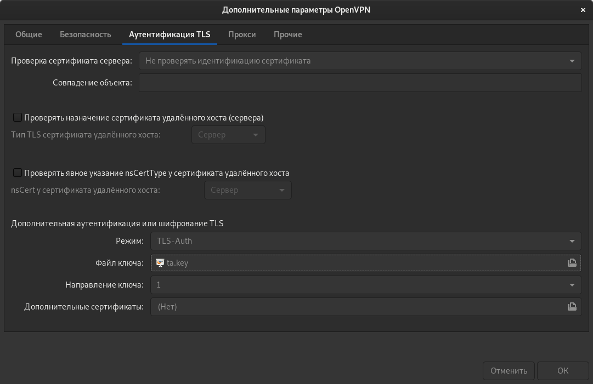
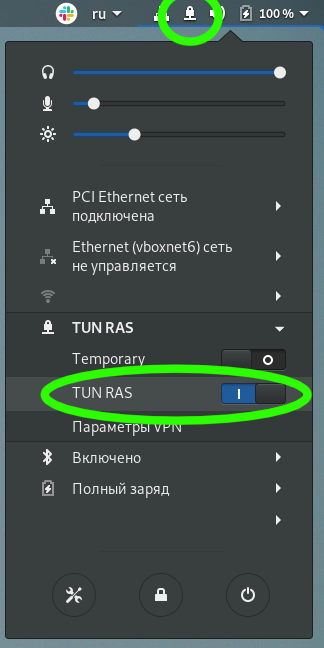

#  VPN

Между двумя виртуалками поднять vpn в режимах
* tun;
* tap; 
* Прочуствовать разницу.

Поднять RAS на базе OpenVPN с клиентскими сертификатами, подключиться с локальной машины на виртуалку.

3*. Самостоятельно изучить, поднять ocserv и подключиться с хоста к виртуалке

## Исполнение

<a name='regards'></a> Выражаю благодарность однокурсникам lupus (Юрий) и Сергею Артемову за помощь в освоении данного материала и настройке виртуального окружения.

Я добился того, что:
* стенд разворачивается автоматом с нужными конфигами, генерацией ключей (кроме их подписывания - об это ниже)
* имеется проверка на работоспособность:
  * статус `systemctl ...`
  * лог `/var/log/...`
  * интерфейсы

Текущая настройка идет в `tun`, считая что для связи между хоставми необходима маршрутизация, то есть сетефой уровень связности (L3).
В `tap` возможно объединить только при наличии канальной связности устройств (L2).

### Разворачивание сервера

Для генерации ключей используется утилита EasyRSA.

```shell
cd 031/vm/
cd ../vm/
vagrant destroy -f && vagrant up 
python3 v2a.py -o ../ansible/inventories/hosts # Это уже как кредо
cd ../ansible/
```

```shell
ansible-playbook playbooks/generate_vpn_server_certs.yml > ../files/generate_vpn_server_certs.yml.txt
```

Обратите внимание на итоговое предупреждение `playbooks/generate_vpn_server_certs.yml`.


<details><summary>см. лог `playbooks/generate_vpn_server_certs.yml`</summary>

```text

PLAY [Playbook of generate vpn-server certs] ***********************************

TASK [Gathering Facts] *********************************************************
ok: [server]

TASK [../roles/generate_vpn_server_certs : Install EPEL Repo package from standart repo] ***
changed: [server]

TASK [../roles/generate_vpn_server_certs : Install Wget] ***********************
changed: [server]

TASK [../roles/generate_vpn_server_certs : EasyRSA deploy commands] ************
ok: [server] => {
    "msg": "rm -f /home/vagrant/common/temp/\nmkdir -p /home/vagrant/common/temp/\ntouch /home/vagrant/common/temp/EasyRSA-3.0.8.tgz\nwget -O /home/vagrant/common/temp/EasyRSA-3.0.8.tgz https://github.com/OpenVPN/easy-rsa/releases/download/v3.0.8/EasyRSA-3.0.8.tgz\ntar -C /home/vagrant/common/temp/ -xzvf /home/vagrant/common/temp/EasyRSA-3.0.8.tgz\nmv /home/vagrant/common/temp/EasyRSA-3.0.8 /home/vagrant/common/temp/easyrsa\nrm -f /home/vagrant/common/temp/EasyRSA-3.0.8.tgz\n"
}

TASK [../roles/generate_vpn_server_certs : EasyRSA deploy] *********************
changed: [server]

TASK [../roles/generate_vpn_server_certs : Copy "vars" file to guest] **********
ok: [server]

TASK [../roles/generate_vpn_server_certs : EasyRSA - Init PKI] *****************
changed: [server]

TASK [../roles/generate_vpn_server_certs : debuggins] **************************
ok: [server] => {
    "msg": "\nNote: using Easy-RSA configuration from: /home/vagrant/common/temp/easyrsa/vars\n\n\nWARNING!!!\n\nYou are about to remove the EASYRSA_PKI at: /home/vagrant/common/temp/easyrsa/pki\nand initialize a fresh PKI here.\n\nType the word 'yes' to continue, or any other input to abort.\n  Confirm removal: \ninit-pki complete; you may now create a CA or requests.\nYour newly created PKI dir is: /home/vagrant/common/temp/easyrsa/pki"
}

TASK [../roles/generate_vpn_server_certs : EasyRSA - Build Auth Center CERT] ***
changed: [server]

TASK [../roles/generate_vpn_server_certs : debuggins] **************************
ok: [server] => {
    "msg": "\nNote: using Easy-RSA configuration from: /home/vagrant/common/temp/easyrsa/vars\nUsing SSL: openssl OpenSSL 1.0.2k-fips  26 Jan 2017\n\nEnter New CA Key Passphrase: \nRe-Enter New CA Key Passphrase: \n\nCA creation complete and you may now import and sign cert requests.\nYour new CA certificate file for publishing is at:\n//home/vagrant/common/temp/easyrsa/pki/ca.crt"
}

TASK [../roles/generate_vpn_server_certs : EasyRSA - DH] ***********************
changed: [server]

TASK [../roles/generate_vpn_server_certs : debuggins] **************************
ok: [server] => {
    "msg": "\nNote: using Easy-RSA configuration from: /home/vagrant/common/temp/easyrsa/vars\nUsing SSL: openssl OpenSSL 1.0.2k-fips  26 Jan 2017\n\nDH parameters of size 2048 created at /home/vagrant/common/temp/easyrsa/pki/dh.pem"
}

TASK [../roles/generate_vpn_server_certs : EasyRSA - prepare Server side CERT] ***
changed: [server]

TASK [../roles/generate_vpn_server_certs : debuggins] **************************
ok: [server] => {
    "msg": "\nNote: using Easy-RSA configuration from: /home/vagrant/common/temp/easyrsa/vars\nUsing SSL: openssl OpenSSL 1.0.2k-fips  26 Jan 2017\n\nKeypair and certificate request completed. Your files are:\nreq: /home/vagrant/common/temp/easyrsa/pki/reqs/server.req\nkey: /home/vagrant/common/temp/easyrsa/pki/private/server.key"
}

TASK [../roles/generate_vpn_server_certs : debuggins] **************************
ok: [server] => {
    "msg": "!!! ALERT !!!\nSo, now you need run command 'cd /home/vagrant/common/temp/ && ./easyrsa/easyrsa sign-req server server' at guest terminal, for:\n* /home/vagrant/common/temp/easyrsa/pki/issued/server.req\n* /home/vagrant/common/temp/easyrsa/pki/issued/server.crt\n"
}

PLAY RECAP *********************************************************************
server                     : ok=15   changed=7    unreachable=0    failed=0    skipped=0    rescued=0    ignored=0   


```

</details>

К сожалению, команда `sign-req` не автоматизируема, что связано с невозможностью осуществления автоматического ввода ответа на вопросы утилиты по факту ключевой фразы к корневому сертификату центра авторизации

```shell
cd ../vm
vagrant ssh server
```

Это внутри виртуалки `server`:

```shell
cd /home/vagrant/common/temp/easyrsa/ 
./easyrsa sign-req server server # <--- вот тут вводим неавтоматизируемые ответы

exit
```

__Замечание__: так как OpenVPN сервер работать будет так же и на не стандартных портах, то в политику SELinux необходимо внести коррективы  (все уже реализовано в плейбуке, но лучше проверить вручную, у меня порты были свободны).
```shell
semanage port -l | grep 1194
  openvpn_port_t                 tcp      1194
  openvpn_port_t                 udp      1194

semanage port -l | grep 1195
semanage port -l | grep 1196

semanage port -a -t openvpn_port_t -p udp 1195 
semanage port -a -t openvpn_port_t -p udp 1196
```

Продолжаем разворачивание инфрастуктуры.

```shell
cd ../ansible
ansible-playbook playbooks/configure_openvpn_server.yml > ../files/configure_openvpn_server.yml.txt
```


<details><summary>см. лог `playbooks/configure_openvpn_server.yml`</summary>

```text

PLAY [Configure openvpn server] ************************************************

TASK [Gathering Facts] *********************************************************
ok: [server]

TASK [../roles/configure_openvpn_server : Install EPEL Repo package from standart repo] ***
ok: [server]

TASK [../roles/configure_openvpn_server : Install Openvpn] *********************
ok: [server]

TASK [../roles/configure_openvpn_server : Install policycoreutils] *************
ok: [server]

TASK [../roles/configure_openvpn_server : SELinux | openvpn_port_t add 1195, 1196] ***
changed: [server]

TASK [../roles/configure_openvpn_server : Create openvpn directories] **********
changed: [server]

TASK [../roles/configure_openvpn_server : Copy "server-{tun,tap,tun-ras}.conf" file] ***
ok: [server] => (item=server-tun.conf)
ok: [server] => (item=server-tap.conf)
changed: [server] => (item=server-tun-ras.conf)

TASK [../roles/configure_openvpn_server : Generate ta.key] *********************
changed: [server]

TASK [../roles/configure_openvpn_server : Collect server keys dirs /etc/openvpn/keys/] ***
changed: [server] => (item=private)
changed: [server] => (item=issued)

TASK [../roles/configure_openvpn_server : Collect server keys /etc/openvpn/keys/] ***
ok: [server] => (item=ca.crt)
ok: [server] => (item=dh.pem)
changed: [server] => (item=ta.key)
ok: [server] => (item=issued/server.crt)
ok: [server] => (item=private/server.key)

RUNNING HANDLER [../roles/configure_openvpn_server : systemctl restart openvpn@server-{tun,tap,tun-ras}.service] ***
changed: [server] => (item=tun)
changed: [server] => (item=tap)
changed: [server] => (item=tun-ras)

PLAY RECAP *********************************************************************
server                     : ok=11   changed=7    unreachable=0    failed=0    skipped=0    rescued=0    ignored=0   


```

</details>

### Демонстрация работоспособности сервера

```shell
ansible-playbook playbooks/check_openvpn_server.yml  > ../files/check_openvpn_server.yml.txt
```


<details><summary>см. лог `playbooks/check_openvpn_server.yml`</summary>

```text

PLAY [Check openvpn server] ****************************************************

TASK [Gathering Facts] *********************************************************
ok: [server]

TASK [../roles/check_openvpn_server : Check openvpn server-{tun,tap,tun-ras}] ***
changed: [server] => (item=systemctl status openvpn@server-tun.service)
changed: [server] => (item=sudo cat /var/log/openvpn/openvpn-tun.log)
changed: [server] => (item=sudo cat /var/log/openvpn/openvpn-tun-status.log)
changed: [server] => (item=systemctl status openvpn@server-tap.service)
changed: [server] => (item=sudo cat /var/log/openvpn/openvpn-tap.log)
changed: [server] => (item=sudo cat /var/log/openvpn/openvpn-tap-status.log)
changed: [server] => (item=systemctl status openvpn@server-tun-ras.service)
changed: [server] => (item=sudo cat /var/log/openvpn/openvpn-tun-ras.log)
changed: [server] => (item=sudo cat /var/log/openvpn/openvpn-tun-ras-status.log)
changed: [server] => (item=/sbin/ip addr | awk -v RS='(^|
)[0-9]+: ' '/^(tun|tap)[0-9]*:/ {print}')

TASK [../roles/check_openvpn_server : Store check to files] ********************
changed: [server -> localhost] => (item={'changed': True, 'end': '2021-09-25 19:47:31.057731', 'stdout': '● openvpn@server-tun.service - OpenVPN Robust And Highly Flexible Tunneling Application On server/tun\n   Loaded: loaded (/usr/lib/systemd/system/openvpn@.service; disabled; vendor preset: disabled)\n   Active: active (running) since Сб 2021-09-25 19:45:45 UTC; 1min 45s ago\n Main PID: 23203 (openvpn)\n   Status: "Initialization Sequence Completed"\n   CGroup: /system.slice/system-openvpn.slice/openvpn@server-tun.service\n           └─23203 /usr/sbin/openvpn --cd /etc/openvpn/ --config server-tun.conf', 'cmd': 'systemctl status openvpn@server-tun.service', 'rc': 0, 'start': '2021-09-25 19:47:31.031796', 'stderr': '', 'delta': '0:00:00.025935', 'invocation': {'module_args': {'creates': None, 'executable': None, '_uses_shell': True, 'strip_empty_ends': True, '_raw_params': 'systemctl status openvpn@server-tun.service', 'removes': None, 'argv': None, 'warn': False, 'chdir': None, 'stdin_add_newline': True, 'stdin': None}}, 'stdout_lines': ['● openvpn@server-tun.service - OpenVPN Robust And Highly Flexible Tunneling Application On server/tun', '   Loaded: loaded (/usr/lib/systemd/system/openvpn@.service; disabled; vendor preset: disabled)', '   Active: active (running) since Сб 2021-09-25 19:45:45 UTC; 1min 45s ago', ' Main PID: 23203 (openvpn)', '   Status: "Initialization Sequence Completed"', '   CGroup: /system.slice/system-openvpn.slice/openvpn@server-tun.service', '           └─23203 /usr/sbin/openvpn --cd /etc/openvpn/ --config server-tun.conf'], 'stderr_lines': [], 'failed': False, 'item': 'systemctl status openvpn@server-tun.service', 'ansible_loop_var': 'item'})
changed: [server -> localhost] => (item={'changed': True, 'end': '2021-09-25 19:47:31.658824', 'stdout': "Sat Sep 25 19:36:12 2021 WARNING: file '/etc/openvpn/keys/private/server.key' is group or others accessible\nSat Sep 25 19:36:12 2021 WARNING: file '/etc/openvpn/keys/ta.key' is group or others accessible\nSat Sep 25 19:36:12 2021 OpenVPN 2.4.11 x86_64-redhat-linux-gnu [Fedora EPEL patched] [SSL (OpenSSL)] [LZO] [LZ4] [EPOLL] [PKCS11] [MH/PKTINFO] [AEAD] built on Apr 21 2021\nSat Sep 25 19:36:12 2021 library versions: OpenSSL 1.0.2k-fips  26 Jan 2017, LZO 2.06\nSat Sep 25 19:36:12 2021 Diffie-Hellman initialized with 2048 bit key\nSat Sep 25 19:36:12 2021 Outgoing Control Channel Authentication: Using 160 bit message hash 'SHA1' for HMAC authentication\nSat Sep 25 19:36:12 2021 Incoming Control Channel Authentication: Using 160 bit message hash 'SHA1' for HMAC authentication\nSat Sep 25 19:36:12 2021 ROUTE_GATEWAY 10.0.2.2/255.255.255.0 IFACE=eth0 HWADDR=52:54:00:4d:77:d3\nSat Sep 25 19:36:12 2021 TUN/TAP device tun0 opened\nSat Sep 25 19:36:12 2021 TUN/TAP TX queue length set to 100\nSat Sep 25 19:36:12 2021 /sbin/ip link set dev tun0 up mtu 1500\nSat Sep 25 19:36:12 2021 /sbin/ip addr add dev tun0 local 172.16.31.1 peer 172.16.31.2\nSat Sep 25 19:36:12 2021 /sbin/ip route add 172.16.31.0/24 via 172.16.31.2\nSat Sep 25 19:36:12 2021 Could not determine IPv4/IPv6 protocol. Using AF_INET\nSat Sep 25 19:36:12 2021 Socket Buffers: R=[212992->212992] S=[212992->212992]\nSat Sep 25 19:36:12 2021 UDPv4 link local (bound): [AF_INET]192.168.31.1:1194\nSat Sep 25 19:36:12 2021 UDPv4 link remote: [AF_UNSPEC]\nSat Sep 25 19:36:12 2021 GID set to nobody\nSat Sep 25 19:36:12 2021 UID set to nobody\nSat Sep 25 19:36:12 2021 MULTI: multi_init called, r=256 v=256\nSat Sep 25 19:36:12 2021 IFCONFIG POOL: base=172.16.31.4 size=62, ipv6=0\nSat Sep 25 19:36:12 2021 Initialization Sequence Completed\nSat Sep 25 19:45:45 2021 event_wait : Interrupted system call (code=4)\nSat Sep 25 19:45:45 2021 /sbin/ip route del 172.16.31.0/24\nRTNETLINK answers: Operation not permitted\nSat Sep 25 19:45:45 2021 ERROR: Linux route delete command failed: external program exited with error status: 2\nSat Sep 25 19:45:45 2021 Closing TUN/TAP interface\nSat Sep 25 19:45:45 2021 /sbin/ip addr del dev tun0 local 172.16.31.1 peer 172.16.31.2\nRTNETLINK answers: Operation not permitted\nSat Sep 25 19:45:45 2021 Linux ip addr del failed: external program exited with error status: 2\nSat Sep 25 19:45:45 2021 SIGTERM[hard,] received, process exiting\nSat Sep 25 19:45:45 2021 WARNING: file '/etc/openvpn/keys/private/server.key' is group or others accessible\nSat Sep 25 19:45:45 2021 WARNING: file '/etc/openvpn/keys/ta.key' is group or others accessible\nSat Sep 25 19:45:45 2021 OpenVPN 2.4.11 x86_64-redhat-linux-gnu [Fedora EPEL patched] [SSL (OpenSSL)] [LZO] [LZ4] [EPOLL] [PKCS11] [MH/PKTINFO] [AEAD] built on Apr 21 2021\nSat Sep 25 19:45:45 2021 library versions: OpenSSL 1.0.2k-fips  26 Jan 2017, LZO 2.06\nSat Sep 25 19:45:45 2021 Diffie-Hellman initialized with 2048 bit key\nSat Sep 25 19:45:45 2021 Outgoing Control Channel Authentication: Using 160 bit message hash 'SHA1' for HMAC authentication\nSat Sep 25 19:45:45 2021 Incoming Control Channel Authentication: Using 160 bit message hash 'SHA1' for HMAC authentication\nSat Sep 25 19:45:45 2021 ROUTE_GATEWAY 10.0.2.2/255.255.255.0 IFACE=eth0 HWADDR=52:54:00:4d:77:d3\nSat Sep 25 19:45:45 2021 TUN/TAP device tun0 opened\nSat Sep 25 19:45:45 2021 TUN/TAP TX queue length set to 100\nSat Sep 25 19:45:45 2021 /sbin/ip link set dev tun0 up mtu 1500\nSat Sep 25 19:45:45 2021 /sbin/ip addr add dev tun0 local 172.16.31.1 peer 172.16.31.2\nSat Sep 25 19:45:45 2021 /sbin/ip route add 172.16.31.0/24 via 172.16.31.2\nSat Sep 25 19:45:45 2021 Could not determine IPv4/IPv6 protocol. Using AF_INET\nSat Sep 25 19:45:45 2021 Socket Buffers: R=[212992->212992] S=[212992->212992]\nSat Sep 25 19:45:45 2021 UDPv4 link local (bound): [AF_INET]192.168.31.1:1194\nSat Sep 25 19:45:45 2021 UDPv4 link remote: [AF_UNSPEC]\nSat Sep 25 19:45:45 2021 GID set to nobody\nSat Sep 25 19:45:45 2021 UID set to nobody\nSat Sep 25 19:45:45 2021 MULTI: multi_init called, r=256 v=256\nSat Sep 25 19:45:45 2021 IFCONFIG POOL: base=172.16.31.4 size=62, ipv6=0\nSat Sep 25 19:45:45 2021 Initialization Sequence Completed", 'cmd': 'sudo cat /var/log/openvpn/openvpn-tun.log', 'rc': 0, 'start': '2021-09-25 19:47:31.608571', 'stderr': '', 'delta': '0:00:00.050253', 'invocation': {'module_args': {'creates': None, 'executable': None, '_uses_shell': True, 'strip_empty_ends': True, '_raw_params': 'sudo cat /var/log/openvpn/openvpn-tun.log', 'removes': None, 'argv': None, 'warn': False, 'chdir': None, 'stdin_add_newline': True, 'stdin': None}}, 'stdout_lines': ["Sat Sep 25 19:36:12 2021 WARNING: file '/etc/openvpn/keys/private/server.key' is group or others accessible", "Sat Sep 25 19:36:12 2021 WARNING: file '/etc/openvpn/keys/ta.key' is group or others accessible", 'Sat Sep 25 19:36:12 2021 OpenVPN 2.4.11 x86_64-redhat-linux-gnu [Fedora EPEL patched] [SSL (OpenSSL)] [LZO] [LZ4] [EPOLL] [PKCS11] [MH/PKTINFO] [AEAD] built on Apr 21 2021', 'Sat Sep 25 19:36:12 2021 library versions: OpenSSL 1.0.2k-fips  26 Jan 2017, LZO 2.06', 'Sat Sep 25 19:36:12 2021 Diffie-Hellman initialized with 2048 bit key', "Sat Sep 25 19:36:12 2021 Outgoing Control Channel Authentication: Using 160 bit message hash 'SHA1' for HMAC authentication", "Sat Sep 25 19:36:12 2021 Incoming Control Channel Authentication: Using 160 bit message hash 'SHA1' for HMAC authentication", 'Sat Sep 25 19:36:12 2021 ROUTE_GATEWAY 10.0.2.2/255.255.255.0 IFACE=eth0 HWADDR=52:54:00:4d:77:d3', 'Sat Sep 25 19:36:12 2021 TUN/TAP device tun0 opened', 'Sat Sep 25 19:36:12 2021 TUN/TAP TX queue length set to 100', 'Sat Sep 25 19:36:12 2021 /sbin/ip link set dev tun0 up mtu 1500', 'Sat Sep 25 19:36:12 2021 /sbin/ip addr add dev tun0 local 172.16.31.1 peer 172.16.31.2', 'Sat Sep 25 19:36:12 2021 /sbin/ip route add 172.16.31.0/24 via 172.16.31.2', 'Sat Sep 25 19:36:12 2021 Could not determine IPv4/IPv6 protocol. Using AF_INET', 'Sat Sep 25 19:36:12 2021 Socket Buffers: R=[212992->212992] S=[212992->212992]', 'Sat Sep 25 19:36:12 2021 UDPv4 link local (bound): [AF_INET]192.168.31.1:1194', 'Sat Sep 25 19:36:12 2021 UDPv4 link remote: [AF_UNSPEC]', 'Sat Sep 25 19:36:12 2021 GID set to nobody', 'Sat Sep 25 19:36:12 2021 UID set to nobody', 'Sat Sep 25 19:36:12 2021 MULTI: multi_init called, r=256 v=256', 'Sat Sep 25 19:36:12 2021 IFCONFIG POOL: base=172.16.31.4 size=62, ipv6=0', 'Sat Sep 25 19:36:12 2021 Initialization Sequence Completed', 'Sat Sep 25 19:45:45 2021 event_wait : Interrupted system call (code=4)', 'Sat Sep 25 19:45:45 2021 /sbin/ip route del 172.16.31.0/24', 'RTNETLINK answers: Operation not permitted', 'Sat Sep 25 19:45:45 2021 ERROR: Linux route delete command failed: external program exited with error status: 2', 'Sat Sep 25 19:45:45 2021 Closing TUN/TAP interface', 'Sat Sep 25 19:45:45 2021 /sbin/ip addr del dev tun0 local 172.16.31.1 peer 172.16.31.2', 'RTNETLINK answers: Operation not permitted', 'Sat Sep 25 19:45:45 2021 Linux ip addr del failed: external program exited with error status: 2', 'Sat Sep 25 19:45:45 2021 SIGTERM[hard,] received, process exiting', "Sat Sep 25 19:45:45 2021 WARNING: file '/etc/openvpn/keys/private/server.key' is group or others accessible", "Sat Sep 25 19:45:45 2021 WARNING: file '/etc/openvpn/keys/ta.key' is group or others accessible", 'Sat Sep 25 19:45:45 2021 OpenVPN 2.4.11 x86_64-redhat-linux-gnu [Fedora EPEL patched] [SSL (OpenSSL)] [LZO] [LZ4] [EPOLL] [PKCS11] [MH/PKTINFO] [AEAD] built on Apr 21 2021', 'Sat Sep 25 19:45:45 2021 library versions: OpenSSL 1.0.2k-fips  26 Jan 2017, LZO 2.06', 'Sat Sep 25 19:45:45 2021 Diffie-Hellman initialized with 2048 bit key', "Sat Sep 25 19:45:45 2021 Outgoing Control Channel Authentication: Using 160 bit message hash 'SHA1' for HMAC authentication", "Sat Sep 25 19:45:45 2021 Incoming Control Channel Authentication: Using 160 bit message hash 'SHA1' for HMAC authentication", 'Sat Sep 25 19:45:45 2021 ROUTE_GATEWAY 10.0.2.2/255.255.255.0 IFACE=eth0 HWADDR=52:54:00:4d:77:d3', 'Sat Sep 25 19:45:45 2021 TUN/TAP device tun0 opened', 'Sat Sep 25 19:45:45 2021 TUN/TAP TX queue length set to 100', 'Sat Sep 25 19:45:45 2021 /sbin/ip link set dev tun0 up mtu 1500', 'Sat Sep 25 19:45:45 2021 /sbin/ip addr add dev tun0 local 172.16.31.1 peer 172.16.31.2', 'Sat Sep 25 19:45:45 2021 /sbin/ip route add 172.16.31.0/24 via 172.16.31.2', 'Sat Sep 25 19:45:45 2021 Could not determine IPv4/IPv6 protocol. Using AF_INET', 'Sat Sep 25 19:45:45 2021 Socket Buffers: R=[212992->212992] S=[212992->212992]', 'Sat Sep 25 19:45:45 2021 UDPv4 link local (bound): [AF_INET]192.168.31.1:1194', 'Sat Sep 25 19:45:45 2021 UDPv4 link remote: [AF_UNSPEC]', 'Sat Sep 25 19:45:45 2021 GID set to nobody', 'Sat Sep 25 19:45:45 2021 UID set to nobody', 'Sat Sep 25 19:45:45 2021 MULTI: multi_init called, r=256 v=256', 'Sat Sep 25 19:45:45 2021 IFCONFIG POOL: base=172.16.31.4 size=62, ipv6=0', 'Sat Sep 25 19:45:45 2021 Initialization Sequence Completed'], 'stderr_lines': [], 'failed': False, 'item': 'sudo cat /var/log/openvpn/openvpn-tun.log', 'ansible_loop_var': 'item'})
changed: [server -> localhost] => (item={'changed': True, 'end': '2021-09-25 19:47:32.244047', 'stdout': 'OpenVPN CLIENT LIST\nUpdated,Sat Sep 25 19:46:53 2021\nCommon Name,Real Address,Bytes Received,Bytes Sent,Connected Since\nROUTING TABLE\nVirtual Address,Common Name,Real Address,Last Ref\nGLOBAL STATS\nMax bcast/mcast queue length,0\nEND', 'cmd': 'sudo cat /var/log/openvpn/openvpn-tun-status.log', 'rc': 0, 'start': '2021-09-25 19:47:32.198728', 'stderr': '', 'delta': '0:00:00.045319', 'invocation': {'module_args': {'creates': None, 'executable': None, '_uses_shell': True, 'strip_empty_ends': True, '_raw_params': 'sudo cat /var/log/openvpn/openvpn-tun-status.log', 'removes': None, 'argv': None, 'warn': False, 'chdir': None, 'stdin_add_newline': True, 'stdin': None}}, 'stdout_lines': ['OpenVPN CLIENT LIST', 'Updated,Sat Sep 25 19:46:53 2021', 'Common Name,Real Address,Bytes Received,Bytes Sent,Connected Since', 'ROUTING TABLE', 'Virtual Address,Common Name,Real Address,Last Ref', 'GLOBAL STATS', 'Max bcast/mcast queue length,0', 'END'], 'stderr_lines': [], 'failed': False, 'item': 'sudo cat /var/log/openvpn/openvpn-tun-status.log', 'ansible_loop_var': 'item'})
changed: [server -> localhost] => (item={'changed': True, 'end': '2021-09-25 19:47:32.819790', 'stdout': '● openvpn@server-tap.service - OpenVPN Robust And Highly Flexible Tunneling Application On server/tap\n   Loaded: loaded (/usr/lib/systemd/system/openvpn@.service; disabled; vendor preset: disabled)\n   Active: active (running) since Сб 2021-09-25 19:45:46 UTC; 1min 46s ago\n Main PID: 23327 (openvpn)\n   Status: "Initialization Sequence Completed"\n   CGroup: /system.slice/system-openvpn.slice/openvpn@server-tap.service\n           └─23327 /usr/sbin/openvpn --cd /etc/openvpn/ --config server-tap.conf', 'cmd': 'systemctl status openvpn@server-tap.service', 'rc': 0, 'start': '2021-09-25 19:47:32.800120', 'stderr': '', 'delta': '0:00:00.019670', 'invocation': {'module_args': {'creates': None, 'executable': None, '_uses_shell': True, 'strip_empty_ends': True, '_raw_params': 'systemctl status openvpn@server-tap.service', 'removes': None, 'argv': None, 'warn': False, 'chdir': None, 'stdin_add_newline': True, 'stdin': None}}, 'stdout_lines': ['● openvpn@server-tap.service - OpenVPN Robust And Highly Flexible Tunneling Application On server/tap', '   Loaded: loaded (/usr/lib/systemd/system/openvpn@.service; disabled; vendor preset: disabled)', '   Active: active (running) since Сб 2021-09-25 19:45:46 UTC; 1min 46s ago', ' Main PID: 23327 (openvpn)', '   Status: "Initialization Sequence Completed"', '   CGroup: /system.slice/system-openvpn.slice/openvpn@server-tap.service', '           └─23327 /usr/sbin/openvpn --cd /etc/openvpn/ --config server-tap.conf'], 'stderr_lines': [], 'failed': False, 'item': 'systemctl status openvpn@server-tap.service', 'ansible_loop_var': 'item'})
changed: [server -> localhost] => (item={'changed': True, 'end': '2021-09-25 19:47:33.407466', 'stdout': "Sat Sep 25 19:36:13 2021 WARNING: file '/etc/openvpn/keys/private/server.key' is group or others accessible\nSat Sep 25 19:36:13 2021 WARNING: file '/etc/openvpn/keys/ta.key' is group or others accessible\nSat Sep 25 19:36:13 2021 OpenVPN 2.4.11 x86_64-redhat-linux-gnu [Fedora EPEL patched] [SSL (OpenSSL)] [LZO] [LZ4] [EPOLL] [PKCS11] [MH/PKTINFO] [AEAD] built on Apr 21 2021\nSat Sep 25 19:36:13 2021 library versions: OpenSSL 1.0.2k-fips  26 Jan 2017, LZO 2.06\nSat Sep 25 19:36:13 2021 Diffie-Hellman initialized with 2048 bit key\nSat Sep 25 19:36:13 2021 Outgoing Control Channel Authentication: Using 160 bit message hash 'SHA1' for HMAC authentication\nSat Sep 25 19:36:13 2021 Incoming Control Channel Authentication: Using 160 bit message hash 'SHA1' for HMAC authentication\nSat Sep 25 19:36:13 2021 TUN/TAP device tap0 opened\nSat Sep 25 19:36:13 2021 TUN/TAP TX queue length set to 100\nSat Sep 25 19:36:13 2021 /sbin/ip link set dev tap0 up mtu 1500\nSat Sep 25 19:36:13 2021 /sbin/ip addr add dev tap0 172.16.32.1/24 broadcast 172.16.32.255\nSat Sep 25 19:36:13 2021 Could not determine IPv4/IPv6 protocol. Using AF_INET\nSat Sep 25 19:36:13 2021 Socket Buffers: R=[212992->212992] S=[212992->212992]\nSat Sep 25 19:36:13 2021 UDPv4 link local (bound): [AF_INET]192.168.32.1:1195\nSat Sep 25 19:36:13 2021 UDPv4 link remote: [AF_UNSPEC]\nSat Sep 25 19:36:13 2021 GID set to nobody\nSat Sep 25 19:36:13 2021 UID set to nobody\nSat Sep 25 19:36:13 2021 MULTI: multi_init called, r=256 v=256\nSat Sep 25 19:36:13 2021 IFCONFIG POOL: base=172.16.32.2 size=253, ipv6=0\nSat Sep 25 19:36:13 2021 Initialization Sequence Completed\nSat Sep 25 19:45:46 2021 event_wait : Interrupted system call (code=4)\nSat Sep 25 19:45:46 2021 Closing TUN/TAP interface\nSat Sep 25 19:45:46 2021 /sbin/ip addr del dev tap0 172.16.32.1/24\nRTNETLINK answers: Operation not permitted\nSat Sep 25 19:45:46 2021 Linux ip addr del failed: external program exited with error status: 2\nSat Sep 25 19:45:46 2021 SIGTERM[hard,] received, process exiting\nSat Sep 25 19:45:46 2021 WARNING: file '/etc/openvpn/keys/private/server.key' is group or others accessible\nSat Sep 25 19:45:46 2021 WARNING: file '/etc/openvpn/keys/ta.key' is group or others accessible\nSat Sep 25 19:45:46 2021 OpenVPN 2.4.11 x86_64-redhat-linux-gnu [Fedora EPEL patched] [SSL (OpenSSL)] [LZO] [LZ4] [EPOLL] [PKCS11] [MH/PKTINFO] [AEAD] built on Apr 21 2021\nSat Sep 25 19:45:46 2021 library versions: OpenSSL 1.0.2k-fips  26 Jan 2017, LZO 2.06\nSat Sep 25 19:45:46 2021 Diffie-Hellman initialized with 2048 bit key\nSat Sep 25 19:45:46 2021 Outgoing Control Channel Authentication: Using 160 bit message hash 'SHA1' for HMAC authentication\nSat Sep 25 19:45:46 2021 Incoming Control Channel Authentication: Using 160 bit message hash 'SHA1' for HMAC authentication\nSat Sep 25 19:45:46 2021 TUN/TAP device tap0 opened\nSat Sep 25 19:45:46 2021 TUN/TAP TX queue length set to 100\nSat Sep 25 19:45:46 2021 /sbin/ip link set dev tap0 up mtu 1500\nSat Sep 25 19:45:46 2021 /sbin/ip addr add dev tap0 172.16.32.1/24 broadcast 172.16.32.255\nSat Sep 25 19:45:46 2021 Could not determine IPv4/IPv6 protocol. Using AF_INET\nSat Sep 25 19:45:46 2021 Socket Buffers: R=[212992->212992] S=[212992->212992]\nSat Sep 25 19:45:46 2021 UDPv4 link local (bound): [AF_INET]192.168.32.1:1195\nSat Sep 25 19:45:46 2021 UDPv4 link remote: [AF_UNSPEC]\nSat Sep 25 19:45:46 2021 GID set to nobody\nSat Sep 25 19:45:46 2021 UID set to nobody\nSat Sep 25 19:45:46 2021 MULTI: multi_init called, r=256 v=256\nSat Sep 25 19:45:46 2021 IFCONFIG POOL: base=172.16.32.2 size=253, ipv6=0\nSat Sep 25 19:45:46 2021 Initialization Sequence Completed", 'cmd': 'sudo cat /var/log/openvpn/openvpn-tap.log', 'rc': 0, 'start': '2021-09-25 19:47:33.363150', 'stderr': '', 'delta': '0:00:00.044316', 'invocation': {'module_args': {'creates': None, 'executable': None, '_uses_shell': True, 'strip_empty_ends': True, '_raw_params': 'sudo cat /var/log/openvpn/openvpn-tap.log', 'removes': None, 'argv': None, 'warn': False, 'chdir': None, 'stdin_add_newline': True, 'stdin': None}}, 'stdout_lines': ["Sat Sep 25 19:36:13 2021 WARNING: file '/etc/openvpn/keys/private/server.key' is group or others accessible", "Sat Sep 25 19:36:13 2021 WARNING: file '/etc/openvpn/keys/ta.key' is group or others accessible", 'Sat Sep 25 19:36:13 2021 OpenVPN 2.4.11 x86_64-redhat-linux-gnu [Fedora EPEL patched] [SSL (OpenSSL)] [LZO] [LZ4] [EPOLL] [PKCS11] [MH/PKTINFO] [AEAD] built on Apr 21 2021', 'Sat Sep 25 19:36:13 2021 library versions: OpenSSL 1.0.2k-fips  26 Jan 2017, LZO 2.06', 'Sat Sep 25 19:36:13 2021 Diffie-Hellman initialized with 2048 bit key', "Sat Sep 25 19:36:13 2021 Outgoing Control Channel Authentication: Using 160 bit message hash 'SHA1' for HMAC authentication", "Sat Sep 25 19:36:13 2021 Incoming Control Channel Authentication: Using 160 bit message hash 'SHA1' for HMAC authentication", 'Sat Sep 25 19:36:13 2021 TUN/TAP device tap0 opened', 'Sat Sep 25 19:36:13 2021 TUN/TAP TX queue length set to 100', 'Sat Sep 25 19:36:13 2021 /sbin/ip link set dev tap0 up mtu 1500', 'Sat Sep 25 19:36:13 2021 /sbin/ip addr add dev tap0 172.16.32.1/24 broadcast 172.16.32.255', 'Sat Sep 25 19:36:13 2021 Could not determine IPv4/IPv6 protocol. Using AF_INET', 'Sat Sep 25 19:36:13 2021 Socket Buffers: R=[212992->212992] S=[212992->212992]', 'Sat Sep 25 19:36:13 2021 UDPv4 link local (bound): [AF_INET]192.168.32.1:1195', 'Sat Sep 25 19:36:13 2021 UDPv4 link remote: [AF_UNSPEC]', 'Sat Sep 25 19:36:13 2021 GID set to nobody', 'Sat Sep 25 19:36:13 2021 UID set to nobody', 'Sat Sep 25 19:36:13 2021 MULTI: multi_init called, r=256 v=256', 'Sat Sep 25 19:36:13 2021 IFCONFIG POOL: base=172.16.32.2 size=253, ipv6=0', 'Sat Sep 25 19:36:13 2021 Initialization Sequence Completed', 'Sat Sep 25 19:45:46 2021 event_wait : Interrupted system call (code=4)', 'Sat Sep 25 19:45:46 2021 Closing TUN/TAP interface', 'Sat Sep 25 19:45:46 2021 /sbin/ip addr del dev tap0 172.16.32.1/24', 'RTNETLINK answers: Operation not permitted', 'Sat Sep 25 19:45:46 2021 Linux ip addr del failed: external program exited with error status: 2', 'Sat Sep 25 19:45:46 2021 SIGTERM[hard,] received, process exiting', "Sat Sep 25 19:45:46 2021 WARNING: file '/etc/openvpn/keys/private/server.key' is group or others accessible", "Sat Sep 25 19:45:46 2021 WARNING: file '/etc/openvpn/keys/ta.key' is group or others accessible", 'Sat Sep 25 19:45:46 2021 OpenVPN 2.4.11 x86_64-redhat-linux-gnu [Fedora EPEL patched] [SSL (OpenSSL)] [LZO] [LZ4] [EPOLL] [PKCS11] [MH/PKTINFO] [AEAD] built on Apr 21 2021', 'Sat Sep 25 19:45:46 2021 library versions: OpenSSL 1.0.2k-fips  26 Jan 2017, LZO 2.06', 'Sat Sep 25 19:45:46 2021 Diffie-Hellman initialized with 2048 bit key', "Sat Sep 25 19:45:46 2021 Outgoing Control Channel Authentication: Using 160 bit message hash 'SHA1' for HMAC authentication", "Sat Sep 25 19:45:46 2021 Incoming Control Channel Authentication: Using 160 bit message hash 'SHA1' for HMAC authentication", 'Sat Sep 25 19:45:46 2021 TUN/TAP device tap0 opened', 'Sat Sep 25 19:45:46 2021 TUN/TAP TX queue length set to 100', 'Sat Sep 25 19:45:46 2021 /sbin/ip link set dev tap0 up mtu 1500', 'Sat Sep 25 19:45:46 2021 /sbin/ip addr add dev tap0 172.16.32.1/24 broadcast 172.16.32.255', 'Sat Sep 25 19:45:46 2021 Could not determine IPv4/IPv6 protocol. Using AF_INET', 'Sat Sep 25 19:45:46 2021 Socket Buffers: R=[212992->212992] S=[212992->212992]', 'Sat Sep 25 19:45:46 2021 UDPv4 link local (bound): [AF_INET]192.168.32.1:1195', 'Sat Sep 25 19:45:46 2021 UDPv4 link remote: [AF_UNSPEC]', 'Sat Sep 25 19:45:46 2021 GID set to nobody', 'Sat Sep 25 19:45:46 2021 UID set to nobody', 'Sat Sep 25 19:45:46 2021 MULTI: multi_init called, r=256 v=256', 'Sat Sep 25 19:45:46 2021 IFCONFIG POOL: base=172.16.32.2 size=253, ipv6=0', 'Sat Sep 25 19:45:46 2021 Initialization Sequence Completed'], 'stderr_lines': [], 'failed': False, 'item': 'sudo cat /var/log/openvpn/openvpn-tap.log', 'ansible_loop_var': 'item'})
changed: [server -> localhost] => (item={'changed': True, 'end': '2021-09-25 19:47:33.979878', 'stdout': 'OpenVPN CLIENT LIST\nUpdated,Sat Sep 25 19:46:46 2021\nCommon Name,Real Address,Bytes Received,Bytes Sent,Connected Since\nROUTING TABLE\nVirtual Address,Common Name,Real Address,Last Ref\nGLOBAL STATS\nMax bcast/mcast queue length,0\nEND', 'cmd': 'sudo cat /var/log/openvpn/openvpn-tap-status.log', 'rc': 0, 'start': '2021-09-25 19:47:33.935546', 'stderr': '', 'delta': '0:00:00.044332', 'invocation': {'module_args': {'creates': None, 'executable': None, '_uses_shell': True, 'strip_empty_ends': True, '_raw_params': 'sudo cat /var/log/openvpn/openvpn-tap-status.log', 'removes': None, 'argv': None, 'warn': False, 'chdir': None, 'stdin_add_newline': True, 'stdin': None}}, 'stdout_lines': ['OpenVPN CLIENT LIST', 'Updated,Sat Sep 25 19:46:46 2021', 'Common Name,Real Address,Bytes Received,Bytes Sent,Connected Since', 'ROUTING TABLE', 'Virtual Address,Common Name,Real Address,Last Ref', 'GLOBAL STATS', 'Max bcast/mcast queue length,0', 'END'], 'stderr_lines': [], 'failed': False, 'item': 'sudo cat /var/log/openvpn/openvpn-tap-status.log', 'ansible_loop_var': 'item'})
changed: [server -> localhost] => (item={'changed': True, 'end': '2021-09-25 19:47:34.543282', 'stdout': '● openvpn@server-tun-ras.service - OpenVPN Robust And Highly Flexible Tunneling Application On server/tun/ras\n   Loaded: loaded (/usr/lib/systemd/system/openvpn@.service; disabled; vendor preset: disabled)\n   Active: active (running) since Сб 2021-09-25 19:45:47 UTC; 1min 47s ago\n Main PID: 23423 (openvpn)\n   Status: "Initialization Sequence Completed"\n   CGroup: /system.slice/system-openvpn.slice/openvpn@server-tun-ras.service\n           └─23423 /usr/sbin/openvpn --cd /etc/openvpn/ --config server-tun-ras.conf', 'cmd': 'systemctl status openvpn@server-tun-ras.service', 'rc': 0, 'start': '2021-09-25 19:47:34.525536', 'stderr': '', 'delta': '0:00:00.017746', 'invocation': {'module_args': {'creates': None, 'executable': None, '_uses_shell': True, 'strip_empty_ends': True, '_raw_params': 'systemctl status openvpn@server-tun-ras.service', 'removes': None, 'argv': None, 'warn': False, 'chdir': None, 'stdin_add_newline': True, 'stdin': None}}, 'stdout_lines': ['● openvpn@server-tun-ras.service - OpenVPN Robust And Highly Flexible Tunneling Application On server/tun/ras', '   Loaded: loaded (/usr/lib/systemd/system/openvpn@.service; disabled; vendor preset: disabled)', '   Active: active (running) since Сб 2021-09-25 19:45:47 UTC; 1min 47s ago', ' Main PID: 23423 (openvpn)', '   Status: "Initialization Sequence Completed"', '   CGroup: /system.slice/system-openvpn.slice/openvpn@server-tun-ras.service', '           └─23423 /usr/sbin/openvpn --cd /etc/openvpn/ --config server-tun-ras.conf'], 'stderr_lines': [], 'failed': False, 'item': 'systemctl status openvpn@server-tun-ras.service', 'ansible_loop_var': 'item'})
changed: [server -> localhost] => (item={'changed': True, 'end': '2021-09-25 19:47:35.128677', 'stdout': "Sat Sep 25 19:36:14 2021 WARNING: file '/etc/openvpn/keys/private/server.key' is group or others accessible\nSat Sep 25 19:36:14 2021 WARNING: file '/etc/openvpn/keys/ta.key' is group or others accessible\nSat Sep 25 19:36:14 2021 OpenVPN 2.4.11 x86_64-redhat-linux-gnu [Fedora EPEL patched] [SSL (OpenSSL)] [LZO] [LZ4] [EPOLL] [PKCS11] [MH/PKTINFO] [AEAD] built on Apr 21 2021\nSat Sep 25 19:36:14 2021 library versions: OpenSSL 1.0.2k-fips  26 Jan 2017, LZO 2.06\nSat Sep 25 19:36:14 2021 Diffie-Hellman initialized with 2048 bit key\nSat Sep 25 19:36:14 2021 Outgoing Control Channel Authentication: Using 160 bit message hash 'SHA1' for HMAC authentication\nSat Sep 25 19:36:14 2021 Incoming Control Channel Authentication: Using 160 bit message hash 'SHA1' for HMAC authentication\nSat Sep 25 19:36:14 2021 ROUTE_GATEWAY 10.0.2.2/255.255.255.0 IFACE=eth0 HWADDR=52:54:00:4d:77:d3\nSat Sep 25 19:36:14 2021 TUN/TAP device tun1 opened\nSat Sep 25 19:36:14 2021 TUN/TAP TX queue length set to 100\nSat Sep 25 19:36:14 2021 /sbin/ip link set dev tun1 up mtu 1500\nSat Sep 25 19:36:14 2021 /sbin/ip addr add dev tun1 local 172.16.33.1 peer 172.16.33.2\nSat Sep 25 19:36:14 2021 /sbin/ip route add 172.16.33.0/24 via 172.16.33.2\nSat Sep 25 19:36:14 2021 Could not determine IPv4/IPv6 protocol. Using AF_INET\nSat Sep 25 19:36:14 2021 Socket Buffers: R=[212992->212992] S=[212992->212992]\nSat Sep 25 19:36:14 2021 TCP/UDP: Socket bind failed on local address [AF_INET]192.168.33.1:1196: Cannot assign requested address (errno=99)\nSat Sep 25 19:36:14 2021 Exiting due to fatal error\nSat Sep 25 19:36:14 2021 /sbin/ip route del 172.16.33.0/24\nSat Sep 25 19:36:14 2021 Closing TUN/TAP interface\nSat Sep 25 19:36:14 2021 /sbin/ip addr del dev tun1 local 172.16.33.1 peer 172.16.33.2\nSat Sep 25 19:41:35 2021 WARNING: file '/etc/openvpn/keys/private/server.key' is group or others accessible\nSat Sep 25 19:41:35 2021 WARNING: file '/etc/openvpn/keys/ta.key' is group or others accessible\nSat Sep 25 19:41:35 2021 OpenVPN 2.4.11 x86_64-redhat-linux-gnu [Fedora EPEL patched] [SSL (OpenSSL)] [LZO] [LZ4] [EPOLL] [PKCS11] [MH/PKTINFO] [AEAD] built on Apr 21 2021\nSat Sep 25 19:41:35 2021 library versions: OpenSSL 1.0.2k-fips  26 Jan 2017, LZO 2.06\nSat Sep 25 19:41:35 2021 Diffie-Hellman initialized with 2048 bit key\nSat Sep 25 19:41:35 2021 Outgoing Control Channel Authentication: Using 160 bit message hash 'SHA1' for HMAC authentication\nSat Sep 25 19:41:35 2021 Incoming Control Channel Authentication: Using 160 bit message hash 'SHA1' for HMAC authentication\nSat Sep 25 19:41:35 2021 ROUTE_GATEWAY 10.0.2.2/255.255.255.0 IFACE=eth0 HWADDR=52:54:00:4d:77:d3\nSat Sep 25 19:41:35 2021 TUN/TAP device tun1 opened\nSat Sep 25 19:41:35 2021 TUN/TAP TX queue length set to 100\nSat Sep 25 19:41:35 2021 /sbin/ip link set dev tun1 up mtu 1500\nSat Sep 25 19:41:35 2021 /sbin/ip addr add dev tun1 local 172.16.33.1 peer 172.16.33.2\nSat Sep 25 19:41:35 2021 /sbin/ip route add 172.16.33.0/24 via 172.16.33.2\nSat Sep 25 19:41:35 2021 Could not determine IPv4/IPv6 protocol. Using AF_INET\nSat Sep 25 19:41:35 2021 Socket Buffers: R=[212992->212992] S=[212992->212992]\nSat Sep 25 19:41:35 2021 TCP/UDP: Socket bind failed on local address [AF_INET]192.168.33.1:1196: Cannot assign requested address (errno=99)\nSat Sep 25 19:41:35 2021 Exiting due to fatal error\nSat Sep 25 19:41:35 2021 /sbin/ip route del 172.16.33.0/24\nSat Sep 25 19:41:35 2021 Closing TUN/TAP interface\nSat Sep 25 19:41:35 2021 /sbin/ip addr del dev tun1 local 172.16.33.1 peer 172.16.33.2\nSat Sep 25 19:42:44 2021 WARNING: file '/etc/openvpn/keys/private/server.key' is group or others accessible\nSat Sep 25 19:42:44 2021 WARNING: file '/etc/openvpn/keys/ta.key' is group or others accessible\nSat Sep 25 19:42:44 2021 OpenVPN 2.4.11 x86_64-redhat-linux-gnu [Fedora EPEL patched] [SSL (OpenSSL)] [LZO] [LZ4] [EPOLL] [PKCS11] [MH/PKTINFO] [AEAD] built on Apr 21 2021\nSat Sep 25 19:42:44 2021 library versions: OpenSSL 1.0.2k-fips  26 Jan 2017, LZO 2.06\nSat Sep 25 19:42:44 2021 Diffie-Hellman initialized with 2048 bit key\nSat Sep 25 19:42:44 2021 Outgoing Control Channel Authentication: Using 160 bit message hash 'SHA1' for HMAC authentication\nSat Sep 25 19:42:44 2021 Incoming Control Channel Authentication: Using 160 bit message hash 'SHA1' for HMAC authentication\nSat Sep 25 19:42:44 2021 ROUTE_GATEWAY 10.0.2.2/255.255.255.0 IFACE=eth0 HWADDR=52:54:00:4d:77:d3\nSat Sep 25 19:42:44 2021 TUN/TAP device tun1 opened\nSat Sep 25 19:42:44 2021 TUN/TAP TX queue length set to 100\nSat Sep 25 19:42:44 2021 /sbin/ip link set dev tun1 up mtu 1500\nSat Sep 25 19:42:44 2021 /sbin/ip addr add dev tun1 local 172.16.33.1 peer 172.16.33.2\nSat Sep 25 19:42:44 2021 /sbin/ip route add 172.16.33.0/24 via 172.16.33.2\nSat Sep 25 19:42:44 2021 Could not determine IPv4/IPv6 protocol. Using AF_INET\nSat Sep 25 19:42:44 2021 Socket Buffers: R=[212992->212992] S=[212992->212992]\nSat Sep 25 19:42:44 2021 TCP/UDP: Socket bind failed on local address [AF_INET]192.168.33.1:1196: Cannot assign requested address (errno=99)\nSat Sep 25 19:42:44 2021 Exiting due to fatal error\nSat Sep 25 19:42:44 2021 /sbin/ip route del 172.16.33.0/24\nSat Sep 25 19:42:44 2021 Closing TUN/TAP interface\nSat Sep 25 19:42:44 2021 /sbin/ip addr del dev tun1 local 172.16.33.1 peer 172.16.33.2\nSat Sep 25 19:42:51 2021 WARNING: file '/etc/openvpn/keys/private/server.key' is group or others accessible\nSat Sep 25 19:42:51 2021 WARNING: file '/etc/openvpn/keys/ta.key' is group or others accessible\nSat Sep 25 19:42:51 2021 OpenVPN 2.4.11 x86_64-redhat-linux-gnu [Fedora EPEL patched] [SSL (OpenSSL)] [LZO] [LZ4] [EPOLL] [PKCS11] [MH/PKTINFO] [AEAD] built on Apr 21 2021\nSat Sep 25 19:42:51 2021 library versions: OpenSSL 1.0.2k-fips  26 Jan 2017, LZO 2.06\nSat Sep 25 19:42:51 2021 Diffie-Hellman initialized with 2048 bit key\nSat Sep 25 19:42:51 2021 Outgoing Control Channel Authentication: Using 160 bit message hash 'SHA1' for HMAC authentication\nSat Sep 25 19:42:51 2021 Incoming Control Channel Authentication: Using 160 bit message hash 'SHA1' for HMAC authentication\nSat Sep 25 19:42:51 2021 ROUTE_GATEWAY 10.0.2.2/255.255.255.0 IFACE=eth0 HWADDR=52:54:00:4d:77:d3\nSat Sep 25 19:42:51 2021 TUN/TAP device tun1 opened\nSat Sep 25 19:42:51 2021 TUN/TAP TX queue length set to 100\nSat Sep 25 19:42:51 2021 /sbin/ip link set dev tun1 up mtu 1500\nSat Sep 25 19:42:51 2021 /sbin/ip addr add dev tun1 local 172.16.33.1 peer 172.16.33.2\nSat Sep 25 19:42:51 2021 /sbin/ip route add 172.16.33.0/24 via 172.16.33.2\nSat Sep 25 19:42:51 2021 Could not determine IPv4/IPv6 protocol. Using AF_INET\nSat Sep 25 19:42:51 2021 Socket Buffers: R=[212992->212992] S=[212992->212992]\nSat Sep 25 19:42:51 2021 TCP/UDP: Socket bind failed on local address [AF_INET]192.168.33.1:1196: Cannot assign requested address (errno=99)\nSat Sep 25 19:42:51 2021 Exiting due to fatal error\nSat Sep 25 19:42:51 2021 /sbin/ip route del 172.16.33.0/24\nSat Sep 25 19:42:51 2021 Closing TUN/TAP interface\nSat Sep 25 19:42:51 2021 /sbin/ip addr del dev tun1 local 172.16.33.1 peer 172.16.33.2\nSat Sep 25 19:45:47 2021 WARNING: file '/etc/openvpn/keys/private/server.key' is group or others accessible\nSat Sep 25 19:45:47 2021 WARNING: file '/etc/openvpn/keys/ta.key' is group or others accessible\nSat Sep 25 19:45:47 2021 OpenVPN 2.4.11 x86_64-redhat-linux-gnu [Fedora EPEL patched] [SSL (OpenSSL)] [LZO] [LZ4] [EPOLL] [PKCS11] [MH/PKTINFO] [AEAD] built on Apr 21 2021\nSat Sep 25 19:45:47 2021 library versions: OpenSSL 1.0.2k-fips  26 Jan 2017, LZO 2.06\nSat Sep 25 19:45:47 2021 Diffie-Hellman initialized with 2048 bit key\nSat Sep 25 19:45:47 2021 Outgoing Control Channel Authentication: Using 160 bit message hash 'SHA1' for HMAC authentication\nSat Sep 25 19:45:47 2021 Incoming Control Channel Authentication: Using 160 bit message hash 'SHA1' for HMAC authentication\nSat Sep 25 19:45:47 2021 ROUTE_GATEWAY 10.0.2.2/255.255.255.0 IFACE=eth0 HWADDR=52:54:00:4d:77:d3\nSat Sep 25 19:45:47 2021 TUN/TAP device tun1 opened\nSat Sep 25 19:45:47 2021 TUN/TAP TX queue length set to 100\nSat Sep 25 19:45:47 2021 /sbin/ip link set dev tun1 up mtu 1500\nSat Sep 25 19:45:47 2021 /sbin/ip addr add dev tun1 local 172.16.33.1 peer 172.16.33.2\nSat Sep 25 19:45:47 2021 /sbin/ip route add 172.16.33.0/24 via 172.16.33.2\nSat Sep 25 19:45:47 2021 Could not determine IPv4/IPv6 protocol. Using AF_INET\nSat Sep 25 19:45:47 2021 Socket Buffers: R=[212992->212992] S=[212992->212992]\nSat Sep 25 19:45:47 2021 UDPv4 link local (bound): [AF_INET]192.168.33.2:1196\nSat Sep 25 19:45:47 2021 UDPv4 link remote: [AF_UNSPEC]\nSat Sep 25 19:45:47 2021 GID set to nobody\nSat Sep 25 19:45:47 2021 UID set to nobody\nSat Sep 25 19:45:47 2021 MULTI: multi_init called, r=256 v=256\nSat Sep 25 19:45:47 2021 IFCONFIG POOL: base=172.16.33.4 size=62, ipv6=0\nSat Sep 25 19:45:47 2021 Initialization Sequence Completed", 'cmd': 'sudo cat /var/log/openvpn/openvpn-tun-ras.log', 'rc': 0, 'start': '2021-09-25 19:47:35.084984', 'stderr': '', 'delta': '0:00:00.043693', 'invocation': {'module_args': {'creates': None, 'executable': None, '_uses_shell': True, 'strip_empty_ends': True, '_raw_params': 'sudo cat /var/log/openvpn/openvpn-tun-ras.log', 'removes': None, 'argv': None, 'warn': False, 'chdir': None, 'stdin_add_newline': True, 'stdin': None}}, 'stdout_lines': ["Sat Sep 25 19:36:14 2021 WARNING: file '/etc/openvpn/keys/private/server.key' is group or others accessible", "Sat Sep 25 19:36:14 2021 WARNING: file '/etc/openvpn/keys/ta.key' is group or others accessible", 'Sat Sep 25 19:36:14 2021 OpenVPN 2.4.11 x86_64-redhat-linux-gnu [Fedora EPEL patched] [SSL (OpenSSL)] [LZO] [LZ4] [EPOLL] [PKCS11] [MH/PKTINFO] [AEAD] built on Apr 21 2021', 'Sat Sep 25 19:36:14 2021 library versions: OpenSSL 1.0.2k-fips  26 Jan 2017, LZO 2.06', 'Sat Sep 25 19:36:14 2021 Diffie-Hellman initialized with 2048 bit key', "Sat Sep 25 19:36:14 2021 Outgoing Control Channel Authentication: Using 160 bit message hash 'SHA1' for HMAC authentication", "Sat Sep 25 19:36:14 2021 Incoming Control Channel Authentication: Using 160 bit message hash 'SHA1' for HMAC authentication", 'Sat Sep 25 19:36:14 2021 ROUTE_GATEWAY 10.0.2.2/255.255.255.0 IFACE=eth0 HWADDR=52:54:00:4d:77:d3', 'Sat Sep 25 19:36:14 2021 TUN/TAP device tun1 opened', 'Sat Sep 25 19:36:14 2021 TUN/TAP TX queue length set to 100', 'Sat Sep 25 19:36:14 2021 /sbin/ip link set dev tun1 up mtu 1500', 'Sat Sep 25 19:36:14 2021 /sbin/ip addr add dev tun1 local 172.16.33.1 peer 172.16.33.2', 'Sat Sep 25 19:36:14 2021 /sbin/ip route add 172.16.33.0/24 via 172.16.33.2', 'Sat Sep 25 19:36:14 2021 Could not determine IPv4/IPv6 protocol. Using AF_INET', 'Sat Sep 25 19:36:14 2021 Socket Buffers: R=[212992->212992] S=[212992->212992]', 'Sat Sep 25 19:36:14 2021 TCP/UDP: Socket bind failed on local address [AF_INET]192.168.33.1:1196: Cannot assign requested address (errno=99)', 'Sat Sep 25 19:36:14 2021 Exiting due to fatal error', 'Sat Sep 25 19:36:14 2021 /sbin/ip route del 172.16.33.0/24', 'Sat Sep 25 19:36:14 2021 Closing TUN/TAP interface', 'Sat Sep 25 19:36:14 2021 /sbin/ip addr del dev tun1 local 172.16.33.1 peer 172.16.33.2', "Sat Sep 25 19:41:35 2021 WARNING: file '/etc/openvpn/keys/private/server.key' is group or others accessible", "Sat Sep 25 19:41:35 2021 WARNING: file '/etc/openvpn/keys/ta.key' is group or others accessible", 'Sat Sep 25 19:41:35 2021 OpenVPN 2.4.11 x86_64-redhat-linux-gnu [Fedora EPEL patched] [SSL (OpenSSL)] [LZO] [LZ4] [EPOLL] [PKCS11] [MH/PKTINFO] [AEAD] built on Apr 21 2021', 'Sat Sep 25 19:41:35 2021 library versions: OpenSSL 1.0.2k-fips  26 Jan 2017, LZO 2.06', 'Sat Sep 25 19:41:35 2021 Diffie-Hellman initialized with 2048 bit key', "Sat Sep 25 19:41:35 2021 Outgoing Control Channel Authentication: Using 160 bit message hash 'SHA1' for HMAC authentication", "Sat Sep 25 19:41:35 2021 Incoming Control Channel Authentication: Using 160 bit message hash 'SHA1' for HMAC authentication", 'Sat Sep 25 19:41:35 2021 ROUTE_GATEWAY 10.0.2.2/255.255.255.0 IFACE=eth0 HWADDR=52:54:00:4d:77:d3', 'Sat Sep 25 19:41:35 2021 TUN/TAP device tun1 opened', 'Sat Sep 25 19:41:35 2021 TUN/TAP TX queue length set to 100', 'Sat Sep 25 19:41:35 2021 /sbin/ip link set dev tun1 up mtu 1500', 'Sat Sep 25 19:41:35 2021 /sbin/ip addr add dev tun1 local 172.16.33.1 peer 172.16.33.2', 'Sat Sep 25 19:41:35 2021 /sbin/ip route add 172.16.33.0/24 via 172.16.33.2', 'Sat Sep 25 19:41:35 2021 Could not determine IPv4/IPv6 protocol. Using AF_INET', 'Sat Sep 25 19:41:35 2021 Socket Buffers: R=[212992->212992] S=[212992->212992]', 'Sat Sep 25 19:41:35 2021 TCP/UDP: Socket bind failed on local address [AF_INET]192.168.33.1:1196: Cannot assign requested address (errno=99)', 'Sat Sep 25 19:41:35 2021 Exiting due to fatal error', 'Sat Sep 25 19:41:35 2021 /sbin/ip route del 172.16.33.0/24', 'Sat Sep 25 19:41:35 2021 Closing TUN/TAP interface', 'Sat Sep 25 19:41:35 2021 /sbin/ip addr del dev tun1 local 172.16.33.1 peer 172.16.33.2', "Sat Sep 25 19:42:44 2021 WARNING: file '/etc/openvpn/keys/private/server.key' is group or others accessible", "Sat Sep 25 19:42:44 2021 WARNING: file '/etc/openvpn/keys/ta.key' is group or others accessible", 'Sat Sep 25 19:42:44 2021 OpenVPN 2.4.11 x86_64-redhat-linux-gnu [Fedora EPEL patched] [SSL (OpenSSL)] [LZO] [LZ4] [EPOLL] [PKCS11] [MH/PKTINFO] [AEAD] built on Apr 21 2021', 'Sat Sep 25 19:42:44 2021 library versions: OpenSSL 1.0.2k-fips  26 Jan 2017, LZO 2.06', 'Sat Sep 25 19:42:44 2021 Diffie-Hellman initialized with 2048 bit key', "Sat Sep 25 19:42:44 2021 Outgoing Control Channel Authentication: Using 160 bit message hash 'SHA1' for HMAC authentication", "Sat Sep 25 19:42:44 2021 Incoming Control Channel Authentication: Using 160 bit message hash 'SHA1' for HMAC authentication", 'Sat Sep 25 19:42:44 2021 ROUTE_GATEWAY 10.0.2.2/255.255.255.0 IFACE=eth0 HWADDR=52:54:00:4d:77:d3', 'Sat Sep 25 19:42:44 2021 TUN/TAP device tun1 opened', 'Sat Sep 25 19:42:44 2021 TUN/TAP TX queue length set to 100', 'Sat Sep 25 19:42:44 2021 /sbin/ip link set dev tun1 up mtu 1500', 'Sat Sep 25 19:42:44 2021 /sbin/ip addr add dev tun1 local 172.16.33.1 peer 172.16.33.2', 'Sat Sep 25 19:42:44 2021 /sbin/ip route add 172.16.33.0/24 via 172.16.33.2', 'Sat Sep 25 19:42:44 2021 Could not determine IPv4/IPv6 protocol. Using AF_INET', 'Sat Sep 25 19:42:44 2021 Socket Buffers: R=[212992->212992] S=[212992->212992]', 'Sat Sep 25 19:42:44 2021 TCP/UDP: Socket bind failed on local address [AF_INET]192.168.33.1:1196: Cannot assign requested address (errno=99)', 'Sat Sep 25 19:42:44 2021 Exiting due to fatal error', 'Sat Sep 25 19:42:44 2021 /sbin/ip route del 172.16.33.0/24', 'Sat Sep 25 19:42:44 2021 Closing TUN/TAP interface', 'Sat Sep 25 19:42:44 2021 /sbin/ip addr del dev tun1 local 172.16.33.1 peer 172.16.33.2', "Sat Sep 25 19:42:51 2021 WARNING: file '/etc/openvpn/keys/private/server.key' is group or others accessible", "Sat Sep 25 19:42:51 2021 WARNING: file '/etc/openvpn/keys/ta.key' is group or others accessible", 'Sat Sep 25 19:42:51 2021 OpenVPN 2.4.11 x86_64-redhat-linux-gnu [Fedora EPEL patched] [SSL (OpenSSL)] [LZO] [LZ4] [EPOLL] [PKCS11] [MH/PKTINFO] [AEAD] built on Apr 21 2021', 'Sat Sep 25 19:42:51 2021 library versions: OpenSSL 1.0.2k-fips  26 Jan 2017, LZO 2.06', 'Sat Sep 25 19:42:51 2021 Diffie-Hellman initialized with 2048 bit key', "Sat Sep 25 19:42:51 2021 Outgoing Control Channel Authentication: Using 160 bit message hash 'SHA1' for HMAC authentication", "Sat Sep 25 19:42:51 2021 Incoming Control Channel Authentication: Using 160 bit message hash 'SHA1' for HMAC authentication", 'Sat Sep 25 19:42:51 2021 ROUTE_GATEWAY 10.0.2.2/255.255.255.0 IFACE=eth0 HWADDR=52:54:00:4d:77:d3', 'Sat Sep 25 19:42:51 2021 TUN/TAP device tun1 opened', 'Sat Sep 25 19:42:51 2021 TUN/TAP TX queue length set to 100', 'Sat Sep 25 19:42:51 2021 /sbin/ip link set dev tun1 up mtu 1500', 'Sat Sep 25 19:42:51 2021 /sbin/ip addr add dev tun1 local 172.16.33.1 peer 172.16.33.2', 'Sat Sep 25 19:42:51 2021 /sbin/ip route add 172.16.33.0/24 via 172.16.33.2', 'Sat Sep 25 19:42:51 2021 Could not determine IPv4/IPv6 protocol. Using AF_INET', 'Sat Sep 25 19:42:51 2021 Socket Buffers: R=[212992->212992] S=[212992->212992]', 'Sat Sep 25 19:42:51 2021 TCP/UDP: Socket bind failed on local address [AF_INET]192.168.33.1:1196: Cannot assign requested address (errno=99)', 'Sat Sep 25 19:42:51 2021 Exiting due to fatal error', 'Sat Sep 25 19:42:51 2021 /sbin/ip route del 172.16.33.0/24', 'Sat Sep 25 19:42:51 2021 Closing TUN/TAP interface', 'Sat Sep 25 19:42:51 2021 /sbin/ip addr del dev tun1 local 172.16.33.1 peer 172.16.33.2', "Sat Sep 25 19:45:47 2021 WARNING: file '/etc/openvpn/keys/private/server.key' is group or others accessible", "Sat Sep 25 19:45:47 2021 WARNING: file '/etc/openvpn/keys/ta.key' is group or others accessible", 'Sat Sep 25 19:45:47 2021 OpenVPN 2.4.11 x86_64-redhat-linux-gnu [Fedora EPEL patched] [SSL (OpenSSL)] [LZO] [LZ4] [EPOLL] [PKCS11] [MH/PKTINFO] [AEAD] built on Apr 21 2021', 'Sat Sep 25 19:45:47 2021 library versions: OpenSSL 1.0.2k-fips  26 Jan 2017, LZO 2.06', 'Sat Sep 25 19:45:47 2021 Diffie-Hellman initialized with 2048 bit key', "Sat Sep 25 19:45:47 2021 Outgoing Control Channel Authentication: Using 160 bit message hash 'SHA1' for HMAC authentication", "Sat Sep 25 19:45:47 2021 Incoming Control Channel Authentication: Using 160 bit message hash 'SHA1' for HMAC authentication", 'Sat Sep 25 19:45:47 2021 ROUTE_GATEWAY 10.0.2.2/255.255.255.0 IFACE=eth0 HWADDR=52:54:00:4d:77:d3', 'Sat Sep 25 19:45:47 2021 TUN/TAP device tun1 opened', 'Sat Sep 25 19:45:47 2021 TUN/TAP TX queue length set to 100', 'Sat Sep 25 19:45:47 2021 /sbin/ip link set dev tun1 up mtu 1500', 'Sat Sep 25 19:45:47 2021 /sbin/ip addr add dev tun1 local 172.16.33.1 peer 172.16.33.2', 'Sat Sep 25 19:45:47 2021 /sbin/ip route add 172.16.33.0/24 via 172.16.33.2', 'Sat Sep 25 19:45:47 2021 Could not determine IPv4/IPv6 protocol. Using AF_INET', 'Sat Sep 25 19:45:47 2021 Socket Buffers: R=[212992->212992] S=[212992->212992]', 'Sat Sep 25 19:45:47 2021 UDPv4 link local (bound): [AF_INET]192.168.33.2:1196', 'Sat Sep 25 19:45:47 2021 UDPv4 link remote: [AF_UNSPEC]', 'Sat Sep 25 19:45:47 2021 GID set to nobody', 'Sat Sep 25 19:45:47 2021 UID set to nobody', 'Sat Sep 25 19:45:47 2021 MULTI: multi_init called, r=256 v=256', 'Sat Sep 25 19:45:47 2021 IFCONFIG POOL: base=172.16.33.4 size=62, ipv6=0', 'Sat Sep 25 19:45:47 2021 Initialization Sequence Completed'], 'stderr_lines': [], 'failed': False, 'item': 'sudo cat /var/log/openvpn/openvpn-tun-ras.log', 'ansible_loop_var': 'item'})
changed: [server -> localhost] => (item={'changed': True, 'end': '2021-09-25 19:47:35.716857', 'stdout': 'OpenVPN CLIENT LIST\nUpdated,Sat Sep 25 19:46:55 2021\nCommon Name,Real Address,Bytes Received,Bytes Sent,Connected Since\nROUTING TABLE\nVirtual Address,Common Name,Real Address,Last Ref\nGLOBAL STATS\nMax bcast/mcast queue length,0\nEND', 'cmd': 'sudo cat /var/log/openvpn/openvpn-tun-ras-status.log', 'rc': 0, 'start': '2021-09-25 19:47:35.673094', 'stderr': '', 'delta': '0:00:00.043763', 'invocation': {'module_args': {'creates': None, 'executable': None, '_uses_shell': True, 'strip_empty_ends': True, '_raw_params': 'sudo cat /var/log/openvpn/openvpn-tun-ras-status.log', 'removes': None, 'argv': None, 'warn': False, 'chdir': None, 'stdin_add_newline': True, 'stdin': None}}, 'stdout_lines': ['OpenVPN CLIENT LIST', 'Updated,Sat Sep 25 19:46:55 2021', 'Common Name,Real Address,Bytes Received,Bytes Sent,Connected Since', 'ROUTING TABLE', 'Virtual Address,Common Name,Real Address,Last Ref', 'GLOBAL STATS', 'Max bcast/mcast queue length,0', 'END'], 'stderr_lines': [], 'failed': False, 'item': 'sudo cat /var/log/openvpn/openvpn-tun-ras-status.log', 'ansible_loop_var': 'item'})
changed: [server -> localhost] => (item={'changed': True, 'end': '2021-09-25 19:47:36.264689', 'stdout': 'tun0: <POINTOPOINT,MULTICAST,NOARP,UP,LOWER_UP> mtu 1500 qdisc pfifo_fast state UNKNOWN group default qlen 100\n    link/none \n    inet 172.16.31.1 peer 172.16.31.2/32 scope global tun0\n       valid_lft forever preferred_lft forever\n    inet6 fe80::2a9c:de5f:7377:4b87/64 scope link flags 800 \n       valid_lft forever preferred_lft forever\ntap0: <BROADCAST,MULTICAST,UP,LOWER_UP> mtu 1500 qdisc pfifo_fast state UNKNOWN group default qlen 100\n    link/ether 8a:81:e2:6f:1e:ce brd ff:ff:ff:ff:ff:ff\n    inet 172.16.32.1/24 brd 172.16.32.255 scope global tap0\n       valid_lft forever preferred_lft forever\n    inet6 fe80::8881:e2ff:fe6f:1ece/64 scope link \n       valid_lft forever preferred_lft forever\ntun1: <POINTOPOINT,MULTICAST,NOARP,UP,LOWER_UP> mtu 1500 qdisc pfifo_fast state UNKNOWN group default qlen 100\n    link/none \n    inet 172.16.33.1 peer 172.16.33.2/32 scope global tun1\n       valid_lft forever preferred_lft forever\n    inet6 fe80::d6a2:b023:1fb1:23fc/64 scope link flags 800 \n       valid_lft forever preferred_lft forever', 'cmd': "/sbin/ip addr | awk -v RS='(^|\n)[0-9]+: ' '/^(tun|tap)[0-9]*:/ {print}'", 'rc': 0, 'start': '2021-09-25 19:47:36.247096', 'stderr': '', 'delta': '0:00:00.017593', 'invocation': {'module_args': {'creates': None, 'executable': None, '_uses_shell': True, 'strip_empty_ends': True, '_raw_params': "/sbin/ip addr | awk -v RS='(^|\n)[0-9]+: ' '/^(tun|tap)[0-9]*:/ {print}'", 'removes': None, 'argv': None, 'warn': False, 'chdir': None, 'stdin_add_newline': True, 'stdin': None}}, 'stdout_lines': ['tun0: <POINTOPOINT,MULTICAST,NOARP,UP,LOWER_UP> mtu 1500 qdisc pfifo_fast state UNKNOWN group default qlen 100', '    link/none ', '    inet 172.16.31.1 peer 172.16.31.2/32 scope global tun0', '       valid_lft forever preferred_lft forever', '    inet6 fe80::2a9c:de5f:7377:4b87/64 scope link flags 800 ', '       valid_lft forever preferred_lft forever', 'tap0: <BROADCAST,MULTICAST,UP,LOWER_UP> mtu 1500 qdisc pfifo_fast state UNKNOWN group default qlen 100', '    link/ether 8a:81:e2:6f:1e:ce brd ff:ff:ff:ff:ff:ff', '    inet 172.16.32.1/24 brd 172.16.32.255 scope global tap0', '       valid_lft forever preferred_lft forever', '    inet6 fe80::8881:e2ff:fe6f:1ece/64 scope link ', '       valid_lft forever preferred_lft forever', 'tun1: <POINTOPOINT,MULTICAST,NOARP,UP,LOWER_UP> mtu 1500 qdisc pfifo_fast state UNKNOWN group default qlen 100', '    link/none ', '    inet 172.16.33.1 peer 172.16.33.2/32 scope global tun1', '       valid_lft forever preferred_lft forever', '    inet6 fe80::d6a2:b023:1fb1:23fc/64 scope link flags 800 ', '       valid_lft forever preferred_lft forever'], 'stderr_lines': [], 'failed': False, 'item': "/sbin/ip addr | awk -v RS='(^|\n)[0-9]+: ' '/^(tun|tap)[0-9]*:/ {print}'", 'ansible_loop_var': 'item'})

PLAY RECAP *********************************************************************
server                     : ok=3    changed=2    unreachable=0    failed=0    skipped=0    rescued=0    ignored=0   


```

</details>

`/sbin/ip addr`

[details --no-link]:[содержание в проекции на tun, tap `ip addr`](./031/files/server-_sbin_ip-addr-|-awk--v-RS='(^|)[0-9]+:-'-'_^(tun|tap)[0-9]*:_-{print}')


TUN:


<details><summary>см. статус `systemctl status openvpn@server-tun.service`</summary>

```text
● openvpn@server-tun.service - OpenVPN Robust And Highly Flexible Tunneling Application On server/tun
   Loaded: loaded (/usr/lib/systemd/system/openvpn@.service; disabled; vendor preset: disabled)
   Active: active (running) since Сб 2021-09-25 19:45:45 UTC; 1min 45s ago
 Main PID: 23203 (openvpn)
   Status: "Initialization Sequence Completed"
   CGroup: /system.slice/system-openvpn.slice/openvpn@server-tun.service
           └─23203 /usr/sbin/openvpn --cd /etc/openvpn/ --config server-tun.conf
```

</details>


<details><summary>см. лог `sudo cat /var/log/openvpn_openvpn-tun.log`</summary>

```text
Sat Sep 25 19:36:12 2021 WARNING: file '/etc/openvpn/keys/private/server.key' is group or others accessible
Sat Sep 25 19:36:12 2021 WARNING: file '/etc/openvpn/keys/ta.key' is group or others accessible
Sat Sep 25 19:36:12 2021 OpenVPN 2.4.11 x86_64-redhat-linux-gnu [Fedora EPEL patched] [SSL (OpenSSL)] [LZO] [LZ4] [EPOLL] [PKCS11] [MH/PKTINFO] [AEAD] built on Apr 21 2021
Sat Sep 25 19:36:12 2021 library versions: OpenSSL 1.0.2k-fips  26 Jan 2017, LZO 2.06
Sat Sep 25 19:36:12 2021 Diffie-Hellman initialized with 2048 bit key
Sat Sep 25 19:36:12 2021 Outgoing Control Channel Authentication: Using 160 bit message hash 'SHA1' for HMAC authentication
Sat Sep 25 19:36:12 2021 Incoming Control Channel Authentication: Using 160 bit message hash 'SHA1' for HMAC authentication
Sat Sep 25 19:36:12 2021 ROUTE_GATEWAY 10.0.2.2/255.255.255.0 IFACE=eth0 HWADDR=52:54:00:4d:77:d3
Sat Sep 25 19:36:12 2021 TUN/TAP device tun0 opened
Sat Sep 25 19:36:12 2021 TUN/TAP TX queue length set to 100
Sat Sep 25 19:36:12 2021 /sbin/ip link set dev tun0 up mtu 1500
Sat Sep 25 19:36:12 2021 /sbin/ip addr add dev tun0 local 172.16.31.1 peer 172.16.31.2
Sat Sep 25 19:36:12 2021 /sbin/ip route add 172.16.31.0/24 via 172.16.31.2
Sat Sep 25 19:36:12 2021 Could not determine IPv4/IPv6 protocol. Using AF_INET
Sat Sep 25 19:36:12 2021 Socket Buffers: R=[212992->212992] S=[212992->212992]
Sat Sep 25 19:36:12 2021 UDPv4 link local (bound): [AF_INET]192.168.31.1:1194
Sat Sep 25 19:36:12 2021 UDPv4 link remote: [AF_UNSPEC]
Sat Sep 25 19:36:12 2021 GID set to nobody
Sat Sep 25 19:36:12 2021 UID set to nobody
Sat Sep 25 19:36:12 2021 MULTI: multi_init called, r=256 v=256
Sat Sep 25 19:36:12 2021 IFCONFIG POOL: base=172.16.31.4 size=62, ipv6=0
Sat Sep 25 19:36:12 2021 Initialization Sequence Completed
Sat Sep 25 19:45:45 2021 event_wait : Interrupted system call (code=4)
Sat Sep 25 19:45:45 2021 /sbin/ip route del 172.16.31.0/24
RTNETLINK answers: Operation not permitted
Sat Sep 25 19:45:45 2021 ERROR: Linux route delete command failed: external program exited with error status: 2
Sat Sep 25 19:45:45 2021 Closing TUN/TAP interface
Sat Sep 25 19:45:45 2021 /sbin/ip addr del dev tun0 local 172.16.31.1 peer 172.16.31.2
RTNETLINK answers: Operation not permitted
Sat Sep 25 19:45:45 2021 Linux ip addr del failed: external program exited with error status: 2
Sat Sep 25 19:45:45 2021 SIGTERM[hard,] received, process exiting
Sat Sep 25 19:45:45 2021 WARNING: file '/etc/openvpn/keys/private/server.key' is group or others accessible
Sat Sep 25 19:45:45 2021 WARNING: file '/etc/openvpn/keys/ta.key' is group or others accessible
Sat Sep 25 19:45:45 2021 OpenVPN 2.4.11 x86_64-redhat-linux-gnu [Fedora EPEL patched] [SSL (OpenSSL)] [LZO] [LZ4] [EPOLL] [PKCS11] [MH/PKTINFO] [AEAD] built on Apr 21 2021
Sat Sep 25 19:45:45 2021 library versions: OpenSSL 1.0.2k-fips  26 Jan 2017, LZO 2.06
Sat Sep 25 19:45:45 2021 Diffie-Hellman initialized with 2048 bit key
Sat Sep 25 19:45:45 2021 Outgoing Control Channel Authentication: Using 160 bit message hash 'SHA1' for HMAC authentication
Sat Sep 25 19:45:45 2021 Incoming Control Channel Authentication: Using 160 bit message hash 'SHA1' for HMAC authentication
Sat Sep 25 19:45:45 2021 ROUTE_GATEWAY 10.0.2.2/255.255.255.0 IFACE=eth0 HWADDR=52:54:00:4d:77:d3
Sat Sep 25 19:45:45 2021 TUN/TAP device tun0 opened
Sat Sep 25 19:45:45 2021 TUN/TAP TX queue length set to 100
Sat Sep 25 19:45:45 2021 /sbin/ip link set dev tun0 up mtu 1500
Sat Sep 25 19:45:45 2021 /sbin/ip addr add dev tun0 local 172.16.31.1 peer 172.16.31.2
Sat Sep 25 19:45:45 2021 /sbin/ip route add 172.16.31.0/24 via 172.16.31.2
Sat Sep 25 19:45:45 2021 Could not determine IPv4/IPv6 protocol. Using AF_INET
Sat Sep 25 19:45:45 2021 Socket Buffers: R=[212992->212992] S=[212992->212992]
Sat Sep 25 19:45:45 2021 UDPv4 link local (bound): [AF_INET]192.168.31.1:1194
Sat Sep 25 19:45:45 2021 UDPv4 link remote: [AF_UNSPEC]
Sat Sep 25 19:45:45 2021 GID set to nobody
Sat Sep 25 19:45:45 2021 UID set to nobody
Sat Sep 25 19:45:45 2021 MULTI: multi_init called, r=256 v=256
Sat Sep 25 19:45:45 2021 IFCONFIG POOL: base=172.16.31.4 size=62, ipv6=0
Sat Sep 25 19:45:45 2021 Initialization Sequence Completed
```

</details>


<details><summary>см. лог `sudo cat /var/log/openvpn_openvpn-tun-status.log`</summary>

```text
OpenVPN CLIENT LIST
Updated,Sat Sep 25 19:46:53 2021
Common Name,Real Address,Bytes Received,Bytes Sent,Connected Since
ROUTING TABLE
Virtual Address,Common Name,Real Address,Last Ref
GLOBAL STATS
Max bcast/mcast queue length,0
END
```

</details>

TAP:


<details><summary>см. статус `systemctl status openvpn@server-tap.service`</summary>

```text
● openvpn@server-tap.service - OpenVPN Robust And Highly Flexible Tunneling Application On server/tap
   Loaded: loaded (/usr/lib/systemd/system/openvpn@.service; disabled; vendor preset: disabled)
   Active: active (running) since Сб 2021-09-25 19:45:46 UTC; 1min 46s ago
 Main PID: 23327 (openvpn)
   Status: "Initialization Sequence Completed"
   CGroup: /system.slice/system-openvpn.slice/openvpn@server-tap.service
           └─23327 /usr/sbin/openvpn --cd /etc/openvpn/ --config server-tap.conf
```

</details>


<details><summary>см. лог `sudo cat /var/log/openvpn_openvpn-tap.log`</summary>

```text
Sat Sep 25 19:36:13 2021 WARNING: file '/etc/openvpn/keys/private/server.key' is group or others accessible
Sat Sep 25 19:36:13 2021 WARNING: file '/etc/openvpn/keys/ta.key' is group or others accessible
Sat Sep 25 19:36:13 2021 OpenVPN 2.4.11 x86_64-redhat-linux-gnu [Fedora EPEL patched] [SSL (OpenSSL)] [LZO] [LZ4] [EPOLL] [PKCS11] [MH/PKTINFO] [AEAD] built on Apr 21 2021
Sat Sep 25 19:36:13 2021 library versions: OpenSSL 1.0.2k-fips  26 Jan 2017, LZO 2.06
Sat Sep 25 19:36:13 2021 Diffie-Hellman initialized with 2048 bit key
Sat Sep 25 19:36:13 2021 Outgoing Control Channel Authentication: Using 160 bit message hash 'SHA1' for HMAC authentication
Sat Sep 25 19:36:13 2021 Incoming Control Channel Authentication: Using 160 bit message hash 'SHA1' for HMAC authentication
Sat Sep 25 19:36:13 2021 TUN/TAP device tap0 opened
Sat Sep 25 19:36:13 2021 TUN/TAP TX queue length set to 100
Sat Sep 25 19:36:13 2021 /sbin/ip link set dev tap0 up mtu 1500
Sat Sep 25 19:36:13 2021 /sbin/ip addr add dev tap0 172.16.32.1/24 broadcast 172.16.32.255
Sat Sep 25 19:36:13 2021 Could not determine IPv4/IPv6 protocol. Using AF_INET
Sat Sep 25 19:36:13 2021 Socket Buffers: R=[212992->212992] S=[212992->212992]
Sat Sep 25 19:36:13 2021 UDPv4 link local (bound): [AF_INET]192.168.32.1:1195
Sat Sep 25 19:36:13 2021 UDPv4 link remote: [AF_UNSPEC]
Sat Sep 25 19:36:13 2021 GID set to nobody
Sat Sep 25 19:36:13 2021 UID set to nobody
Sat Sep 25 19:36:13 2021 MULTI: multi_init called, r=256 v=256
Sat Sep 25 19:36:13 2021 IFCONFIG POOL: base=172.16.32.2 size=253, ipv6=0
Sat Sep 25 19:36:13 2021 Initialization Sequence Completed
Sat Sep 25 19:45:46 2021 event_wait : Interrupted system call (code=4)
Sat Sep 25 19:45:46 2021 Closing TUN/TAP interface
Sat Sep 25 19:45:46 2021 /sbin/ip addr del dev tap0 172.16.32.1/24
RTNETLINK answers: Operation not permitted
Sat Sep 25 19:45:46 2021 Linux ip addr del failed: external program exited with error status: 2
Sat Sep 25 19:45:46 2021 SIGTERM[hard,] received, process exiting
Sat Sep 25 19:45:46 2021 WARNING: file '/etc/openvpn/keys/private/server.key' is group or others accessible
Sat Sep 25 19:45:46 2021 WARNING: file '/etc/openvpn/keys/ta.key' is group or others accessible
Sat Sep 25 19:45:46 2021 OpenVPN 2.4.11 x86_64-redhat-linux-gnu [Fedora EPEL patched] [SSL (OpenSSL)] [LZO] [LZ4] [EPOLL] [PKCS11] [MH/PKTINFO] [AEAD] built on Apr 21 2021
Sat Sep 25 19:45:46 2021 library versions: OpenSSL 1.0.2k-fips  26 Jan 2017, LZO 2.06
Sat Sep 25 19:45:46 2021 Diffie-Hellman initialized with 2048 bit key
Sat Sep 25 19:45:46 2021 Outgoing Control Channel Authentication: Using 160 bit message hash 'SHA1' for HMAC authentication
Sat Sep 25 19:45:46 2021 Incoming Control Channel Authentication: Using 160 bit message hash 'SHA1' for HMAC authentication
Sat Sep 25 19:45:46 2021 TUN/TAP device tap0 opened
Sat Sep 25 19:45:46 2021 TUN/TAP TX queue length set to 100
Sat Sep 25 19:45:46 2021 /sbin/ip link set dev tap0 up mtu 1500
Sat Sep 25 19:45:46 2021 /sbin/ip addr add dev tap0 172.16.32.1/24 broadcast 172.16.32.255
Sat Sep 25 19:45:46 2021 Could not determine IPv4/IPv6 protocol. Using AF_INET
Sat Sep 25 19:45:46 2021 Socket Buffers: R=[212992->212992] S=[212992->212992]
Sat Sep 25 19:45:46 2021 UDPv4 link local (bound): [AF_INET]192.168.32.1:1195
Sat Sep 25 19:45:46 2021 UDPv4 link remote: [AF_UNSPEC]
Sat Sep 25 19:45:46 2021 GID set to nobody
Sat Sep 25 19:45:46 2021 UID set to nobody
Sat Sep 25 19:45:46 2021 MULTI: multi_init called, r=256 v=256
Sat Sep 25 19:45:46 2021 IFCONFIG POOL: base=172.16.32.2 size=253, ipv6=0
Sat Sep 25 19:45:46 2021 Initialization Sequence Completed
```

</details>


<details><summary>см. лог `sudo cat /var/log/openvpn_openvpn-tap-status.log`</summary>

```text
OpenVPN CLIENT LIST
Updated,Sat Sep 25 19:46:46 2021
Common Name,Real Address,Bytes Received,Bytes Sent,Connected Since
ROUTING TABLE
Virtual Address,Common Name,Real Address,Last Ref
GLOBAL STATS
Max bcast/mcast queue length,0
END
```

</details>

TUN-RAS:


<details><summary>см. статус `systemctl status openvpn@server-tun-ras.service`</summary>

```text
● openvpn@server-tun-ras.service - OpenVPN Robust And Highly Flexible Tunneling Application On server/tun/ras
   Loaded: loaded (/usr/lib/systemd/system/openvpn@.service; disabled; vendor preset: disabled)
   Active: active (running) since Сб 2021-09-25 19:45:47 UTC; 1min 47s ago
 Main PID: 23423 (openvpn)
   Status: "Initialization Sequence Completed"
   CGroup: /system.slice/system-openvpn.slice/openvpn@server-tun-ras.service
           └─23423 /usr/sbin/openvpn --cd /etc/openvpn/ --config server-tun-ras.conf
```

</details>


<details><summary>см. лог `sudo cat /var/log/openvpn_openvpn-tun-ras.log`</summary>

```text
Sat Sep 25 19:36:14 2021 WARNING: file '/etc/openvpn/keys/private/server.key' is group or others accessible
Sat Sep 25 19:36:14 2021 WARNING: file '/etc/openvpn/keys/ta.key' is group or others accessible
Sat Sep 25 19:36:14 2021 OpenVPN 2.4.11 x86_64-redhat-linux-gnu [Fedora EPEL patched] [SSL (OpenSSL)] [LZO] [LZ4] [EPOLL] [PKCS11] [MH/PKTINFO] [AEAD] built on Apr 21 2021
Sat Sep 25 19:36:14 2021 library versions: OpenSSL 1.0.2k-fips  26 Jan 2017, LZO 2.06
Sat Sep 25 19:36:14 2021 Diffie-Hellman initialized with 2048 bit key
Sat Sep 25 19:36:14 2021 Outgoing Control Channel Authentication: Using 160 bit message hash 'SHA1' for HMAC authentication
Sat Sep 25 19:36:14 2021 Incoming Control Channel Authentication: Using 160 bit message hash 'SHA1' for HMAC authentication
Sat Sep 25 19:36:14 2021 ROUTE_GATEWAY 10.0.2.2/255.255.255.0 IFACE=eth0 HWADDR=52:54:00:4d:77:d3
Sat Sep 25 19:36:14 2021 TUN/TAP device tun1 opened
Sat Sep 25 19:36:14 2021 TUN/TAP TX queue length set to 100
Sat Sep 25 19:36:14 2021 /sbin/ip link set dev tun1 up mtu 1500
Sat Sep 25 19:36:14 2021 /sbin/ip addr add dev tun1 local 172.16.33.1 peer 172.16.33.2
Sat Sep 25 19:36:14 2021 /sbin/ip route add 172.16.33.0/24 via 172.16.33.2
Sat Sep 25 19:36:14 2021 Could not determine IPv4/IPv6 protocol. Using AF_INET
Sat Sep 25 19:36:14 2021 Socket Buffers: R=[212992->212992] S=[212992->212992]
Sat Sep 25 19:36:14 2021 TCP/UDP: Socket bind failed on local address [AF_INET]192.168.33.1:1196: Cannot assign requested address (errno=99)
Sat Sep 25 19:36:14 2021 Exiting due to fatal error
Sat Sep 25 19:36:14 2021 /sbin/ip route del 172.16.33.0/24
Sat Sep 25 19:36:14 2021 Closing TUN/TAP interface
Sat Sep 25 19:36:14 2021 /sbin/ip addr del dev tun1 local 172.16.33.1 peer 172.16.33.2
Sat Sep 25 19:41:35 2021 WARNING: file '/etc/openvpn/keys/private/server.key' is group or others accessible
Sat Sep 25 19:41:35 2021 WARNING: file '/etc/openvpn/keys/ta.key' is group or others accessible
Sat Sep 25 19:41:35 2021 OpenVPN 2.4.11 x86_64-redhat-linux-gnu [Fedora EPEL patched] [SSL (OpenSSL)] [LZO] [LZ4] [EPOLL] [PKCS11] [MH/PKTINFO] [AEAD] built on Apr 21 2021
Sat Sep 25 19:41:35 2021 library versions: OpenSSL 1.0.2k-fips  26 Jan 2017, LZO 2.06
Sat Sep 25 19:41:35 2021 Diffie-Hellman initialized with 2048 bit key
Sat Sep 25 19:41:35 2021 Outgoing Control Channel Authentication: Using 160 bit message hash 'SHA1' for HMAC authentication
Sat Sep 25 19:41:35 2021 Incoming Control Channel Authentication: Using 160 bit message hash 'SHA1' for HMAC authentication
Sat Sep 25 19:41:35 2021 ROUTE_GATEWAY 10.0.2.2/255.255.255.0 IFACE=eth0 HWADDR=52:54:00:4d:77:d3
Sat Sep 25 19:41:35 2021 TUN/TAP device tun1 opened
Sat Sep 25 19:41:35 2021 TUN/TAP TX queue length set to 100
Sat Sep 25 19:41:35 2021 /sbin/ip link set dev tun1 up mtu 1500
Sat Sep 25 19:41:35 2021 /sbin/ip addr add dev tun1 local 172.16.33.1 peer 172.16.33.2
Sat Sep 25 19:41:35 2021 /sbin/ip route add 172.16.33.0/24 via 172.16.33.2
Sat Sep 25 19:41:35 2021 Could not determine IPv4/IPv6 protocol. Using AF_INET
Sat Sep 25 19:41:35 2021 Socket Buffers: R=[212992->212992] S=[212992->212992]
Sat Sep 25 19:41:35 2021 TCP/UDP: Socket bind failed on local address [AF_INET]192.168.33.1:1196: Cannot assign requested address (errno=99)
Sat Sep 25 19:41:35 2021 Exiting due to fatal error
Sat Sep 25 19:41:35 2021 /sbin/ip route del 172.16.33.0/24
Sat Sep 25 19:41:35 2021 Closing TUN/TAP interface
Sat Sep 25 19:41:35 2021 /sbin/ip addr del dev tun1 local 172.16.33.1 peer 172.16.33.2
Sat Sep 25 19:42:44 2021 WARNING: file '/etc/openvpn/keys/private/server.key' is group or others accessible
Sat Sep 25 19:42:44 2021 WARNING: file '/etc/openvpn/keys/ta.key' is group or others accessible
Sat Sep 25 19:42:44 2021 OpenVPN 2.4.11 x86_64-redhat-linux-gnu [Fedora EPEL patched] [SSL (OpenSSL)] [LZO] [LZ4] [EPOLL] [PKCS11] [MH/PKTINFO] [AEAD] built on Apr 21 2021
Sat Sep 25 19:42:44 2021 library versions: OpenSSL 1.0.2k-fips  26 Jan 2017, LZO 2.06
Sat Sep 25 19:42:44 2021 Diffie-Hellman initialized with 2048 bit key
Sat Sep 25 19:42:44 2021 Outgoing Control Channel Authentication: Using 160 bit message hash 'SHA1' for HMAC authentication
Sat Sep 25 19:42:44 2021 Incoming Control Channel Authentication: Using 160 bit message hash 'SHA1' for HMAC authentication
Sat Sep 25 19:42:44 2021 ROUTE_GATEWAY 10.0.2.2/255.255.255.0 IFACE=eth0 HWADDR=52:54:00:4d:77:d3
Sat Sep 25 19:42:44 2021 TUN/TAP device tun1 opened
Sat Sep 25 19:42:44 2021 TUN/TAP TX queue length set to 100
Sat Sep 25 19:42:44 2021 /sbin/ip link set dev tun1 up mtu 1500
Sat Sep 25 19:42:44 2021 /sbin/ip addr add dev tun1 local 172.16.33.1 peer 172.16.33.2
Sat Sep 25 19:42:44 2021 /sbin/ip route add 172.16.33.0/24 via 172.16.33.2
Sat Sep 25 19:42:44 2021 Could not determine IPv4/IPv6 protocol. Using AF_INET
Sat Sep 25 19:42:44 2021 Socket Buffers: R=[212992->212992] S=[212992->212992]
Sat Sep 25 19:42:44 2021 TCP/UDP: Socket bind failed on local address [AF_INET]192.168.33.1:1196: Cannot assign requested address (errno=99)
Sat Sep 25 19:42:44 2021 Exiting due to fatal error
Sat Sep 25 19:42:44 2021 /sbin/ip route del 172.16.33.0/24
Sat Sep 25 19:42:44 2021 Closing TUN/TAP interface
Sat Sep 25 19:42:44 2021 /sbin/ip addr del dev tun1 local 172.16.33.1 peer 172.16.33.2
Sat Sep 25 19:42:51 2021 WARNING: file '/etc/openvpn/keys/private/server.key' is group or others accessible
Sat Sep 25 19:42:51 2021 WARNING: file '/etc/openvpn/keys/ta.key' is group or others accessible
Sat Sep 25 19:42:51 2021 OpenVPN 2.4.11 x86_64-redhat-linux-gnu [Fedora EPEL patched] [SSL (OpenSSL)] [LZO] [LZ4] [EPOLL] [PKCS11] [MH/PKTINFO] [AEAD] built on Apr 21 2021
Sat Sep 25 19:42:51 2021 library versions: OpenSSL 1.0.2k-fips  26 Jan 2017, LZO 2.06
Sat Sep 25 19:42:51 2021 Diffie-Hellman initialized with 2048 bit key
Sat Sep 25 19:42:51 2021 Outgoing Control Channel Authentication: Using 160 bit message hash 'SHA1' for HMAC authentication
Sat Sep 25 19:42:51 2021 Incoming Control Channel Authentication: Using 160 bit message hash 'SHA1' for HMAC authentication
Sat Sep 25 19:42:51 2021 ROUTE_GATEWAY 10.0.2.2/255.255.255.0 IFACE=eth0 HWADDR=52:54:00:4d:77:d3
Sat Sep 25 19:42:51 2021 TUN/TAP device tun1 opened
Sat Sep 25 19:42:51 2021 TUN/TAP TX queue length set to 100
Sat Sep 25 19:42:51 2021 /sbin/ip link set dev tun1 up mtu 1500
Sat Sep 25 19:42:51 2021 /sbin/ip addr add dev tun1 local 172.16.33.1 peer 172.16.33.2
Sat Sep 25 19:42:51 2021 /sbin/ip route add 172.16.33.0/24 via 172.16.33.2
Sat Sep 25 19:42:51 2021 Could not determine IPv4/IPv6 protocol. Using AF_INET
Sat Sep 25 19:42:51 2021 Socket Buffers: R=[212992->212992] S=[212992->212992]
Sat Sep 25 19:42:51 2021 TCP/UDP: Socket bind failed on local address [AF_INET]192.168.33.1:1196: Cannot assign requested address (errno=99)
Sat Sep 25 19:42:51 2021 Exiting due to fatal error
Sat Sep 25 19:42:51 2021 /sbin/ip route del 172.16.33.0/24
Sat Sep 25 19:42:51 2021 Closing TUN/TAP interface
Sat Sep 25 19:42:51 2021 /sbin/ip addr del dev tun1 local 172.16.33.1 peer 172.16.33.2
Sat Sep 25 19:45:47 2021 WARNING: file '/etc/openvpn/keys/private/server.key' is group or others accessible
Sat Sep 25 19:45:47 2021 WARNING: file '/etc/openvpn/keys/ta.key' is group or others accessible
Sat Sep 25 19:45:47 2021 OpenVPN 2.4.11 x86_64-redhat-linux-gnu [Fedora EPEL patched] [SSL (OpenSSL)] [LZO] [LZ4] [EPOLL] [PKCS11] [MH/PKTINFO] [AEAD] built on Apr 21 2021
Sat Sep 25 19:45:47 2021 library versions: OpenSSL 1.0.2k-fips  26 Jan 2017, LZO 2.06
Sat Sep 25 19:45:47 2021 Diffie-Hellman initialized with 2048 bit key
Sat Sep 25 19:45:47 2021 Outgoing Control Channel Authentication: Using 160 bit message hash 'SHA1' for HMAC authentication
Sat Sep 25 19:45:47 2021 Incoming Control Channel Authentication: Using 160 bit message hash 'SHA1' for HMAC authentication
Sat Sep 25 19:45:47 2021 ROUTE_GATEWAY 10.0.2.2/255.255.255.0 IFACE=eth0 HWADDR=52:54:00:4d:77:d3
Sat Sep 25 19:45:47 2021 TUN/TAP device tun1 opened
Sat Sep 25 19:45:47 2021 TUN/TAP TX queue length set to 100
Sat Sep 25 19:45:47 2021 /sbin/ip link set dev tun1 up mtu 1500
Sat Sep 25 19:45:47 2021 /sbin/ip addr add dev tun1 local 172.16.33.1 peer 172.16.33.2
Sat Sep 25 19:45:47 2021 /sbin/ip route add 172.16.33.0/24 via 172.16.33.2
Sat Sep 25 19:45:47 2021 Could not determine IPv4/IPv6 protocol. Using AF_INET
Sat Sep 25 19:45:47 2021 Socket Buffers: R=[212992->212992] S=[212992->212992]
Sat Sep 25 19:45:47 2021 UDPv4 link local (bound): [AF_INET]192.168.33.2:1196
Sat Sep 25 19:45:47 2021 UDPv4 link remote: [AF_UNSPEC]
Sat Sep 25 19:45:47 2021 GID set to nobody
Sat Sep 25 19:45:47 2021 UID set to nobody
Sat Sep 25 19:45:47 2021 MULTI: multi_init called, r=256 v=256
Sat Sep 25 19:45:47 2021 IFCONFIG POOL: base=172.16.33.4 size=62, ipv6=0
Sat Sep 25 19:45:47 2021 Initialization Sequence Completed
```

</details>


<details><summary>см. лог `sudo cat /var/log/openvpn_openvpn-tun-ras-status.log`</summary>

```text
OpenVPN CLIENT LIST
Updated,Sat Sep 25 19:46:55 2021
Common Name,Real Address,Bytes Received,Bytes Sent,Connected Since
ROUTING TABLE
Virtual Address,Common Name,Real Address,Last Ref
GLOBAL STATS
Max bcast/mcast queue length,0
END
```

</details>

### Клиент

```shell
ansible-playbook playbooks/generate_vpn_client_certs.yml  > ../files/generate_vpn_client_certs.yml.txt
```


<details><summary>см. лог `playbooks/generate_vpn_client_certs.yml`</summary>

```text

PLAY [Playbook of generate vpn-client certs] ***********************************

TASK [Gathering Facts] *********************************************************
ok: [server]

TASK [../roles/generate_vpn_client_certs : EasyRSA - client side CERT] *********
changed: [server]

TASK [../roles/generate_vpn_client_certs : debuggin] ***************************
ok: [server] => {
    "msg": "\nNote: using Easy-RSA configuration from: /home/vagrant/common/temp/easyrsa/vars\nUsing SSL: openssl OpenSSL 1.0.2k-fips  26 Jan 2017\n\nKeypair and certificate request completed. Your files are:\nreq: /home/vagrant/common/temp/easyrsa/pki/reqs/client.req\nkey: /home/vagrant/common/temp/easyrsa/pki/private/client.key"
}

TASK [../roles/generate_vpn_client_certs : debuggin] ***************************
ok: [server] => {
    "msg": "!!! ALERT !!!\nSo, now you need run command 'cd /home/vagrant/common/temp/ && ./easyrsa/easyrsa sign-req client client' at guest terminal\n"
}

PLAY RECAP *********************************************************************
server                     : ok=4    changed=1    unreachable=0    failed=0    skipped=0    rescued=0    ignored=0   


```

</details>

Опять, так как `sign-req` не автоматизируема:

```shell
cd ../vm
vagrant ssh server
```

Это внутри виртуалки `server`:

```shell
cd /home/vagrant/common/temp/easyrsa/ 
./easyrsa sign-req client client # <--- вот тут вводим не автоматизируемые ответы
```

```shell
exit
cd ../ansible
```

Конфигурируем клиента TUN:

```shell
ansible-playbook playbooks/configure_openvpn_clienttun.yml > ../files/configure_openvpn_clienttun.yml.txt
```


<details><summary>см. лог `playbooks/configure_openvpn_clienttun.yml`</summary>

```text

PLAY [Configure openvpn tun-client] ********************************************

TASK [Gathering Facts] *********************************************************
ok: [clienttun]

TASK [../roles/configure_openvpn_clienttun : Install EPEL Repo package from standart repo] ***
changed: [clienttun]

TASK [../roles/configure_openvpn_clienttun : Install Openvpn] ******************
changed: [clienttun]

TASK [../roles/configure_openvpn_clienttun : Copy "client.conf" file] **********
changed: [clienttun]

TASK [../roles/configure_openvpn_clienttun : Collect client keys dirs /etc/openvpn/] ***
changed: [clienttun] => (item=private)
changed: [clienttun] => (item=issued)

TASK [../roles/configure_openvpn_clienttun : Collect client keys /etc/openvpn/] ***
changed: [clienttun] => (item=ca.crt)
changed: [clienttun] => (item=ta.key)
changed: [clienttun] => (item=private/client.key)
changed: [clienttun] => (item=issued/client.crt)

RUNNING HANDLER [../roles/configure_openvpn_clienttun : systemctl-restart-openvpn] ***
changed: [clienttun]

PLAY RECAP *********************************************************************
clienttun                  : ok=7    changed=6    unreachable=0    failed=0    skipped=0    rescued=0    ignored=0   


```

</details>

Конфигурируем клиента TAP:

```shell
ansible-playbook playbooks/configure_openvpn_clienttap.yml > ../files/configure_openvpn_clienttap.yml.txt
```


<details><summary>см. лог `playbooks/configure_openvpn_clienttap.yml`</summary>

```text

PLAY [Configure openvpn tap-client] ********************************************

TASK [Gathering Facts] *********************************************************
ok: [clienttap]

TASK [../roles/configure_openvpn_clienttap : Install EPEL Repo package from standart repo] ***
changed: [clienttap]

TASK [../roles/configure_openvpn_clienttap : Install Openvpn] ******************
changed: [clienttap]

TASK [../roles/configure_openvpn_clienttap : Copy "client.conf" file] **********
changed: [clienttap]

TASK [../roles/configure_openvpn_clienttap : Collect client keys dirs /etc/openvpn/] ***
changed: [clienttap] => (item=private)
changed: [clienttap] => (item=issued)

TASK [../roles/configure_openvpn_clienttap : Collect client keys /etc/openvpn/] ***
changed: [clienttap] => (item=ca.crt)
changed: [clienttap] => (item=ta.key)
changed: [clienttap] => (item=private/client.key)
changed: [clienttap] => (item=issued/client.crt)

RUNNING HANDLER [../roles/configure_openvpn_clienttap : systemctl-restart-openvpn] ***
changed: [clienttap]

PLAY RECAP *********************************************************************
clienttap                  : ok=7    changed=6    unreachable=0    failed=0    skipped=0    rescued=0    ignored=0   


```

</details>

Собираем в кучу сертификаты для клиента TUN-RAS:

```shell
ansible-playbook playbooks/configure_openvpn_clienttunras.yml > ../files/configure_openvpn_clienttunras.yml.txt
```


<details><summary>см. лог `playbooks/configure_openvpn_clienttunras.yml`</summary>

```text

PLAY [What is nessesary for tun-ras-client] ************************************

TASK [Gathering Facts] *********************************************************
ok: [server]

TASK [../roles/configure_openvpn_clienttunras : Collect client keys for remote access (part 1)] ***
changed: [server]

TASK [../roles/configure_openvpn_clienttunras : Collect client keys for remote access (part 2)] ***
changed: [server] => (item=ca.crt)
changed: [server] => (item=ta.key)
changed: [server] => (item=private/client.key)
changed: [server] => (item=issued/client.crt)

TASK [../roles/configure_openvpn_clienttunras : debuggins] *********************
ok: [server] => {
    "msg": "Ready. Use cert files for access to vpn 192.168.33.2 from your desktop client.\n"
}

PLAY RECAP *********************************************************************
server                     : ok=4    changed=2    unreachable=0    failed=0    skipped=0    rescued=0    ignored=0   


```

</details>

```text
Ready. Use cert files for access to vpn 192.168.33.2 from your desktop client
```

### Демонстрация работоспособности клиента

```shell
ansible-playbook playbooks/check_openvpn_client.yml  > ../files/check_openvpn_client.yml.txt
```


<details><summary>см. лог `playbooks/check_openvpn_client.yml`</summary>

```text

PLAY [Check openvpn tun/tap-client] ********************************************

TASK [Gathering Facts] *********************************************************
ok: [clienttun]
ok: [clienttap]

TASK [../roles/check_openvpn_client : Check openvpn client] ********************
changed: [clienttap] => (item=systemctl status openvpn@client.service)
changed: [clienttun] => (item=systemctl status openvpn@client.service)
changed: [clienttap] => (item=/sbin/ip addr | awk -v RS='(^|
)[0-9]+: ' '/^(tun|tap)[0-9]*:/ {print}')
changed: [clienttun] => (item=/sbin/ip addr | awk -v RS='(^|
)[0-9]+: ' '/^(tun|tap)[0-9]*:/ {print}')

TASK [../roles/check_openvpn_client : Store check to files] ********************
changed: [clienttap -> localhost] => (item={'changed': True, 'end': '2021-09-25 20:07:08.766058', 'stdout': '● openvpn@client.service - OpenVPN Robust And Highly Flexible Tunneling Application On client\n   Loaded: loaded (/usr/lib/systemd/system/openvpn@.service; enabled; vendor preset: disabled)\n   Active: active (running) since Сб 2021-09-25 19:57:40 UTC; 9min ago\n Main PID: 29600 (openvpn)\n   Status: "Pre-connection initialization successful"\n   CGroup: /system.slice/system-openvpn.slice/openvpn@client.service\n           └─29600 /usr/sbin/openvpn --cd /etc/openvpn/ --config client.conf', 'cmd': 'systemctl status openvpn@client.service', 'rc': 0, 'start': '2021-09-25 20:07:08.710120', 'stderr': '', 'delta': '0:00:00.055938', 'invocation': {'module_args': {'creates': None, 'executable': None, '_uses_shell': True, 'strip_empty_ends': True, '_raw_params': 'systemctl status openvpn@client.service', 'removes': None, 'argv': None, 'warn': False, 'chdir': None, 'stdin_add_newline': True, 'stdin': None}}, 'stdout_lines': ['● openvpn@client.service - OpenVPN Robust And Highly Flexible Tunneling Application On client', '   Loaded: loaded (/usr/lib/systemd/system/openvpn@.service; enabled; vendor preset: disabled)', '   Active: active (running) since Сб 2021-09-25 19:57:40 UTC; 9min ago', ' Main PID: 29600 (openvpn)', '   Status: "Pre-connection initialization successful"', '   CGroup: /system.slice/system-openvpn.slice/openvpn@client.service', '           └─29600 /usr/sbin/openvpn --cd /etc/openvpn/ --config client.conf'], 'stderr_lines': [], 'failed': False, 'item': 'systemctl status openvpn@client.service', 'ansible_loop_var': 'item'})
changed: [clienttun -> localhost] => (item={'changed': True, 'end': '2021-09-25 20:07:08.784102', 'stdout': '● openvpn@client.service - OpenVPN Robust And Highly Flexible Tunneling Application On client\n   Loaded: loaded (/usr/lib/systemd/system/openvpn@.service; enabled; vendor preset: disabled)\n   Active: active (running) since Сб 2021-09-25 19:56:22 UTC; 10min ago\n Main PID: 17806 (openvpn)\n   Status: "Initialization Sequence Completed"\n   CGroup: /system.slice/system-openvpn.slice/openvpn@client.service\n           └─17806 /usr/sbin/openvpn --cd /etc/openvpn/ --config client.conf', 'cmd': 'systemctl status openvpn@client.service', 'rc': 0, 'start': '2021-09-25 20:07:08.736657', 'stderr': '', 'delta': '0:00:00.047445', 'invocation': {'module_args': {'creates': None, 'executable': None, '_uses_shell': True, 'strip_empty_ends': True, '_raw_params': 'systemctl status openvpn@client.service', 'removes': None, 'argv': None, 'warn': False, 'chdir': None, 'stdin_add_newline': True, 'stdin': None}}, 'stdout_lines': ['● openvpn@client.service - OpenVPN Robust And Highly Flexible Tunneling Application On client', '   Loaded: loaded (/usr/lib/systemd/system/openvpn@.service; enabled; vendor preset: disabled)', '   Active: active (running) since Сб 2021-09-25 19:56:22 UTC; 10min ago', ' Main PID: 17806 (openvpn)', '   Status: "Initialization Sequence Completed"', '   CGroup: /system.slice/system-openvpn.slice/openvpn@client.service', '           └─17806 /usr/sbin/openvpn --cd /etc/openvpn/ --config client.conf'], 'stderr_lines': [], 'failed': False, 'item': 'systemctl status openvpn@client.service', 'ansible_loop_var': 'item'})
changed: [clienttun -> localhost] => (item={'changed': True, 'end': '2021-09-25 20:07:09.389596', 'stdout': 'tun0: <POINTOPOINT,MULTICAST,NOARP,UP,LOWER_UP> mtu 1500 qdisc pfifo_fast state UNKNOWN group default qlen 100\n    link/none \n    inet 172.16.31.6 peer 172.16.31.5/32 scope global tun0\n       valid_lft forever preferred_lft forever\n    inet6 fe80::bbd0:5759:30c1:79bb/64 scope link flags 800 \n       valid_lft forever preferred_lft forever', 'cmd': "/sbin/ip addr | awk -v RS='(^|\n)[0-9]+: ' '/^(tun|tap)[0-9]*:/ {print}'", 'rc': 0, 'start': '2021-09-25 20:07:09.371900', 'stderr': '', 'delta': '0:00:00.017696', 'invocation': {'module_args': {'creates': None, 'executable': None, '_uses_shell': True, 'strip_empty_ends': True, '_raw_params': "/sbin/ip addr | awk -v RS='(^|\n)[0-9]+: ' '/^(tun|tap)[0-9]*:/ {print}'", 'removes': None, 'argv': None, 'warn': False, 'chdir': None, 'stdin_add_newline': True, 'stdin': None}}, 'stdout_lines': ['tun0: <POINTOPOINT,MULTICAST,NOARP,UP,LOWER_UP> mtu 1500 qdisc pfifo_fast state UNKNOWN group default qlen 100', '    link/none ', '    inet 172.16.31.6 peer 172.16.31.5/32 scope global tun0', '       valid_lft forever preferred_lft forever', '    inet6 fe80::bbd0:5759:30c1:79bb/64 scope link flags 800 ', '       valid_lft forever preferred_lft forever'], 'stderr_lines': [], 'failed': False, 'item': "/sbin/ip addr | awk -v RS='(^|\n)[0-9]+: ' '/^(tun|tap)[0-9]*:/ {print}'", 'ansible_loop_var': 'item'})
changed: [clienttap -> localhost] => (item={'changed': True, 'end': '2021-09-25 20:07:09.374138', 'stdout': '', 'cmd': "/sbin/ip addr | awk -v RS='(^|\n)[0-9]+: ' '/^(tun|tap)[0-9]*:/ {print}'", 'rc': 0, 'start': '2021-09-25 20:07:09.358774', 'stderr': '', 'delta': '0:00:00.015364', 'invocation': {'module_args': {'creates': None, 'executable': None, '_uses_shell': True, 'strip_empty_ends': True, '_raw_params': "/sbin/ip addr | awk -v RS='(^|\n)[0-9]+: ' '/^(tun|tap)[0-9]*:/ {print}'", 'removes': None, 'argv': None, 'warn': False, 'chdir': None, 'stdin_add_newline': True, 'stdin': None}}, 'stdout_lines': [], 'stderr_lines': [], 'failed': False, 'item': "/sbin/ip addr | awk -v RS='(^|\n)[0-9]+: ' '/^(tun|tap)[0-9]*:/ {print}'", 'ansible_loop_var': 'item'})

PLAY RECAP *********************************************************************
clienttap                  : ok=3    changed=2    unreachable=0    failed=0    skipped=0    rescued=0    ignored=0   
clienttun                  : ok=3    changed=2    unreachable=0    failed=0    skipped=0    rescued=0    ignored=0   


```

</details>


Проверка клиента TUN:

[details --no-link]:[лог в проекции на tun `ip addr`](./031/files/clienttun-_sbin_ip-addr-|-awk--v-RS='(^|)[0-9]+:-'-'_^(tun|tap)[0-9]*:_-{print}'.txt)


<details><summary>см. лог `systemctl status openvpn@client.service.txt`</summary>

```text
● openvpn@client.service - OpenVPN Robust And Highly Flexible Tunneling Application On client
   Loaded: loaded (/usr/lib/systemd/system/openvpn@.service; enabled; vendor preset: disabled)
   Active: active (running) since Сб 2021-09-25 19:56:22 UTC; 10min ago
 Main PID: 17806 (openvpn)
   Status: "Initialization Sequence Completed"
   CGroup: /system.slice/system-openvpn.slice/openvpn@client.service
           └─17806 /usr/sbin/openvpn --cd /etc/openvpn/ --config client.conf
```

</details>

Проверка клиента TAP:


<details><summary>см. лог `systemctl status openvpn@client.service.txt`</summary>

```text
● openvpn@client.service - OpenVPN Robust And Highly Flexible Tunneling Application On client
   Loaded: loaded (/usr/lib/systemd/system/openvpn@.service; enabled; vendor preset: disabled)
   Active: active (running) since Сб 2021-09-25 19:57:40 UTC; 9min ago
 Main PID: 29600 (openvpn)
   Status: "Pre-connection initialization successful"
   CGroup: /system.slice/system-openvpn.slice/openvpn@client.service
           └─29600 /usr/sbin/openvpn --cd /etc/openvpn/ --config client.conf
```

</details>

Проверка клиента TUN-RAS:

Для демонстрации примера "удаленного" доступа к ресурсам VPN, не видимых из "внешнего" мира

```shell
ansible-playbook playbooks/ras_additional.yml > ../files/ras_additional.yml.txt
```


<details><summary>см. лог `ansible-playbook playbooks/ras_additional.yml`</summary>

```text

PLAY [RAS] *********************************************************************

TASK [Gathering Facts] *********************************************************
ok: [server]

TASK [../roles/ras_additional : forwarding on] *********************************
changed: [server]

TASK [../roles/ras_additional : Install EPEL Repo package from standart repo] ***
ok: [server]

TASK [../roles/ras_additional : NGINX | Install NGINX package from EPEL Repo] ***
ok: [server]

TASK [../roles/ras_additional : Copy "nginx.conf" file] ************************
ok: [server]

TASK [../roles/ras_additional : NGINX | Create RAS Nginx index page] ***********
ok: [server]

RUNNING HANDLER [../roles/ras_additional : restart network] ********************
changed: [server]

PLAY RECAP *********************************************************************
server                     : ok=7    changed=2    unreachable=0    failed=0    skipped=0    rescued=0    ignored=0   


```

</details>

Проверка локальной работы веб-сервера

```shell
cd ../vm
vagrant ssh server

[vagrant@server ~]$ curl 127.0.0.1:80
curl: (7) Failed connect to 127.0.0.1:80; В соединении отказано

[vagrant@server ~]$ curl 192.168.33.2:80
curl: (7) Failed connect to 192.168.33.2:80; В соединении отказано

[vagrant@server ~]$ curl 172.16.33.1:80
Hello from RAS :) # <--- Работает на сервере исключительно внутри VPN

exit
```

Теперь можно произвести подключение внешнего клиента к VPN серверу (на практике далеко в облаке с пробросом единственного порта):

```shell
sudo openvpn --config /etc/openvpn/ras_client.conf
```

С такими параметрами 


<details><summary>см. содержание `ras_client.conf`</summary>

```text
remote 192.168.33.2 1196
client
proto udp
dev tun
ca /home/b/pycharm_projects_2021_2/otus_linux/031/vm/guest/temp/ras_client/ca.crt
cert /home/b/pycharm_projects_2021_2/otus_linux/031/vm/guest/temp/ras_client/issued/client.crt
key /home/b/pycharm_projects_2021_2/otus_linux/031/vm/guest/temp/ras_client/private/client.key
tls-auth /home/b/pycharm_projects_2021_2/otus_linux/031/vm/guest/temp/ras_client/ta.key 1

```

</details>


Получив "удаленный" доступ исключительно из-под VPN сети к серверу:


К сожалению "тумблер" Network Manager имеет своеобразные нюансы и не дает до конца сделать такой доступ, хотя VPN соединение поднимается и стабильно









Сравните, как выглядят маршруты при одной и той же конфигурации VPN-сервера. 

Первое, то, что по-умолчанию на хосте:

```shell
ip r

default via 192.168.101.1 dev enp4s0 proto dhcp metric 100 
10.0.1.0/24 dev br-9707410ef63e proto kernel scope link src 10.0.1.1 linkdown 
169.254.0.0/16 dev br-1c50456e325d scope link metric 1000 linkdown 
172.16.1.0/24 dev br-1c50456e325d proto kernel scope link src 172.16.1.1 linkdown 
172.17.0.0/16 dev docker0 proto kernel scope link src 172.17.0.1 linkdown 
172.22.0.0/16 dev br-3ee911ac2bd5 proto kernel scope link src 172.22.0.1 linkdown 
192.168.33.0/24 dev vboxnet6 proto kernel scope link src 192.168.33.1 
192.168.101.0/24 dev enp4s0 proto kernel scope link src 192.168.101.3 metric 100 
```

Второе, то, что при консольном запуске `sudo openvpn --config /etc/openvpn/ras_client.conf`

```shell
ip r

  default via 192.168.101.1 dev enp4s0 proto dhcp metric 100 
  10.0.1.0/24 dev br-9707410ef63e proto kernel scope link src 10.0.1.1 linkdown 
  169.254.0.0/16 dev br-1c50456e325d scope link metric 1000 linkdown 
  172.16.1.0/24 dev br-1c50456e325d proto kernel scope link src 172.16.1.1 linkdown 
  172.16.33.0/24 dev tun0 proto kernel scope link src 172.16.33.2 
  172.17.0.0/16 dev docker0 proto kernel scope link src 172.17.0.1 linkdown 
  172.22.0.0/16 dev br-3ee911ac2bd5 proto kernel scope link src 172.22.0.1 linkdown 
  192.168.33.0/24 dev vboxnet6 proto kernel scope link src 192.168.33.1 
  192.168.101.0/24 dev enp4s0 proto kernel scope link src 192.168.101.3 metric 100 

curl 172.16.33.1

  Hello from RAS :) <---- отработает отлично
```

A третье, то, что делает Network Manager при базовой конфигурации VPN клиента. И оно НЕ работает. 

```shell
ip r

  default dev tun0 proto static scope link metric 50 
  default via 192.168.101.1 dev enp4s0 proto dhcp metric 100 
  10.0.1.0/24 dev br-9707410ef63e proto kernel scope link src 10.0.1.1 linkdown 
  169.254.0.0/16 dev br-1c50456e325d scope link metric 1000 linkdown 
  172.16.1.0/24 dev br-1c50456e325d proto kernel scope link src 172.16.1.1 linkdown 
  172.16.33.0/24 dev tun0 proto kernel scope link src 172.16.33.2 metric 50 
  172.17.0.0/16 dev docker0 proto kernel scope link src 172.17.0.1 linkdown 
  172.22.0.0/16 dev br-3ee911ac2bd5 proto kernel scope link src 172.22.0.1 linkdown 
  192.168.33.0/24 dev vboxnet6 proto kernel scope link src 192.168.33.1 
  192.168.33.2 via 192.168.101.1 dev enp4s0 proto static metric 100 
  192.168.101.0/24 dev enp4s0 proto kernel scope link src 192.168.101.3 metric 100 
  192.168.101.1 dev enp4s0 proto static scope link metric 100 

curl 172.16.33.1 <---- НЕ отработает от слова "совсем"
```

Если кто знает, как просто поправить "тумблер" Network Manager, прошу коммит. 